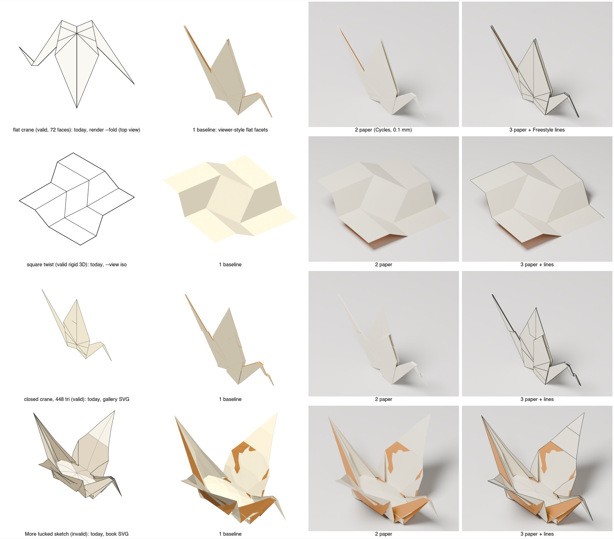
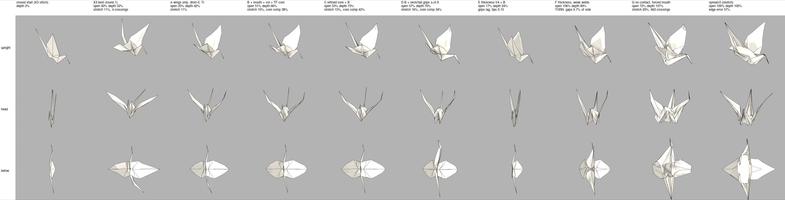
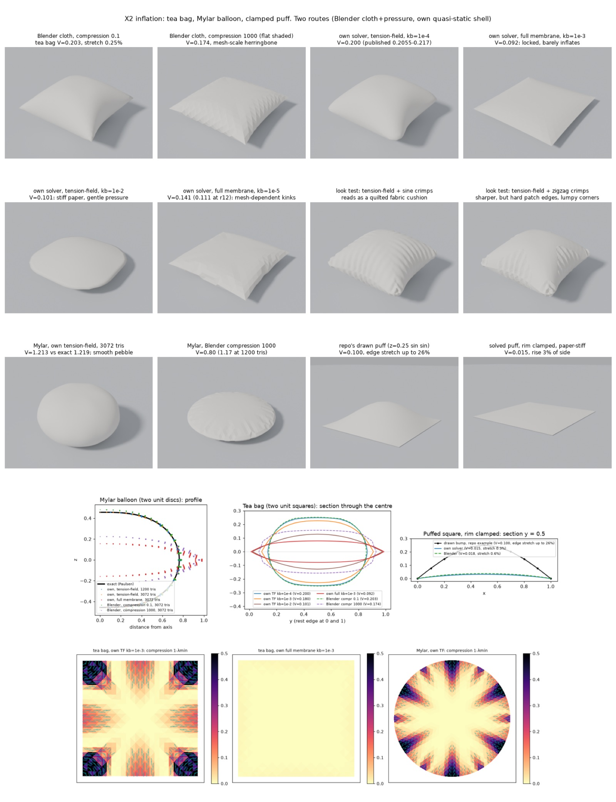

# 11 — Refined final forms: paper that opens, spreads and inflates, drawn well

Written 2026-09-28 against `83fc960`; requirements only, nothing implemented.
It answers the owner's request of that day: the material study's results do not
look *refined*, so how should the rendering of a finished model improve,
especially where a step opens the body (the crane), inflates it (the water
bomb) or spreads the wings, and where a mesh model of the paper and
finite-element analysis come in.

The evidence is in [`research/`](research/README.md#refined-final-forms-2026-09-28):
seven research slices ([H1](research/H1-diagnosis.md)–[H7](research/H7-tooling.md)),
a completeness critique ([Z2](research/Z2-critic.md)), nine experiments run for
this file ([X1](research/X1-paper-look-renders.md)–[X3](research/X3-crane-opening.md),
[Y1](research/Y1-valid-curved-looks.md)–[Y6](research/Y6-fea-oracle.md)), and an
adversarial verification ([V](research/V-verification.md)) that re-ran or
re-fetched the load-bearing claims of H1–H7 and X1–X3. **V did not re-check
Y1–Y6**: the no-stretch floor, the locking result, the pod result, the water bomb
and the FEA runs are each one researcher's run, cited as such. New terms are
defined where they first appear and collected in
[glossary-additions](glossary-additions.md#refined-final-forms); **SKETCH** and
**UNVERIFIED** keep their meanings
([glossary-additions](glossary-additions.md#code-and-tests)).

## Summary

**The pictures under review are shapes paper cannot take.** The owner's
preferred crane, *More tucked* (the gallery's `spread-0`), was built by placing
vertices where the crane should be, not by bending paper. 74.2% of its sheet is
stretched or squashed by more than 10%, where paper tears at a few percent.
345 pairs of its triangles pass through each other. 15 joins inside panels are
bent more than 45° where the crease pattern has no crease, *false creases*
([H1](research/H1-diagnosis.md) findings 4 and 7, reproduced by
[V](research/V-verification.md)).

Part of that is proved. Paper cannot stretch, so two points of the sheet can
never end up farther apart than they are on the flat square. At a wing root,
vertices 37 and 46 are 0.269 of the sheet apart on the square and 0.336 apart in
the sketch: 0.067 too far. When a pair is too far apart by some amount *e*,
closing the gap moves at least one of the two points by *e*/2, here 0.034 of the
sheet, 20 px at the gallery's 600 px per sheet side. The worst pair gives the
*no-stretch floor*: 20.0 px in 3D, and **17 px** in the gallery's upright
picture, where the worst pair is a different one, vertices 46 and 182
([Y2](research/Y2-reachability.md) result 1). The nearest paper a search found
moves the outline about 16 px on average.

**Presentation cannot fix the sketch; on valid shapes it is most of the gap.**
Under one paper look (soft light, a contact shadow, two colours for the two
sides, smooth shading within panels), every valid shape tried read as
photographed paper to the experimenter. That covered flat folds, rigid 3D and
bent wings. The same look leaves the sketch's defects in place and makes them
easier to see ([X1](research/X1-paper-look-renders.md),
[Y1](research/Y1-valid-curved-looks.md)). Two limits: the owner has not judged
those renders yet, and no valid crane with an *open body* exists, so whether one
would look refined is untested. Today's viewer is part of the problem too: its
hard light and missing shadow cause the faceting, not its mesh.

**The drawing adds defects of its own, which are cheap to fix.** The book-style
drawing draws each boundary between two regions twice, so interior lines print
heavier than the outline. Seven lines stop in mid-paper, six exactly where layers
pass through each other. Its lines total 23.6 times the drawing's diagonal,
against 4.8 for the production flat crane ([H6](research/H6-illustration.md)
findings 2–4, [V](research/V-verification.md)).

**The route to paper that opens is the one simulation uses, and the study did
not take it.** Start from a state in which every layer is at least a paper's
thickness from every other; move the controls in small steps; never let a step
carry paper through paper. The contact method that does this is IPC
([§3.2](#32-one-solver)). The folded crane is not such a start: its layers lie
on each other at distance zero. The study instead started solves from guesses
and repaired them: 31 body pull requests between #318 and #396, then the
prescribed targets of #398 and #400. Fifteen of those pull requests repaired
contact one pair at a time and each moved the paper by less than 0.2 px
([H1](research/H1-diagnosis.md) finding 3).

The path gets further, within limits. Pulling the crane's wings spread them at
3.1–4.8% edge error and 8–11% stretch, against the sketch's 57% and 107%
([X3](research/X3-crane-opening.md) tip grips, [Y4](research/Y4-crane-v2.md) run
A). With the conservative collision check, no two pieces of the sheet that share
no vertex crossed. That is far closer to paper, but still outside the 1% screen
this file proposes, and no run converged. The body opens as a *pod*, swinging open about its spine, not as the
sketch's *pillow*, because no load tried lengthens it
([X3](research/X3-crane-opening.md), [Y4](research/Y4-crane-v2.md)).

**Inflated paper needs a membrane that can shorten for free.** A *membrane* is
the part of a sheet model that resists changes of length within the sheet. A
*tension-field* membrane resists stretching only, and shortening becomes
crimps. With little bending it reproduces the one exact answer and agrees
across codes on a second case. The Mylar balloon, two discs sealed at the rim
whose inflated shape is known exactly, comes within 0.44%. The tea bag, two
squares sealed at the rim, has no exact answer; three independent codes give
0.20 of its side cubed. At the bending of kami, standard thin origami paper, the
same model gives 0.10–0.18, so the amount of puff is the author's to choose. Membranes that also
resist shortening gave 0.05–0.17 in the solvers tried, but a plain shell with
less bending breaks into folds and reaches 0.184. Which one real paper follows
is open ([X2](research/X2-inflating-paper.md), [H4](research/H4-inflation.md),
[Y6](research/Y6-fea-oracle.md)). senbazuru can already fold the flat water bomb.
Pressure alone then unfolds it, so its creases need rest angles and stiffness
([Y5](research/Y5-waterbomb.md)).

**What this file asks for**, in the order of [§Milestones](#milestones):

1. **F0, honest labels (S).** Every pose the owner reviews carries a *paper
   screen*: strain, the no-stretch floor, crossings, false creases. A sketch is
   labelled a sketch. The owner judges the existing contact sheets (the grids of
   renders in `research/img/`) and decides the crane target.
2. **F1, the look on valid shapes (S–M).** Lines drawn once, with roles and
   weights; tone by paper side, with gradients; a viewer and offline stills with
   a paper look.
3. **F2, a prototype solver as an oracle (M, two weeks).** Python and `ipctk`,
   the Python binding of the IPC Toolkit contact library, outside CI. It carries
   the cheapest decisive test first: can any load or re-crease lengthen the
   crane's body at all? That answer decides the crane target; F2's go/no-go
   decides whether F4 happens.
4. **F3, Haskell numerics (M).** A sparse LDLᵀ factor, the direct solver each
   Newton step needs, measured about 200× faster than the study's `SparseSolve`
   (0.27–0.29 s against 61.7–66.5 s at 6,912 unknowns). Also hand-written dual
   numbers, which compute exact derivatives beside values and give one hinge's
   second derivatives 13–92× faster than the `ad` package; the study computes no
   second derivatives today.
5. **F4, contact and path-following in the library (L–XL)**, only if F2 passes.
6. **F5–F7**: the crane's body; inflation and the water bomb; a book renderer
   for curved paper.

**What the owner sees, and when.** In the first week (F0), every gallery pose
with its paper screen, More tucked labelled a sketch, and the viewer showing
coincident layers correctly. In two to three weeks (F1), the valid wing spreads
(body closed) in the new drawing, viewer and stills. F2's core-lengthening test
answers "is a pillow body possible here" within its two weeks. An opened body as
a library result needs F2, F3, F4 and F5: two to four months of this file's work
at best, and F5 may end in a stated blocker. F4's last stage, `Material.Settle`,
also waits on the sequence track's M6, which needs a sequence runner (M2, M4)
not yet built. Until then the only open-bodied crane is a labelled
sketch.

**Decisions only the owner can make** are in [§Open questions](#open-questions-for-the-owner),
numbered 15–25 to continue [decisions §9](decisions.md#9-owner-decisions). The
first is what "refined" must mean: a picture that looks like a book's finished
crane, or a shape that is paper.

## Words this file uses

Terms are defined where this file first uses them and collected, one copy each,
in [glossary-additions](glossary-additions.md#refined-final-forms): *edge
error*, *principal strain*, *angle sum*, *kami*, *membrane*, *tension-field
membrane*, *energy*, *L\**, *double fold*, *paper screen*, *no-stretch floor*,
*false crease*, *shape sketch*, *nearest paper*, *admissible start*, *barrier
contact*, *CCD*, *IPC*, *thickness floor*, *creep*, *cut-and-stitch start*,
*crimp* (in inflation), *puff amount*, *virtual cap*, *path driver*, *material
track*, *pod* and *pillow*. A fold angle is 0° flat and 180° folded flat, as in
the [glossary](../docs/glossary.md). Pixel figures are at the study gallery's
600 px per sheet side.

## Problem and evidence

### What the owner is looking at

At 600 px per sheet side. **(V)** marks a figure the verification reproduced
independently.

| Pose | Largest edge error | Principal strain | Area strained > 10% | Crossing pairs | Joins bent > 45° | No-stretch floor |
| --- | ---: | ---: | ---: | ---: | ---: | ---: |
| Closed crane (`before`) | 1.4e-11 | ≈ 0 | 0 | 0 | 0 | 0 |
| First candidate (`after`, #398) | 5.26% | +22.3 / −5.7% | 1.7% | 683 | 4 | 1.0 px |
| Narrower body (#400) | 58.04% | +152.2 / −82.1% | — | 266 | — | 25.4 px |
| **More tucked (`spread-0`)** | **57.29%** | **+106.8 / −83.6%** | **74.2% (V)** | **345 (V)** | **15 (V)** | **17.1 px** |

Sources: [H1](research/H1-diagnosis.md) findings 4 and 7, [Y2](research/Y2-reachability.md)
result 1. The first candidate is nearly paper *in its lengths*: the nearest
length-keeping shapes found are 2.7–4.3 px from it on average. It still crosses
itself at 683 pairs; stretch and crossing are separate defects. More tucked is
far on both.

**Why More tucked cannot be paper.** The worst pair of points in 3D is at a wing
root: vertices 37 and 46, 0.269 of the sheet apart on the square and 0.336 apart
in the sketch, 25% farther. No bending or folding can do that. The body causes it.
The sketch lays the sheet's central diagonal flat along the crane, which pulls
the wing roots apart, and every nearest-paper shape folds that diagonal back
into a V keel instead ([Y2](research/Y2-reachability.md) results 1 and 3). The
floor bounds how far *material points* must move; how far the *outline* must
move is a search result (14.5–17.5 px on average, 54–57 px at worst, whatever
mesh, membrane model or starting shape), not a proof. The sketch's cushion is
also a dome, curved two ways, which paper cannot take without stretching
([H1](research/H1-diagnosis.md) finding 6). The first candidate copied a solved
body with 0.0018% strain, then spread its movement over the rest of the sheet by
a smoothing that ignores lengths. The pillow targets replaced the body with the
dome (finding 5).

**Where the false creases come from.** H1 and H2 blamed *locking*: nearly
unstretchable flat triangles that can bend only along their own edges.
[Y3](research/Y3-locking.md) tested this and **refuted it for the crane**. The
joins bent more than 45° carry the same total turning, length × angle summed
over them, at every resolution: 145, 142 and 141 on meshes of 448, 1,792 and
7,168 triangles. This measure distinguishes the two cases. A smooth curve
sampled more finely bends less at each join, so its joins fall below 45° and
drop out of the sum. A real fold keeps its turning. The kinks sit where the
construction's prescribed regions meet its smoothed fill. On a pose the study
actually solved, the held wing, no join passes 4° on any mesh or stiffness.
Locking is real: on a strip bent across its mesh lines it costs 1.6–12 px, and
one refinement mostly cures it.

### What the drawing adds

[H6](research/H6-illustration.md) measured the book drawing of More tucked
(`CraneBookDrawing`), and [V](research/V-verification.md) confirmed it:

- **Each boundary is emitted twice**, once for each region beside it. 58–64% of
  the boundary length is drawn as two strokes lying exactly on top of each other,
  so 74–78% of the ink laid down belongs to a doubled pair. A doubled stroke
  prints about 29% darker, so interior lines print heavier than the outline, the
  reverse of a book. Removing the copies removes 37–39% of the ink.
- **Near-parallel ink.** Separately, 22–28% of the outline ink runs within 1 px
  of a near-parallel line ([H1](research/H1-diagnosis.md) finding 15). That comes
  from the geometry, and 16.6% remains after de-duplication.
- **Loose ends.** Seven lines in the upright view stop in mid-paper; six stop
  within 0.01 px of where two layers cross.
- **Volume.** 617 paths. Total line length 23.6 times the drawing's diagonal,
  against 4.8 for the production flat crane; 17.5 after a prototype restyle.
- **Tone.** One flat tone per panel, in three levels, the same for both sides of
  the paper. Diagrams colour the two sides differently first
  ([H6](research/H6-illustration.md) findings 17–21).
- **Seams.** Same-colour fills split across two paths leave light hairlines: 1,401
  lighter pixels inside the first candidate's preview
  ([V](research/V-verification.md)).

The prototype restyle of the same SVG (each boundary once, three weights, joined
strokes, small gaps) cuts 617 paths to 162 without moving any paper
([H6](research/H6-illustration.md) finding 3). Its visible gain on More tucked is
modest, because the geometry dominates.

### Where the effort went

About 31 body pull requests landed between 2026-09-20 and 09-26. Fifteen of
them guarded or repaired one contact pair at a time. Each moved the paper
0.005–0.17 drawing pixels, while the full step the solver still asked for stayed
5,000–11,700 times the size at which it would call the shape settled
([H1](research/H1-diagnosis.md) finding 3). None brought a solve near an answer.
Four attempts to build a separated start failed at the start itself (#379, #381,
#383, #385; [H3](research/H3-contact.md) finding 2).

The accepted non-flat results share a pattern. Each started from a valid state,
moved a small region a small step, and held nearly everything else. The failures
released many touching layers at once, started from a guess that already
crossed, or were never solved ([H1](research/H1-diagnosis.md) finding 2). That
pattern is path-following, done by hand.

### Rendering is not the fix

[X1](research/X1-paper-look-renders.md) rendered four models three ways in
Blender Cycles, one camera each. The valid ones (the flat crane, the square
twist, the closed crane) read as photographed paper. More tucked keeps its
wrong-side blotches where the sheet passes through itself, its stretched roots
and its fan-shaped body. [Y1](research/Y1-valid-curved-looks.md) repeated this
on valid *bent* shapes, the study's accepted wing spreads: they read as clean
paper too. Flat and smooth normals change the image by a mean absolute error of
about 0.1%.

Three findings from those renders shape the design:

- **Coincident layers need care in a viewer.** The whole-crane gallery writes the
  GLB's *complete-paper* scene, whose touching layers sit at one depth. three.js
  then draws the closed crane 95.2% in the back colour. The default
  *visible-paper* scene draws it 100% right, with no vertex moved
  ([V](research/V-verification.md), X1 correction).
- **Separating layers for a still can itself cross paper.** The renders above
  lifted stacked layers by a height from the layer order. On the valid wing
  spreads that lift creates 64–314 crossing pairs, because the stacks are
  hinged, not flat ([Y1](research/Y1-valid-curved-looks.md)). Y1 gave them as up
  to 375 thicknesses deep. The script behind that figure was not kept; if it
  used Y1's shared depth in `geom.py`, the figure measures the piercing edge,
  not the paper (correction 3). The meshes were not kept to re-measure.
- **Display smoothing is unsafe before paper has thickness.** Subdividing a
  stacked, zero-thickness mesh for display creates new crossings: 29–52 pairs
  from Catmull–Clark at an untagged 30° hinge, and 598–1,466 on layers separated
  for rendering. Phong tessellation is safe only when every panel boundary is
  tagged sharp, and then changes no visible pixel.

### What a physical path achieved

[X3](research/X3-crane-opening.md) and [Y4](research/Y4-crane-v2.md) opened the
study's 448-triangle closed crane with `ipctk`, the Python binding of IPC
Toolkit (MIT source), in a Newton solve with barrier contact
([§3.2](#32-one-solver)):

- **A start had to be built,** by cutting the sheet at its folds and stitching it
  back under contact ([§3.4](#34-an-admissible-start)). Heights alone cannot
  separate the layers.
- **The wings spread; the body opens as a pod.** Within 3% strain, with no
  crossing between pieces that share no vertex, the best body depth was 28% of
  the sketch's. Letting the body's core gather slack as a tension field raised it
  to 51%. At the end of the path depth reached 70–74%, but at 5–16% stretch. The
  seams where the sheet was stitched still cross, 172–251 pairs in X3's states
  and 600–900 on Y4's welded sheet, which the runs did not guard.
- **Why.** The sketch's body is the sheet's centre square flattened. Its
  head-to-tail length is 0.414 against 0.235 closed. The eight creases along the
  centre lines sit at a fold angle of 14°, nearly flat (the diagonals at 4°). In
  every run that neither tore nor crossed, the core kept its closed length
  (0.215–0.235), the centre-line creases stayed at 140–180°, and the diagonals
  opened only to 92–146°. So the body swings open about its spine, the diagonal
  crease running head to tail. The only boxy, open bodies came from a run that
  tore and one with contact switched off (663 crossing pairs). Stretch collects at
  the roots of the neck and tail flaps. Wing, mouth, back, volume and
  neck-and-tail loads all failed to lengthen the core.
- **What helped.** The tension-field core gave +23 points of depth and halved the
  stretch elsewhere; refining the core gave +7 to +9. A thickness floor made the
  coarse mesh worse: the solve jammed, the grips lagged far behind their
  targets, or the stitches tore. Tight-Inclusion collision checks kept zero
  crossings between separate pieces in every run, where the faster Additive
  checks once let one through (confirmed by an A/B re-run of that step).

The honest conclusion: the path reaches a crane with spread wings and a
pod-shaped body, closer to paper than anything the study has, but no state yet
passes a 1% screen. Photographs show real cranes with pillow bodies
([opening-a-crane.md](../docs/notes/opening-a-crane.md)). They are shaped by
hand: after pulling the wings, the folder pinches the wing bases into an
X-shaped stand the crane sits on, which adds creases along the wings that the
pattern does not have ([H4](research/H4-inflation.md) finding 15). Y4 proposes
that the missing ingredient is a similar *plastic* re-crease, a change of rest
angle, at the neck and tail reverse folds. That is **UNVERIFIED**, and F2 tests
it first.

### Inflation, measured

Volumes are for discs of radius 1 and squares of side 1.

- **The membrane.** Tension field, little bending: Mylar balloon 1.2132 against
  the exact 1.2185; tea bag 0.1995 (our solver), 0.2021–0.2023 (CalculiX) and
  0.2027 (Blender cloth), against Kepert's construction of 0.2055. A membrane
  that also resists shortening gives the Mylar balloon 0.5734 and, at ten times
  the bending, the tea bag 0.092 in our solver, where the tension field gives
  0.180 (Blender: 0.8005–1.1694 and 0.1738; [Y6](research/Y6-fea-oracle.md)
  "X2 references"). Its answer moves with the mesh.
- **The puff amount.** Volume depends on p̂ = pL³/B: p the pressure, L the
  panel's side, B the paper's bending stiffness. It measures how hard the air
  pushes against how hard the paper resists bending. Over breath pressures and
  papers at origami scale, volume changes by about 2×, so the author's control
  should be the amount of puff, not pascals ([H4](research/H4-inflation.md)
  finding 9).
- **Never clamp an inflating panel.** With its rim clamped, a square of paper
  rises only 0.7–1.5% of its side at kami stiffness. Inflation works because
  paper flows in from free edges and flaps.
- **The look needs crimps.** The tension-field answer is the smooth average.
  Paper gathers the slack into a few *crimps*, ridges of gathered slack (not the
  crimp fold), whose wavelength is roughly 1.7–5.4 cm for kami, as long as the
  model. That is an order-of-magnitude estimate from a stretched-sheet law
  ([H4](research/H4-inflation.md) finding 8, [V](research/V-verification.md)).
  Placing crimps from the compression field is open work.
- **Once paper wrinkles, only the volume is reproducible.** A plain shell that
  breaks into folds gives the same volume from two random seeds but different
  shapes, thickness 0.457 against 0.399 ([Y6](research/Y6-fea-oracle.md)).
- **The water bomb.** A pattern generated for this work (45 vertices, 48 faces)
  folds flat with its tucks today: `senbazuru fold` finds 1,521 valid stackings,
  and the traditional one is `--stacking 16,21`. Blender cloth with pressure
  either unfolded it to the sheet's size or blew up. Some creases must keep their
  rest angle against the puff ([Y5](research/Y5-waterbomb.md)).

## Goals

1. Every picture presented as paper passes a stated screen, or is labelled a
   sketch.
2. Valid bent, opened and inflated paper renders with a refined look, in the GLB
   viewer, in offline stills and in book-style SVG.
3. A path from a valid state to an opened or inflated one, computed with contact
   that never lets paper cross paper, first as an external prototype and then in
   Haskell.
4. The crane with spread wings and an opened body, the water bomb inflated, and
   a puffed pillow, as reviewable galleries with their measurements.
5. Default outputs and the 38 tracked goldens (`git ls-files test/golden | wc -l`
   at `83fc960`) unchanged; every new look is opt-in.

## Non-goals

- **Machine-learned image generation or neural rendering.** Neither is
  deterministic enough for goldens, and neither says where its paper came from.
- **Calibrated physical prediction.** Parameters are paper-like so shapes are
  plausible; outputs remain labelled illustrative.
- **A general finite-element code as the production path**
  ([§9](#9-why-not-a-general-shell-fea-code)).
- **Real-time interactive simulation.**
- **Replacing rigid figures.** The rigid run stays authoritative for every
  diagram and every later rigid step
  ([D14](decisions.md#d14-material-consumption)).
- **Unlabelled display-only geometry.** SVG and GLB keep one geometry (owner rule
  of 2026-09-26); a still's layer separation (R-11-14) is recorded as display-only
  in its fidelity record.

Four of [D18](decisions.md#d18-non-goals)'s non-goals would be reopened, **for
illustrations only**, by [§Proposed amendments](#proposed-amendments-to-the-decision-record):
pressure or inflation, thickness as geometry, sliding contact, and calibrated
paper (here: paper-like parameters, stated as such).

## What "refined" means

Three layers, each measurable, then the owner's eye. All at a declared page
scale (600 px per sheet side) and the gallery's fixed cameras.

| Layer | Measure | Today, More tucked | Target |
| --- | --- | --- | --- |
| **Paper** | Largest principal strain, outside declared tension-field regions | +106.8% | ≤ 1% (owner decision 16; 0.1% reported beside it) |
| | Largest stretch inside declared tension-field regions | — | ≤ 1% |
| | No-stretch floor at the declared strain, picture and 3D (R-11-3) | 17.1 / 20.0 px at zero strain | ≤ 1 px |
| | Crossing pairs on the *displayed* mesh | 345 | 0 |
| | False creases: Σ length × angle (sheet lengths × degrees) over joins bent past a threshold (45° on poses), at two mesh levels | 145, 142, 141 (a fold) | 0 at the pose's mesh and one level finer |
| | Vertices whose angle sum changed by more than 1° | 99 changed by > 5° | 0 outside tension-field regions |
| **Drawing** | Ink emitted twice | 74–78% | 0% |
| | Loose line ends not at a cusp | 7 / 6 / 2 / 12 per view | 0 on an accepted pose |
| | Paths per view | 617 | ≤ 200; necessary, not sufficient: the restyle already meets it |
| | Total line length ÷ drawing diagonal | 23.6 (17.5 restyled) | within 1.5× of a finished 3D book figure the owner names; the flat crane's 4.8 is a floor, not the target |
| | Line hierarchy, raster darkness | inverted | outline : interior : crease ≈ 1.6 : 1 : 0.5 |
| | Seams inside a same-paint region | present (1,401 px in the first candidate's preview) | 0 |
| **Appearance** | Wrong-side pixels in a two-colour still | 44.5% (Cycles, GLB as written) | ≤ 1% |
| | Written corner normals pointing behind their triangle | 8 corners at risk | 0 |
| | Ten cues of real paper, scored yes / partly / no against reference photographs: no facets inside a panel, crisp creases, a contact shadow, darkening in pockets, true paper colour, backlit glow, crease memory in close-up, readable paper edges, no wrong-side patches, no polygonal outline on a curved panel ([H5](research/H5-photoreal.md) A7) | — | 8 of 10; "no wrong-side patches" mandatory |

Then **owner review**: blind pairs at the book size and as a 150 px thumbnail,
one sentence of reason, recorded in the change's note. A failure is routed, not
patched: a geometry defect goes to the shape milestones, a style defect to the
look milestones. No tolerance is widened after seeing a result
([H6](research/H6-illustration.md) acceptance ideas).

The strain target is a decision, not a fact. At 600 px per sheet side, 1% of a
0.2-sheet panel is 1.2 px, and 1.8–3 px on a 0.3–0.5-sheet body panel. The provisional 0.1%
screen of 2026-09-26 is about ten times stricter than anything visible at that
scale ([H2](research/H2-sheet-mechanics.md) finding 21,
[V](research/V-verification.md)).

## Design

### 1. The paper screen

The first requirement costs little and changes what the owner sees.

- **R-11-1.** Every gallery pose writes a *paper screen* beside its drawing:
  - largest principal strain, stretch and squash separately;
  - the no-stretch floor in the picture and in 3D (R-11-3);
  - crossing pairs on the displayed mesh, by the study's strict test, with
    `ipctk` as an oracle outside CI;
  - false-crease turning at the pose's mesh and one level finer;
  - the core's head-to-tail length and the centre-crease angles, which tell a pod
    from a pillow where body depth and volume cannot (a pod reached 92–94% of the
    sketch's core volume, [Y4](research/Y4-crane-v2.md)).
- **R-11-2.** A pose built by placing vertices is labelled *shape sketch* in its
  drawing, its GLB extras and its gallery card. PRD 08's geometry axis gains the
  value `as prescribed` ([§Proposed amendments](#proposed-amendments-to-the-decision-record)).
- **R-11-3.** The no-stretch floor, as [Y2](research/Y2-reachability.md) defines
  it: for every pair of material vertices,
  `(|xᵢ − xⱼ| − (1 + ε) |uᵢ − uⱼ|) / 2` at page scale, where `x` is the pose
  position, `u` the flat-sheet position and ε the declared strain screen; the
  floor is the largest value, in 3D and after projection. **The halving is not a
  slip:** two points too far apart by *e* can share the correction, so the floor
  promises only that one of them moves *e*/2. The screen reports it at ε = 0 and
  at the declared ε, and the ≤ 1 px target applies to the second. It needs no
  solver, holds for creased or crumpled paper, and took about 1 s for three
  models. It assumes a convex sheet; on a non-convex sheet it is refused, since
  distances must then be measured within the sheet.
  - **SKETCH:** `data ScreenError = NonConvexSheet | …`, with an `Explain`
    instance ([D20](decisions.md#d20-errors)).

An authored target is still useful as a direction to pull towards
([§3.6](#36-sketches-become-targets-never-starts)). The screen only stops it being
mistaken for paper.

### 2. The look track

For valid shapes. None of it changes a default output.

#### 2.1 Book drawing

From [H6](research/H6-illustration.md), confirmed by [V](research/V-verification.md):

- **R-11-4. Each boundary once.** The drawing cuts region boundaries into maximal
  stretches, as `Origami.Visible` already does for flat models, and emits each
  stretch once, labelled with the regions on both sides.
- **R-11-5. Lines by role.** Six roles:
  - `Outline`: paper on one side, empty page on the other;
  - `FoldEdge`: a depth jump along a crease;
  - `RawEdge`: a depth jump along the paper's cut edge;
  - `TurningContour`: a depth jump along a join inside a bent panel, where the
    surface turns away from the reader;
  - `CreaseMark`: a crease with the same sheet at the same depth on both sides;
  - `Intersection`: a defect, never inked in book mode, always reported.

  Weights: outline ≥ 1.5 × edges ≥ 2 × crease marks (Lang's 2:1, Petty's 3:1).
  This amends PRD 08 W1, which gives a silhouette crease weight.
- **R-11-6. Strokes, simplification, gaps.** Join stretches into strokes through
  points where exactly two meet. Drop dangling strokes under 5 px at the declared
  scale. Leave a gap of about 1.5 px where a line stops against another. This is
  the *halo* of technical illustration, and the origami rule that a crease stops
  short of an edge. Every threshold is stated in page pixels.
- **R-11-7. A report beside every drawing**: loose ends, intersection length,
  panels whose triangle normals spread past a declared angle, strokes dropped.
- **R-11-8. Tone.** Paper side first (colour side and white side), then light,
  kept to mid-tones so lines always read. A panel is painted flat or with one
  linear gradient. On unstretched paper the shade is constant along each straight
  *ruling* of a bent panel, so one gradient across the rulings is exact for a
  cylindrical bend ([H6](research/H6-illustration.md) finding 13). A panel whose
  normals spread too far keeps a flat tone and is reported.
  - **SKETCH:** `Fill Colour [[V2]]` becomes `Fill Paint [[V2]]`, with
    `Paint = Solid Colour | Linear V2 V2 [(Double, Colour)]`, ends in model
    units. Nothing default uses `Linear`, so every golden keeps its bytes.
  - One path per paint, as `Diagram`'s `Fill` contract already requires; a
    gradient split across two paths leaves the same seam (H6 finding 25).
- **R-11-9. Which creases.** A finished-model figure declares its crease policy:
  by fold angle, by the next step's references, or an authored list. Omission is
  never by length alone.

#### 2.2 3D viewer and offline stills

From [H5](research/H5-photoreal.md), [X1](research/X1-paper-look-renders.md) and
[Y1](research/Y1-valid-curved-looks.md):

- **R-11-10.** The study's gallery viewers load the visible-paper scene, or give
  coincident layers a per-layer depth bias; never the complete scene alone.
  Settled GLBs and animations that write the complete scene first
  ([§Proposed amendments](#proposed-amendments-to-the-decision-record)) are
  shown with the depth bias.
- **R-11-11.** The viewer uses a colour-preserving tone map (Khronos PBR Neutral),
  studio environment light, one soft shadow onto a ground plane, and screen-space
  ambient occlusion. three.js r186 has all four. A first three.js version came out
  harsher than Cycles (a hard-edged shadow, weak occlusion), so this is tuned
  against the owner's review, not assumed.
- **R-11-12.** Smooth normals keep `PaperLighting`'s rule: a corner whose panel
  average points behind its own triangle keeps the flat normal. Without it,
  smoothing leaves black triangles at the wing roots. PRD 08 R-08-6 gains this
  rule.
- **R-11-13.** An offline still is rendered from one two-sided surface rebuilt
  from FOLD, never from the GLB as written: Cycles picks either of the GLB's two
  coincident copies and shows the wrong side on 44.5% of paper pixels. Other
  path tracers are **UNVERIFIED**. The recipe is in
  [H5](research/H5-photoreal.md) "The paper-look recipe": rough diffuse, a little
  sheen, translucency mixed at 0.15–0.3, PBR Neutral. A still costs 12–25 s at
  1200 × 1000 in Cycles on the owner's machine.
- **R-11-14.** In a still, coincident layers are separated along each layer's own
  normal, continuously across a panel, and the displayed mesh passes the same
  crossing check as geometry, and the still's fidelity record says the
  separation is display-only. Heights taken from the layer order suit flat stacks
  only; on hinged stacks they crossed 64–314 pairs (Y1).
- **R-11-15.** No solid thickness (a shell offset, Blender's Solidify) beyond
  R-11-14's separation, and no display smoothing, until the shape track produces
  paper with thickness. Blender's even-thickness offset explodes at 180° folds,
  and both smoothing methods create crossings on stacks.

Where the still generator lives is a licence question. Blender's FAQ requires
published scripts that use its Python API to be GPL
([V](research/V-verification.md)). For that reason this pull request keeps its
24 Blender scripts out of the tree. Mitsuba 3 is BSD-style and has a two-sided
material, but loads OBJ and PLY rather than glTF, and no paper still has been
rendered in it (**UNVERIFIED**). Owner decision 20.

### 3. The shape track

#### 3.1 One energy

A shape is found by minimising an *energy* over all vertex positions
([Words](#words-this-file-uses)), step by step along a path. Each term below is
one piece of that number, and each is a choice the research measured:

| Term | Form | Why |
| --- | --- | --- |
| Membrane, where paper must keep its lengths | St Venant–Kirchhoff on each triangle's Green strain, a standard measure of how a triangle's shape changed, at the paper's stretch-to-bend ratio γ ≈ 5e7 | A material, not a penalty weight ([H2](research/H2-sheet-mechanics.md) findings 2 and 19) |
| Membrane, where paper may gather | Tension field | Inflation and body opening need it ([X2](research/X2-inflating-paper.md), [Y4](research/Y4-crane-v2.md)); declared per region |
| Panel bending | Discrete-shell hinges, as the study has | Always on: a tension field with no bending crumples through itself ([H4](research/H4-inflation.md) finding 2) |
| Creases | Springs `κ l (θ − θ₀)²`, where `l` is the crease length, θ its fold angle and `κ = B/L*` with L* ≈ 150–215 thicknesses; stiffening near ±180° as MERLIN, a bar-and-hinge origami solver, does | Measured crease stiffness ([H2](research/H2-sheet-mechanics.md) finding 7) |
| Rest angles | From the step that made each crease, minus a declared springback; shaping steps write new rest angles | Plasticity moves the rest angle (H2 finding 7); the likely missing piece for the crane's body |
| Contact | A barrier over all non-neighbouring pairs of surface, with the paper's thickness as its floor | Keeps layers apart along any path that never crosses, with no fixed direction and no layer list ([H3](research/H3-contact.md)) |
| Loads | Exact grips; a volume target over a declared cavity closed by a *virtual cap*, triangles closing the cavity's opening that are never paper; optional gravity | Pressure is an energy only for a closed surface ([H4](research/H4-inflation.md) finding 10) |

The hinge coefficient on a mesh is not the plate's bending stiffness `D`: on the
study's meshes `D` ≈ 2–5.8 × the coefficient, depending on direction
([V](research/V-verification.md), corrections row "H2 F2, F20"). So γ and p̂ are converted through a
measured calibration per mesh, not by assuming they are equal.

Parameters: kami at 72 µm, `E` stated as an unmeasured 3–4 GPa, results reported
in the groups that do not depend on `E` (γ, L\*/t and p̂). At 600 px per sheet a
kami crease is sharp (tightest radius about 0.36 px), and a loaded panel bends
over about 42–62 px beside each crease ([H2](research/H2-sheet-mechanics.md)
finding 8).

#### 3.2 One solver

- **R-11-16.** Newton's method on the total energy. It chooses each step from the
  energy's second derivatives, its *Hessian*. Each triangle's piece of the
  Hessian is projected to be positive semi-definite, so every step goes downhill.
  A sparse direct factor solves for the step. A line search shortens the step,
  first capped by *continuous collision detection* (CCD): the step is cut to
  before any two pieces of surface would touch. This replaces the study's
  Gauss–Newton for the new track: Gauss–Newton minimises sums of squares, and
  neither a barrier nor the pressure term (pressure times enclosed volume) is one
  ([H4](research/H4-inflation.md) finding 12).
- **The barrier.** An energy that is zero beyond a small activation distance and
  grows without bound as two separate pieces of surface approach the floor. Its
  gradient pushes them apart. Barrier plus CCD is IPC, *incremental potential
  contact* (Li et al. 2020). Its guarantee is that no accepted state has paper
  crossing paper, **provided the start has none and every gap exceeds the
  floor** ([H3](research/H3-contact.md) findings 4–7). C-IPC is its variant with
  a thickness floor.
- **R-11-17.** Barrier stiffness adapts, as IPC Toolkit's
  `initial_barrier_stiffness` and `update_barrier_stiffness` do. A fixed stiffness
  of 1 stalled the double fold at 0.77°; 1e4 let it reach about 110° with no
  crossings ([V](research/V-verification.md), H7 correction).
- **R-11-18.** CCD is conservative (Tight Inclusion, tolerance 1e-5, 10⁶
  iterations). Its cost depends on the state: twice Additive CCD's on X3's
  opened crane (0.2 s against 0.1 s per call over 50,421 candidate pairs),
  150–250 times on Y4's packed state, and more than 10 minutes per step on a
  flat stack at default tolerance ([H7](research/H7-tooling.md) finding 13).
  Additive CCD once let a crossing through (X3's step 6, reproduced by V).

#### 3.3 One path

- **R-11-19.** A *path driver* moves controls, not vertices, over a parameter `s`
  from 0 to 1: rest angles, grip positions, the puff amount. It warm-starts each
  step from the last accepted state, halves the step when convergence is slow,
  grows it when fast, and records every accepted state as a checked point. No
  mesh position is ever interpolated
  ([fold-angles-are-the-state.md](../docs/notes/fold-angles-are-the-state.md)).
- **R-11-20.** Every recorded state passes the paper screen, not only the
  endpoint.

#### 3.4 An admissible start

An *admissible start* is a state whose non-neighbouring pieces of surface are all
farther apart than the thickness floor. A flat-folded state has touching layers
at distance zero, so it is not one. A layer lying between two faces of a crease
that wraps it cannot be a thickness above one and a thickness below the other
where they meet. So heights alone never separate a crane: 60 of its creases
wrap another layer along a length ([X3](research/X3-crane-opening.md), proved
independently by [V](research/V-verification.md)). The outer fold must instead
shift sideways round the layers it wraps, which bookbinders call *creep*. Four
routes:

| Route | Status | Next test |
| --- | --- | --- |
| **Cut at the folds, lift the flat pieces by the layer order, stitch back under contact** | Crane, 448 triangles: 0.144% edge error; stitch gaps at most 49 µm on a 15 cm sheet, about 0.7 of kami's thickness; 172 stitched pairs still cross ([X3](research/X3-crane-opening.md), V). Water bomb: the lifted pieces start with 0 crossings but were never stitched under contact; a welded start has 243 crossings where up to 24 layers meet ([Y5](research/Y5-waterbomb.md)) | Close the stitches or weld them; check the welded sheet; stitches that carry each crease's rest angle |
| Creep: creases shift sideways round the layers they wrap | Untested; not ruled out (V) | [H3](research/H3-contact.md) Phase A on the flat closed crane |
| Fold from the flat square with contact on | One fold stops at 179.2–179.4° with layers one thickness apart ([H7](research/H7-tooling.md) finding 13); the double fold has reached about 110° | Double fold to 175° with adaptive stiffness |
| Heights only, from the layer order | **Impossible** on the crane (above) | — |

Airbag simulation meets the same problem and builds its start geometrically,
fold by fold, with outer layers on a larger circumference ([Y6](research/Y6-fea-oracle.md)).
A thickness floor ramped up from small, the counterpart of the airbag industry's
growing contact thickness, may ease the jams; **UNVERIFIED**.

- **R-11-21.** A start is admissible when: no crossing on the welded sheet; every
  non-neighbouring distance at least 0.99 × the declared thickness; strain within
  the screen outside declared crease strips.
  - **SKETCH:** `data StartError = StartCrosses [(FaceId, FaceId)] | StartTooClose Double | …`,
    with an `Explain` instance.
- **R-11-22.** Refine along wrapped creases *before* adding thickness. On the
  448-triangle mesh a floor of 0.15 mm (X3's thickness, about twice kami's) could
  not be stitched below 7.6% edge error, because a wrapped crease had to bridge
  up to 46 layers on one coarse edge. At 75 µm, about kami's thickness, it reached
  2.7%; at 37.5 µm it stitched to 0.78% with no crossing between separate pieces,
  but openings from it jammed or tore ([Y4](research/Y4-crane-v2.md) results 2–3).
  Strips of a few thicknesses beside every wrapped crease cost an estimated
  2,190–5,475 triangles on the crane ([H3](research/H3-contact.md) finding 18).

#### 3.5 Meshes

- **R-11-23.** Crease-aligned refinement to an edge length of about L\*/5, 0.015–0.02
  of the sheet: about 5,000 triangles for a whole sheet
  ([H2](research/H2-sheet-mechanics.md) finding 19). No slivers. Where the bend
  direction is known, edges run along it: bending a strip 270°, cells cut across
  the bend gave ridges up to 43°, cells cut along it at most 13.5°
  ([Y3](research/Y3-locking.md)).
- **R-11-24.** Sharp tags for any display smoothing are
  [D19](decisions.md#d19-realistic-rendering)'s feature edges (every edge that is
  not `J`, `U` included), plus any join bent past a declared angle. Y1 tagged only
  M, V, F and B, and so missed the study's `U` wing-root hinge.

#### 3.6 Sketches become targets, never starts

- **R-11-25.** An authored pose enters a solve only as a soft target: an energy
  pulling chosen material points towards it, whose stiffness doubles when the
  solver stalls short of it, as injective deformation processing does (IDP,
  [H3](research/H3-contact.md) finding 6). It is never an initial guess. Barrier
  methods cannot start from a crossing state, and none disentangles one
  ([H3](research/H3-contact.md) findings 4–7). Untangling methods exist (H3
  finding 13: Baraff et al. 2003; Buffet et al. 2019, given a layer order), but
  are weakest on deep, global tangling over open edges, like More tucked's, and
  stop at touching.
- **R-11-26.** *Nearest paper* is a measuring tool: a length-keeping projection
  that reports how far an authored pose must move for no triangle to stretch
  beyond a stated strain. It takes about 30 s at 448 triangles
  ([Y2](research/Y2-reachability.md)). It ignores contact (its results have
  526–649 crossing pairs), so it is a target for a path solve, never a pose.

### 4. The crane

Spreading one wing with the body held is solved: the study's held-wing spreads
pass at 392 and 1,192 triangles. Spreading both wings on the whole crane is not
yet paper: the path reaches it at 3.1–4.8% edge error and 8–11% stretch
([X3](research/X3-crane-opening.md), [Y4](research/Y4-crane-v2.md)). The body is
open research. The order of experiments:

1. **Lengthen the core, first and cheaply (F2).** Try rest-angle changes at the
   neck and tail reverse folds, and loads at their roots, first with contact off
   (0.05–0.19 s per iteration with the existing scripts), then under contact.
   More wing, mouth or volume load will not do it.
2. **Grips near the wing roots** as small patches, not points. Point grips at the
   tips twist one wing flat.
3. **A tension-field body core**, always.
4. **Find the pocket's opening** before any volume target. A volume needs a closed
   surface, and no one has found which edges bound the hole under the body: four
   midpoints of the sheet's edges meet there, but four points are not a rim
   ([crane-pocket-map.md](../docs/notes/crane-pocket-map.md)).
5. **Refine along wrapped creases**, then add thickness.

The target silhouette is owner decision 15. The options, with their evidence:

| Option | Evidence | What it looks like |
| --- | --- | --- |
| More tucked, labelled a declared schematic | Some point must move ≥ 17 px to become paper (proved); the nearest paper found moves the outline 14.5–17.5 px on average (a search result, not a bound) | Today's picture, honestly labelled |
| The first-candidate family (`after`) | 2.7–4.3 px on average from paper, floor 1.0 px; one wing-tip arch to model as a curl ([Y2](research/Y2-reachability.md)) | Spread wings, body slightly open; a path solve must remove its 683 crossings |
| The nearest-paper crane | 14.5–17.5 px from More tucked at ≤ 1% strain; ignores contact (526–649 crossings), so a target, not a pose | A traditional crane with raised wings, the body folded as a keel |
| A valid pod | Best within 3% strain: 28% of the sketch's depth, 51% with a tension-field core ([Y4](research/Y4-crane-v2.md)) | A rounded pod between V wings; the underside stays a closed seam |
| A pillow reached by shaping | Real cranes have one; no simulation has reached it | Unknown until experiment 1 succeeds |

A physical reference would settle what "pillow" means, and costs half a day. Fold
a 15 cm kami crane, open it to a More-tucked-like pose, and capture it in 3D with
Apple's Object Capture on the owner's Mac. Then measure body height and width,
wing droop, tip separation and underside opening at the gallery's cameras
([Z2](research/Z2-critic.md) experiment X9). The data are the owner's own, so
their provenance is clean. **UNVERIFIED**: that Object Capture resolves a crane
well enough.

### 5. Inflation, the water bomb and the puffed pillow

- **R-11-27.** Inflation is a *volume target* over a declared cavity. The author
  gives the *puff amount*, as a fraction of the tension-field maximum for that
  outline or as p̂. A cavity with an opening is closed by a virtual cap that is
  never paper: never drawn, never in contact or length checks, never written to
  FOLD ([H4](research/H4-inflation.md) finding 13; #106 step 4).
- **R-11-28.** Benchmarks, one exact (the Mylar balloon) and one cross-checked
  (the tea bag), as tests with a named failure each
  ([H4](research/H4-inflation.md) implication 3):
  - the Mylar balloon, discs of radius 1: rim radius 0.7628, thickness 0.9139,
    volume 1.2185, each within 1%;
  - the tea bag at X2's parameters (membrane factor 1e3, bending 1e-4, p = 1,
    24 × 24 cells): volume 0.20 ± 2% and thickness 0.50 ± 0.02, where three codes
    give 0.1995, 0.2021–0.2023 and 0.2027. At any bending it stays below 0.26596,
    the sphere of the same area and the only proved ceiling. As bending
    vanishes it should approach Kepert's 0.2055, so a result there is
    investigated, not failed.

  Each fails if the membrane resists shortening: the tea bag then gives volume
  0.172 and thickness 0.308 with no bending (H4 finding 4), or 0.092 at ten times
  the benchmark's bending, where the tension field gives 0.180 (X2); and the
  Mylar balloon 0.5734 (X2). Gate on volume, not on the wrinkled
  shape, which is not unique ([Y6](research/Y6-fea-oracle.md)).
- **R-11-29.** A puffed pillow fixture beside `examples/puffed-square.fold`, not
  in place of it: two layers sharing the boundary, generated by our own
  tension-field solve. The existing fixture is a stretched dome (up to 26.4%
  stretch) with no outline from `--view iso`; a closed pillow has 84 candidate
  outline edges ([H4](research/H4-inflation.md) finding 6).
- **R-11-30.** The water bomb's flat state becomes a fixture. The pattern generated
  in [Y5](research/Y5-waterbomb.md) checks with 0 violations, and
  `--stacking 16,21` selects the traditional tuck. Index 0 is a valid flat state
  that is not the traditional model (448 of 552 orders agree), so the water bomb
  selects its tuck with four `layers A above B` relations per side
  ([D11](decisions.md#d11-stacking-choices-are-relations)), and a test pins that
  index 0 differs. Authoring its steps as a sequence waits on M4: folding only
  some layers is what the corners-up step needs. Until then its page is the
  generated pattern's `render --steps`.
  - Its inflation needs crease rest angles and stiffness that hold against the
    puff, and the author says which creases may open.
  - Its cavity is the pattern's top side everywhere, measured at 2,700 points, so
    a uniform load on that side is its pressure.
- **R-11-31.** Crimps are drawn from the solver's compression field, where it says
  paper is slack and along the direction it gathers. In a book drawing that means
  a few strokes; in 3D it is research. Smooth sine crimps read as quilted fabric
  ([X2](research/X2-inflating-paper.md)).

### 6. Steps that open or inflate, on a page

A book draws an inflate or spread step as the step's arrow (PRD 06's inflate or
pull symbol) on the state before, and then a finished figure in three-quarter
view ([the-puff-is-a-drawing.md](../docs/notes/the-puff-is-a-drawing.md)).

- **R-11-32.** The step page is unchanged: the rigid frame, the page's one camera
  and scale ([AGENTS.md](../AGENTS.md#gotchas)). The settled illustration of an
  inflate or spread step is a separate figure after the page, with the rigid
  page's camera and its own extent, never a grid cell (R-07-32). Making it a page
  cell, with its own three-quarter camera, is the one exception a book makes. It
  would amend D14 and AGENTS.md's one-camera rule, so it is owner decision 23.
- **Animation of a flexible path stays research.** The path driver's recorded
  states are checked keys, but PRD 08 and D19 reject morph targets, whose
  crossfade moves vertices in straight lines, which R-11-19 forbids. How to show
  motion between keys is a later spike.

### 7. Where it lives

| Stage | Where | Why |
| --- | --- | --- |
| Paper screen, look track (F0, F1) | `study/`; `Diagram`'s `Paint` in the library | The screen reads existing files; `Paint` changes no default output |
| Prototype solver (F2) | Python under `study/`, outside CI; `ipctk` a user-installed external tool | [D17](decisions.md#d17-third-party-and-external-tools): running an external program is not vendoring. The `ipctk` wheel statically links LGPL-2.1 filib, so it is installed, never vendored. A Python driver is a toolchain decision, owner decision 21 |
| FEA oracle | CalculiX, outside the repository and CI | Single-layer inflation checks only ([§9](#9-why-not-a-general-shell-fea-code)) |
| Numerics (F3) | `Numeric.Sparse`, `Numeric.Dual` in the library | [D15](decisions.md#d15-graduation-from-study-to-library) stage 2 reserves the place |
| Contact and path (F4) | `Material.Contact`, `Material.Settle` | Only if F2's go/no-go passes |

The learning goal decides what must be Haskell: the energies, their derivatives,
the Newton loop, the distances and barrier, the factorisation, and every check
that accepts or refuses a result. External tools answer only "which method is
worth reimplementing", and give a second opinion on intersections
([H7](research/H7-tooling.md) finding 23). An external tool's shape may be shown
for review, labelled a prototype, never as the published illustration (owner
decision 22).

The measurements that make the Haskell path realistic, re-run at low load
([V](research/V-verification.md), corrections row "H7 F5, F7"):

| At 6,912 unknowns | Factor and one solve |
| --- | ---: |
| The study's `SparseSolve` | 61.7–66.5 s |
| A readable Haskell up-looking LDLᵀ, AMD order | 0.27–0.29 s |
| Eigen `SimplicialLDLT` | 72 ms |
| CHOLMOD (it chose a simplicial factor here) | 14.9–16.6 ms |

A hand-written hyper-dual number gives a 12-input hinge Hessian in 39–40 µs,
against 0.5–3.6 ms with `ad` ([H7](research/H7-tooling.md) findings 7–8, issue
#62). At 20,000 unknowns, about a crane refined to 13,000 triangles, fifty Newton
iterations would take minutes, acceptable offline. **UNVERIFIED**: extrapolated
from the measured sizes.

**PRD 07's contracts change underneath.** `settle`'s type stays, but four of
[D14](decisions.md#d14-material-consumption)'s rules do not fit a barrier solve:
the flat start, directional contact pairs, thickness stored but not used, and a
single stiffness preset. Each is a row in
[§Proposed amendments](#proposed-amendments-to-the-decision-record).

### 8. Cost and scale

- The visibility step that draws a bent mesh clips every pair of triangles:
  about 200,000 pairs per view at 448 triangles, 51 million at 16× refinement. It
  needs a broad phase before meshes grow. **UNVERIFIED**; F1 counts it at 448,
  1,792 and 7,168 triangles.
- CCD dominates each contact iteration (R-11-18). A compiled or vectorised solver
  is needed before 5,000 triangles.
- D15's gates, which are also the recommended default of owner decision 12 (not
  yet decided), cap `run --settle` at 1,192 refined triangles until 3–5 compiled
  runs after #208 justify another number, and default CI at 392. The shape track
  needs 2,000–6,000. The study's galleries state their own budget; the library
  caps stay until F4 measures.

### 9. Why not a general shell FEA code

The owner named finite-element analysis. The study *is* one, in the discrete
form graphics uses: triangle elements, a membrane, hinge bending, springs at
creases ([H2](research/H2-sheet-mechanics.md) finding 1). What it lacks is not
finite elements but four specific things: a membrane that is a material, contact
that starts valid and stays valid, a path, and the start
([H1](research/H1-diagnosis.md) finding 22).

[Y6](research/Y6-fea-oracle.md) installed CalculiX 2.23 (GPL, from conda-forge in
about a minute) and ran 25 tea-bag decks and four crease and contact tests.
Code_Aster and Kratos have no macOS arm64 build, FEniCSx has no shell element,
and Abaqus and LS-DYNA are commercial.

- **As an oracle for inflation, it works.** Its tension-only membrane gives the
  tea bag 0.2023 and 0.2021 at two meshes, within 1.4% of our solver and 0.2% of
  Blender. Three single-threaded repeats were byte-identical.
- **It does not decide the model.** A plain elastic shell stays a slab at
  0.108–0.114 on every mesh up to 64 × 64. With ten times less bending it breaks
  out into sharp folds at 0.184, and two random seeds give the same volume and
  different shapes. Which answer real paper gives needs a measurement, not a
  code (owner decision 24).
- **It has no crease.** A fold built with shared nodes is a rigid joint: lifting
  the far layer needs a reaction of 1.8e-4, against 2e-13 for a hinge built by
  hand from doubled nodes. Each shell is expanded into a solid of thickness `t`,
  so a fold tighter than radius `t/2`, every flat fold, cannot be built.
- **Its contact carries no guarantee.** Penalty contact held three stacked layers
  one thickness apart over most of their length, but let one sink to 0.57 `t` at a
  fold root. The airbag industry accepts such penetrations; this file's gate
  does not.

So a general FEA code is an external oracle for smooth single-layer checks,
inflation especially, run outside the repository and CI like Blender. It is not
the route to a folded crane. The discrete-shell energy gives a crease for free,
IPC gives the crossing guarantee, and both can live in property-tested Haskell.
Discrete Shells Origami (Burgoon, Wood and Grinspun, 2006), the direct precedent
without contact, reports that its authors could not fold even a modest crane.
Airbag practice contributes the geometric thick start (§3.4) and the flat sheet
as a separate stress-free reference, which material coordinates already are.

## Milestones

F for *final forms*, to keep them apart from the sequence milestones M0–M8.
Effort: S a few days, M one to two weeks, L three to six weeks, XL more.

| F | Delivers | Effort | Gate to leave it |
| --- | --- | --- | --- |
| **F0** | Paper screen on every gallery pose (R-11-1–3); sketch labels; gallery viewers on the visible scene (R-11-10); the owner's blind review of the X1, Y1 and Y2 contact sheets; a physical reference capture; owner decisions 15–17 and 25 | S | Every gallery pose shows its screen; More tucked shows 17.1 px and "shape sketch" |
| **F1** | Book drawing (R-11-4–9); viewer look (R-11-11, 12); offline stills (R-11-13–15); visibility broad phase counted | S–M | The Drawing and Appearance rows of [§What "refined" means](#what-refined-means) met on the valid wing spreads and closed crane (A-11-3 to A-11-5); the owner's blind pairs recorded |
| **F2** | Prototype solver as an oracle: the energy of §3.1, Newton with CCD, adaptive barrier, path driver; the core-lengthening test (§4 item 1); the start bake-off (§3.4); benchmarks (R-11-28). **Budget: two weeks, declared before it starts** | M | **Go/no-go**, all four: the double fold reaches 175° with zero crossings and ≤ 1% strain; the prototype reproduces the study's accepted wing spread within 1 px; the Mylar and tea-bag benchmarks pass; the core-lengthening test has run, contact off and then on, and its result is recorded. The pillow option stays open only if the core reaches ≥ 0.325 (halfway from the closed 0.235 to the sketch's 0.414) at ≤ 3% stretch with zero crossings; otherwise F5 targets the pod |
| **F3** | D15 stage 1, then `Numeric.Sparse` (up-looking LDLᵀ, AMD) replacing `SparseSolve` as stage 2; `Numeric.Dual` and `HyperDual` (#62) | M | Every accepted and rejected study control keeps its verdict (D15); Hessians match central differences to 1e-6 relative; A-11-12 |
| **F4** | D15 stage 3, then `Material.Contact` (distances, barrier with thickness, CCD, grid broad phase, projected Newton) and a path-following settle, D15 stages 4–7 | L–XL | Matches F2's oracle within 0.1 px at 600 px per sheet on F2's converged fixtures (double fold, held wing, benchmarks); zero crossings by the in-repo check, confirmed by `ipctk` |
| **F5** | The crane's body, by §4's experiments | L | An accepted pose (paper screen and owner review pass), or a stated blocker with the path's states kept |
| **F6a** | Prototype inflation: the pillow, the water bomb's first inflation, crimp strokes. Oracle only, never a gallery pose | M | The water bomb holds a declared puff amount without unfolding (Y5's Blender runs unfolded or blew up), with zero crossings on the welded sheet; the pillow and crimp strokes reviewed by the owner |
| **F6b** | Library inflation: the pillow fixture, the water bomb held inflated | M–L | R-11-28 as tests; the screen passing |
| **F7** | A library book renderer for curved paper (PRD 08 W1 extended by §2.1) | L | The drawing rows on fixtures, as goldens |
| **R** | Research: display smoothing with thickness; crimps in 3D; animating flexible paths | — | Each as its own bounded study |

**Order.** F0 → F1; F0 → F2 → F4 → F5; F2 → F6a; F4 → F6b; F1 → F7. F1 and F2
run in parallel. F3 follows D15 stage 1 and precedes F4; F4 takes D15 stages
3–7 in order. F4's `Material.Settle` also waits on M8's gates (#208, M6), and F7
on M7b's W1. The water bomb's source waits on M4.

**Stop rule.** If F2's go/no-go fails within its two weeks, F4 does not start.
The project keeps the penalty study, the paper screen and the look track, and
uses F3 to make the existing solves faster. No experiment in these milestones
is followed by a series of one-pair repairs: a new limiting pair is a result,
not a work item.

**The visible-change rule.** Every illustration pull request states the change it
expects to see at the declared scale, at least 1 px somewhere, or says it is
diagnostic only. That rule would have stopped the one-pair repair series after
one or two pull requests ([H1](research/H1-diagnosis.md) implication 8).

## Proposed amendments to the decision record

This file edits nothing outside `PRDs/`. Each row is a change for the owner to
accept or refuse; the decision record, not this file, records the answer.

| Decision | Today | Proposed | Evidence |
| --- | --- | --- | --- |
| [D18](decisions.md#d18-non-goals) non-goals | Pressure or inflation, thickness as geometry, sliding contact, calibrated paper | Reopened for **illustrations only**. Calibration becomes "paper-like parameters, stated as such" | §Goals; [H1](research/H1-diagnosis.md) finding 26 |
| [D14](decisions.md#d14-material-consumption) | Settled geometry never enters a later step | An optional *material track* carries bent states from move to move for illustrations only; every rigid output stays byte-identical | A flat folded `recordBefore` is not an admissible start; carrying states forward, or building one (X3), gives one ([H7](research/H7-tooling.md) findings 21–22) |
| D14 / R-07-7 | A settle is a static solve from `recordBefore`, which must be flat, else `SettleStartNotFlat` | A material-track settle is a path from an admissible start: the flat sheet, the previous accepted material state, or a built start. `SettleStartNotFlat` stays for the static settle | §3.4 |
| D14 / R-07-8, `SettleInput.contact` | Contact pairs are `recordBefore`'s coplanar `faceOrders`, read along one direction | A barrier over all non-neighbouring pairs with a thickness floor; no pair list | [H3](research/H3-contact.md) |
| D14 / R-07-26 | Thickness is stored, not interpreted | Thickness is the barrier's floor in material-track settles | §3.2 |
| D14, `SettleInput.stiffness` | One preset, `illustrative` = `Bending 1 0.2` | A material (γ, L\*/t, tension-field regions), a rest-angle schedule and loads, as new `SettleInput` fields | §3.1 |
| D14 / R-07-31 | Settled GLB: complete-sheet scene first | Visible scene first when it exports; otherwise the complete scene, shown with a per-layer depth bias | R-11-10 |
| [D15](decisions.md#d15-graduation-from-study-to-library) stage 2 | `SparseSolve` and `DirectionalDistance` become `Numeric.*` | `Numeric.Sparse`, an up-looking LDLᵀ with AMD, graduates instead of `SparseSolve`; `DirectionalDistance` graduates only if the penalty path does | 61.7–66.5 s against 0.27–0.29 s at 6,912 unknowns |
| D15 stage 4 | Penalty contact rows only; barrier rows stay in the study | Barrier contact with a thickness floor graduates if F2 passes | [H3](research/H3-contact.md), [X3](research/X3-crane-opening.md), [Y4](research/Y4-crane-v2.md) |
| [D17](decisions.md#d17-third-party-and-external-tools) | External programs are oracles; IPC-family tools apply to open states only | Unchanged as a rule. IPC-family tools apply from an admissible start (§3.4). A Python prototype under `study/` drives them outside CI. A wheel with statically linked LGPL code is never vendored | [V](research/V-verification.md), corrections row "all: ipctk is MIT" |
| [D19](decisions.md#d19-realistic-rendering) geometry axis | rigid panels · bent zero-thickness (settled) · thickness offsets (research) · as read | Adds **as prescribed** (a shape sketch); "thickness offsets" becomes "thickness by contact (a barrier floor)" | R-11-2, R-11-15 |
| PRD 08 R-08-6 | Normals summed per smoothing region | Adds `PaperLighting`'s rule: a corner whose average points behind its triangle keeps the flat normal | [H5](research/H5-photoreal.md) finding 3 |
| PRD 08 W1 line table | Silhouettes at crease weight 1.0 | The line roles and weights of R-11-5 | [H6](research/H6-illustration.md) finding 8 |
| [decisions §9](decisions.md#9-owner-decisions) | Owner decisions 1–14 | Adds 15–25 from [§Open questions](#open-questions-for-the-owner) | this file |

## Acceptance criteria

Each criterion names the change that turns it red, and is run once with that
change to see it go red, as [D16](decisions.md#d16-testing-and-acceptance)
requires.

| # | Check | Turns red when |
| --- | --- | --- |
| A-11-1 | The paper screen on `spread-0.fold` reports a zero-strain no-stretch floor of 17.1 px (picture) and 20.0 px (3D), 345 crossing pairs, principal strain +106.8% / −83.6%; on `after.fold`, 1.0 px | the floor is computed along edges only |
| A-11-2 | False-crease turning at a 45° threshold on `spread-0`'s construction at 448, 1,792 and 7,168 triangles stays within 5% (a fold). At a 20° threshold on Y3's strip bent 270° with cells cut across the bend, the turning falls to 0 under one refinement (a curve) | the measure counts joins (15, 26, 56 on `spread-0`) instead of summing length × angle; or the threshold is dropped, so a curve's conserved total turning is summed |
| A-11-3 | Book drawing of More tucked: no stretch emitted twice; loose ends reported, not drawn | stretches emitted per region, not per boundary |
| A-11-4 | A two-colour still of a FOLD-rebuilt surface, from the chosen generator, checked by hand outside CI (D17): ≤ 1% wrong-side pixels against the two-colour SVG rasterised at a matched camera. The matched reference is not built yet (**UNVERIFIED**) | the generator reads the GLB's two copies |
| A-11-5 | No written corner normal points behind its triangle on `spread-0` (8 corners at risk) | R-08-6 implemented without the rule |
| A-11-6 | `git diff --name-only --diff-filter=MD origin/main...HEAD -- test/golden/` prints nothing, and `--diff-filter=A` lists only goldens the feature adds (D16) | a default path gains `Paint`, fidelity, normals or lines |
| A-11-7 | The Mylar and tea-bag benchmarks (R-11-28) | the membrane resists shortening |
| A-11-8 | Prototype double fold: second crease ≥ 175°, zero crossings, strain ≤ 1% | barrier stiffness fixed at 1 (it stalls at 0.77°, V) |
| A-11-9 | An admissible crane start: zero crossings on the welded sheet, all gaps ≥ 0.99 t | stitched copies exempted from the crossing check |
| A-11-10 | Every state the path driver records passes the paper screen | only the endpoint checked |
| A-11-11 | `waterbomb-balloon.fold` checks with 0 violations; its source selects the tuck by relations, and a test shows index 0 differs | the fixture's source selects the tuck by index |
| A-11-12 | `Numeric.Sparse` on the recorded 6,912-unknown matrix: fed CHOLMOD's recorded AMD permutation, the factor has exactly 959,364 off-diagonal non-zeros ([H7](research/H7-tooling.md) finding 7); with the library's own ordering, at most 1.1× that; residual below 1e-10 on random sparse positive-definite matrices. Timings from 3–5 compiled runs are reported in the pull request, not gated (D16 adopts no wall-clock guard) | AMD replaced by the natural order |

## Risks

| Risk | Evidence | Mitigation |
| --- | --- | --- |
| The crane's pillow body is unreachable by any load the owner accepts | [Y4](research/Y4-crane-v2.md): no load lengthened the core | F2 tests it first and cheaply; the pod, `after` and schematic options stay open |
| The start construction does not scale to a refined, thick crane | Y4 results 2–3 | R-11-22: refine first; the start bake-off in F2 |
| Stitched starts hide crossings at the seams | 172–251 pairs in X3's states | A-11-9 checks the welded sheet |
| CCD cost | R-11-18 | Broad phase and compiled code, measured before 5,000 triangles |
| The prototype becomes the product | [H7](research/H7-tooling.md) Option B | D17 unchanged: oracles never ahead of the in-repo path |
| Tension-field regions hide real stretch | a tension field reports only stretch | The screen reports squash separately and requires regions to be declared |
| Look work polishes invalid shapes | [X1](research/X1-paper-look-renders.md): realism exposes defects | F1's acceptance uses valid shapes only; sketches are labelled |
| Evidence from one run | Y1–Y6 were not independently verified | Each is cited as one run; F2 reproduces the ones it builds on |

## Open questions for the owner

Numbered to continue [decisions §9](decisions.md#9-owner-decisions).

| # | Decision | Recommended default | If decided otherwise | Before |
| --- | --- | --- | --- | --- |
| 15 | What "refined" requires: a picture that looks like a book's finished crane, or a shape that is paper; and the crane target (§4) | Both: More tucked labelled a schematic now; the pod as the physical target; the pillow only if F2's core-lengthening test passes | Picture only: F2–F5 are not needed, and the look track works on sketches, labelled. Paper only: More tucked leaves the gallery | F0 |
| 16 | The strain screen | 1% outside declared tension-field regions, with 0.1% reported beside it | 0.1%: few poses pass, and the tension-field regions carry the look | F0 |
| 17 | D19's `as prescribed` value | Yes | Sketches stay unlabelled in their files | F0 |
| 18 | Reopen four D18 non-goals for illustrations only | Yes | F2–F6 stay research notes | F2 |
| 19 | Sim-FAST is CC BY 4.0, not unlicensed | Ideas only, as for GPL sources, to keep one rule | Adapted code carries CC BY attribution, not MIT | F2 |
| 20 | Offline stills: a GPL Blender script in its own directory, a Mitsuba script under MIT, or stills outside the repository. This pull request keeps its 24 Blender scripts out of the tree meanwhile | Mitsuba, with Blender kept to one-off renders outside the tree | A GPL directory with its own licence file and a line in the research README | F1 |
| 21 | A Python prototype under `study/`, outside CI | Yes | The prototype lives outside the repository; only its FOLD outputs arrive, as fixtures with provenance | F2 |
| 22 | May an external tool's shape be shown for review | Yes, labelled a prototype, never a golden or the published illustration | Review waits for F4 | F2 |
| 23 | An inflate or spread step's settled figure as a page cell with its own three-quarter camera | No: a separate figure after the page (R-11-32) | Amends D14 (R-07-32) and the AGENTS.md one-camera rule | F7 |
| 24 | The membrane for inflated paper: tension field with crimps drawn on top, or a plain shell whose folds depend on a seed | Tension field | The look depends on a seed, stated with each pose; F2's benchmarks change | F2 |
| 25 | The finished 3D book figure the ink-volume target is measured against | The owner names one | The flat crane's 4.8, as a floor only | F1 |

Decisions 15, 16 and 17 were decided on 2026-09-29 as recommended; for 16 the
crossings are reported with no pass/fail depth yet. The decision record holds
the answers ([decisions §9](decisions.md#9-owner-decisions)).

This pull request also adds nine JPEG contact sheets (2.4 MB) under
`PRDs/research/img/`, the first raster images in the repository, because the
evidence is visual. If the owner prefers, they go and the notes keep only the
commands that regenerate them.

## Corrections to file

Found while researching this file, outside `PRDs/`, so not edited here:

1. **Melancon et al. 2021 is misattributed.** Fixed by #406.
   `docs/related-projects.md:56` said
   Bertoldi's group modelled inflatable origami in Abaqus as shells with pressure
   and self-contact, and `docs/notes/the-puff-is-a-drawing.md:162` repeats it. The
   paper's Supplementary Information contains no finite-element analysis: design
   is geometric and validation experimental. The main text was paywalled, so mark
   the claim unverified or remove it ([Y6](research/Y6-fea-oracle.md)).
2. **`docs/related-projects.md` rows.** Fixed by #406. CalculiX is GPL-2.0-or-later
   (conda-forge metadata), listed as "not checked". Blender's licence page gives
   its source as GPL-2.0-or-later and its binaries as GPL-3.0-or-later, listed as
   GPL-2.0. No row exists for `ipctk` (MIT source; the PyPI wheel statically
   links LGPL-2.1 filib) or Mitsuba 3 (BSD-style), both run for this research, as
   D17 requires ([V](research/V-verification.md)).
3. **The body specimen's crossings are rounding.** Resolved 2026-09-29 by #407,
   [crossing-counts-on-touching-paper.md](../docs/notes/crossing-counts-on-touching-paper.md).
   This item first said that `study/fold-material/fixtures/whole-crane-body.fold`, an "accepted"
   specimen, had 13 crossing pairs by `ipctk`, 5 deeper than a thickness and the
   deepest 31 thicknesses. Each part was wrong:
   - The specimen was never accepted. The study rejects it on its own screens.
   - The 13 came from Y1's own counter, not ipctk. That counter flags 48 pairs,
     13 of them "deeper than `1e-7`"; ipctk flags 58; the study's check flags 2.
     Each counts zero-thickness paper touching itself at its own tolerance.
   - Y1's depth is the smaller distance of the piercing edge's two ends from
     the other triangle's plane, which measures the edge, not the paper. No pair passes
     more than `2.42e-7` of the sheet through another: 0.00036 t, 0.000145 px.
     The study's check misses no crossing deeper than its `1e-7`.
4. **`senbazuru-material-study --help` writes a gallery into `./--help/`.**
   `Main.hs:160` takes any single argument as the output directory.
5. **`senbazuru export examples/squaretwist.fold` refuses** the visible scene:
   "panel 8 needs a planar surface". Face 8 is out of plane by about 1e-6;
   `--all-layers` works ([X1](research/X1-paper-look-renders.md)).
6. **The whole-crane gallery writes the complete-paper scene** for its viewers
   (`WholeCraneGallery.hs:164`); R-11-10.

## Research links

The notes are indexed, with one line each, in the
[research README](research/README.md#refined-final-forms-2026-09-28). Earlier
work this file builds on: [G](research/G-realistic-rendering-and-simulation.md),
[07](07-prd-material-consumption.md), [08](08-prd-realistic-rendering.md).
