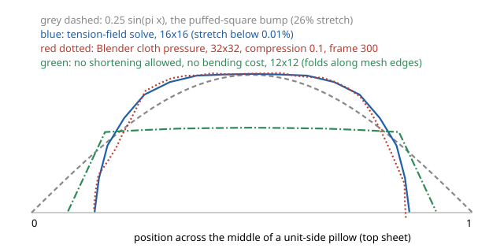
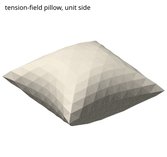
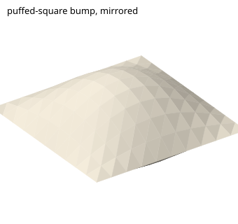
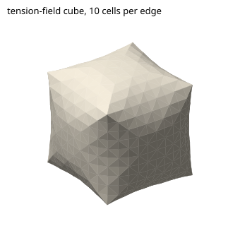
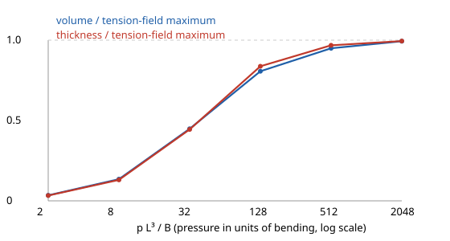

# H4. Inflation and opening: water bomb, crane body, wing spread

Research slice H4, written 2026-09-28 against `main` at `83fc960` (clean tree
apart from `.claude/`). Nothing under the repository was modified. Every
experiment below was run in the scratch directory
`scripts/H4-inflation/` with the scripts named beside each result; they are
small, self-contained, and use only NumPy (the copy bundled with Blender 4.4.1)
or Blender itself. Earlier research is cited by slice and finding number:
**G** is `PRDs/research/G-realistic-rendering-and-simulation.md`.

> **Verification, 2026-09-28.** [V](V-verification.md) re-checked this note.
> Correction: Cerda & Mahadevan's prefactor is 2√π, not √(2π), so finding 8's
> wrinkle wavelengths are **2.0–6.5 cm**, not 1.4–4.6 cm; the conclusion that
> they are as long as the model gets stronger. Kepert's 0.217 is a heuristic
> bound resting on two unproved assumptions; the only rigorous ceiling is 0.266.
> This note's paper (0.1 mm, 3 GPa, ν 0.3) gives twice the bending stiffness of
> [H2](H2-sheet-mechanics.md)'s kami; [PRD 11](../11-prd-refined-final-forms.md)
> uses kami at 72 µm and reports in the puff amount p̂, which does not change
> any conclusion. Finding 17 was tested on a pillow and a cube only;
> [Y4](Y4-crane-v2.md) tests it on the crane.

## Summary

Paper that is blown up or pulled open behaves, to a very good approximation,
like a sheet that **cannot stretch but can shorten for free**. Shortening
shows up as wrinkles, crimps or small extra folds, and to the eye the
shortening is what makes a pillow look like a pillow. Engineers call this
*tension-field theory*: the sheet carries pull in the directions where it is
taut and nothing in the directions where it is slack. With that one rule, the
classic shapes come out right:

- The circular Mylar balloon (W. H. Paulsen 1994): rim pulls in by 23.7%, thickness
  0.599 of its diameter, 8.6% of the material taken up by crimps.
- The square "tea-bag" pillow: volume about 0.20 × side³, thickness 0.50 ×
  side, each side's midpoint drawn in by 0.14 × side, a flat top and steep
  walls. No closed form exists; our 8/12/16-cell solves give 0.1953 / 0.1992 /
  0.2006 × side³, rising toward Robin's estimate 0.2017 and Kepert's
  construction 0.2055 (upper bound 0.217). Blender's cloth pressure gives
  0.1997 on a 32 × 32 mesh.

The material study cannot produce these shapes as written, for a structural
reason rather than a numerical one. Its length term penalises shortening
exactly as hard as stretching (`FoldRelaxation.hs:703-710`, residual
`distance - rest`). An experiment with the same rule gives a boxy pillow whose
shape is set by where the mesh edges are (0.172 × side³, folds on mesh lines),
or, with a little bending cost, less than half the volume (Blender: 0.094).
The whole-crane sketches therefore *prescribe* the puff, and prescribing it
by moving vertices is what stretches the paper: the pillow-target sketch
reaches +152% local stretch (`docs/notes/crane-pillow-target.md`), and even the
existing `examples/puffed-square.fold` bump stretches it by up to 26.4%.

The recommendations, in order:

1. **Replace symmetric length springs by one-sided principal-stretch rows**
   for any region that is allowed to puff (M). The study already computes
   principal stretches (`FoldRelaxation.hs:201-222`); the residual becomes
   `max(0, λ − 1)`, the same shape as the existing contact rows (`:668`).
2. **Drive the opening with an enclosed volume, measured through a virtual cap
   over the pocket's mouth**, as one extra least-squares row (S–M). A follower
   pressure on an *open* sheet is not the gradient of anything (measured
   Jacobian asymmetry 0.82) and does not fit the study's Gauss–Newton solver;
   a volume row does, and its multiplier *is* the pressure.
3. **Measure the "amount of puff" in units of bending**, `p̂ = p·L³/B`, not as a
   percentage: with no bending, pressure does not change the shape at all.
4. **Keep grips for the crane.** References show the crane body opening
   mainly by pulling the wings down and out, with blowing as a fallback. Use
   grips plus a small cavity volume target, stepped through a continuation,
   never a prescribed body sketch.
5. **Use Blender cloth pressure as a one-day visual prototype** (running it is
   not vendoring, D17), then check its output with our own strain and
   crossing measures, because a single frame of a dynamic simulation can be
   anywhere between 0.29 and 0.83 thick before it settles.
6. **Draw the compression field.** Where the tension-field solve says paper is
   slack, a book draws a few crimp strokes. For paper at hand scale the
   wrinkle wavelength (1.4–4.6 cm) is as large as the model, so these are a
   few folds, not a texture.

What "refined" means on this axis, measurably: every triangle's largest
principal stretch below 0.1%, volume and thickness within a few percent of the
tension-field answer for the same outline, results stable under mesh
refinement, and a silhouette from every camera, which a closed pillow has and
a one-sheet bump does not (84 silhouette edges versus 0 from `--view iso`).

## Terms used here

- **Inextensible**: cannot be stretched. Paper at the pressures a mouth
  produces strains by 10⁻⁶ to 10⁻⁴ (finding 8), so for drawing purposes it is
  inextensible.
- **Principal stretches** `λ₁ ≥ λ₂`: take a tiny circle drawn on the flat
  sheet; after deformation it is an ellipse, and its two semi-axes divided by
  the circle's radius are `λ₁` and `λ₂`. `λ = 1` means unchanged, `λ > 1`
  stretched, `λ < 1` shortened. An edge only measures one direction, which is
  why edge errors can miss stretch (finding 5).
- **Tension field (slack, wrinkled, taut)**: a region is *taut* if both
  stretches are 1, *wrinkled* if one direction is taut and the other has
  shortened (`λ₂ < 1`), and *slack* if both have shortened. A tension-field
  model charges energy only for `λ > 1`.
- **Follower load**: a force that turns with the surface. Pressure pushes
  along the current normal, so as the paper tilts, the push tilts with it.
- **Divergence theorem volume**: the volume inside a closed triangle mesh is
  `V = (1/6) Σ x₀ · (x₁ × x₂)` over its triangles, all wound outward. Its
  derivative with respect to a vertex is one third of the area-weighted
  normals of the triangles around it, which is exactly the pressure force per
  unit pressure. That identity is why pressure and volume are two views of one
  thing, *for a closed surface*.
- **Cavity, mouth, cap**: the cavity is the air inside a pocket; the mouth is
  the loop of paper edge through which it is open; a cap is a surface we
  invent to close the mouth for arithmetic. A cap is not paper.
- **Grip**: a set of material vertices whose positions the author prescribes
  (the study's pinned vertices, `relaxPinnedHinges`, `FoldRelaxation.hs:255`).
- The origami words (crease, mountain, valley, flap, pocket, waterbomb) are in
  `docs/glossary.md`.

## Findings

### A. What an inflated inextensible sheet looks like, in numbers

1. **The Mylar balloon has an exact answer, and it says the outline pulls
   in.** Two discs of radius `a` sealed at the rim inflate to a surface of
   revolution that maximises volume for a fixed profile length (W. H. Paulsen,
   Amer. Math. Monthly 101 (1994) 953–958; not read here, known through the
   two sources below). The fetched Wikipedia page gives the profile length
   `a = k₁ r` and axis thickness `τ = 2 k₂ r`, with `k₁ = 1.3110287771` and
   `k₂ = 0.5990701173` (the lemniscate constants; the page calls them A and
   B), plus `V = (2/3)π a r²` and `S = π² r²`. `mylar.py` gives, for `a = 1`:

   | Quantity | Value |
   | --- | ---: |
   | Rim radius `r` | 0.7628 (the rim pulls in 23.7%) |
   | Thickness on the axis | 0.9139, i.e. 0.599 of the inflated diameter |
   | Volume | 1.2185 |
   | Inflated area / flat area | 0.9139 (8.6% taken up by crimps) |
   | Volume / sphere of the same area | 0.8228 |

   Wikipedia attributes the missing area to crimping that increases toward
   the rim. [fetched] https://en.wikipedia.org/wiki/Mylar_balloon_(geometry);
   [ran] `python3 mylar.py`. The same problem is Eq. 6 of J. D. Paulsen's
   review, which notes the curve also describes the shortest air-supported
   dome meeting the ground at right angles [paper, fetched] (Paulsen J. D.,
   *Wrapping liquids, solids, and gases in thin sheets*, Annu. Rev. Condens.
   Matter Phys. 10 (2019), arXiv:1804.07425, §6.1).

2. **The square pillow has no closed form; its numbers are bounds and
   computations.**
   - Robin's approximate formula gives 0.19 × side³ for a square, his fuller
     formula 0.2017; Kepert's construction gives 0.2055 and his upper bound is
     0.217. The Wikipedia page cites Robin (Mathematics Today, June 2004) and
     marks Kepert's numbers "citation needed". [fetched]
     https://en.wikipedia.org/wiki/Paper_bag_problem
   - Deakin (2009) writes down the three coupled PDEs for a filled
     inextensible membrane and states no general solutions are known.
     [paper, fetched] Deakin M. A. B., *The filled inelastic membrane*, Bull.
     Aust. Math. Soc. 80 (2009) 506–509, doi:10.1017/S0004972709000549.
   - Our own tension-field solve (`pillow.py`: per-triangle energy
     `A₀·k·Σ max(0, λᵢ − 1)²` minus `p·V`, L-BFGS, stiffness stepped
     10² → 10³ → 10⁴), unit side, `p = 1`:

   | Cells per side | Volume / side³ | Thickness / side | Side midpoint drawn in | Max `λ₁ − 1` | Area / flat area |
   | ---: | ---: | ---: | ---: | ---: | ---: |
   | 8 | 0.1953 | 0.4975 | 0.137 | < 10⁻⁴ | 0.960 |
   | 12 | 0.1992 | 0.5011 | 0.142 | < 10⁻⁴ | 0.963 |
   | 16 | 0.2006 | 0.5014 | 0.143 | 1.0 × 10⁻⁴ | 0.963 |

   [ran] `python3.11 pillow.py square {8,12,16} tfield` (Blender's bundled
   Python). Every stage stopped at its 4000-iteration limit rather than the
   `1e-9` gradient test, so these are approximate minima; the volume rises
   monotonically with refinement toward the published range, which is the
   check that matters. The same code on a disc (finding 1's balloon) gives
   rim 0.7612, thickness 0.9132 and volume 1.2063 on 12 rings, against 0.7628,
   0.9139 and 1.2162 (the exact volume times the 72-sided rim polygon's area
   ratio to the power 3/2, a rough correction for the mesh's smaller disc):
   within 1% on every quantity. [ran] `pillow.py disc 12 tfield`.

   **One defect, and it matters for the study.** Checking every pair of
   triangles that share no vertex, the pillows (tension-field 16-cell,
   symmetric and edge-only 12-cell) and the cube of finding 7 have no
   crossing pairs, but the 12-ring disc has 30, all in its outermost ring
   (rest radius 0.944–0.971), where the rim is shortened by 24%; the 8-ring
   disc has none. [ran] `crossings.py`, `disccheck.py`. Where the sheet is
   slack, a tension-field energy with no bending says nothing about the
   shape, and a fine mesh crumples there until it passes through itself. A
   small bending term (finding 9) or contact is needed in exactly the places
   where the paper wrinkles.

   The shape, across the middle of the top sheet (figure
   `scripts/H4-inflation/profiles.svg`): flat on top at a half-thickness of 0.25,
   near-vertical walls, the seam drawn in to 0.143 from each side. Corners
   stay pointed and lie in the seam plane; the corner-to-corner diagonal
   shrinks from 1.414 to 1.289.

   

3. **Tension-field theory is the standard model for this regime, and it
   predicts where wrinkles go.**
   - Siéfert, Bico, Reyssat & Roman define the regime as
     `E t³/L³ ≪ p ≪ E t/L`: pressure far above what bending can resist, far
     below what stretches the sheet. There the sheet is "quasi-inextensible
     but infinitely bendable", compression costs nothing, and wrinkles are
     decoration. Their experiments inflate heat-sealed sheets at about 0.1 bar
     and match tension-field predictions. Inflation *increases* the curvature
     of a curved outline, which is why a "9"-shaped balloon closes on itself.
     Wrinkles appear where the sheet is in compression and are absent in
     bands under tension along the seam. [paper, fetched] *Geometry and
     mechanics of inextensible curvilinear balloons*, JMPS 143 (2020) 104068,
     https://blog.espci.fr/benoitroman/files/2020/09/siefert20.pdf, §1–2.
   - Skouras et al. build a design tool on the same idea: a relaxed energy
     that is zero when both stretches are below one, uses the energetically
     optimal compressive stretch when one is, and the full energy otherwise.
     It is convex but only C¹, so they smooth the transitions. Pressure forces
     are `Σ (1/3) p Aₑ nₑ`, and the shape solves internal force plus pressure
     force equal zero. Their full (non-relaxed) model on ≈59k elements took
     more than two hours; the relaxed one took 4.5 s, 77 s and 157 s on ≈3k,
     ≈15k and ≈59k elements, and they report coarse meshes are already
     satisfactory. [paper, fetched] Skouras, Thomaszewski, Kaufmann, Garg,
     Bickel, Grinspun, Gross, *Designing inflatable structures*, ACM TOG 33(4)
     (SIGGRAPH 2014), https://cgl.ethz.ch/publications/papers/paperSko14a.php
     (PDF read), §4.1–4.3, §6.
   - The theory's origins (Pipkin 1986; Steigmann 1990; Mansfield 1969) are
     cited by both papers; not read here.

4. **If shortening costs as much as stretching, the pillow comes out wrong,
   and it comes out wrong in a mesh-dependent way.** Same square, same code,
   stretch energy `(λ − 1)²` both ways and no bending cost: volume 0.1719,
   thickness 0.308, side drawn in 0.083, principal stretches within
   0.9998–1.0002 everywhere, area ratio 1.000. The profile (green in the
   figure) is a box: a flat lid at 0.154 and a sharp drop. The paper has
   gained volume by folding along *mesh edges*, which cost nothing here.
   [ran] `pillow.py square 12 sym`. This is not an artefact of our code; it is
   a theorem. Any polyhedral surface can be deformed without stretching into
   one of larger volume by adding folds, and when the start is convex the
   result is not:
   J. D. Paulsen's review summarises Pak's +18.2% for a cube, Bleecker's
   +21.9% and Buchin & Schulz's +25.7%, with Alexandrov's theorem for the
   non-convexity [paper, fetched] (arXiv:1804.07425, §6.2; Pak, *Inflating
   the cube without stretching*, arXiv:math/0607754, abstract fetched). With
   a real bending cost those free folds are no longer free. Blender with
   compression stiffness equal to tension stiffness (200) and bending 0.05
   reaches only 0.094 × side³ and 0.15 thickness; with compression stiffness
   0.1 it reaches 0.1995 and 0.478. [ran] `Blender -b --python
   blender_pillow.py -- 16 200 {200,0.1} 2 100 …`.

   **The study's length rows are of the symmetric kind.** `edgeRow` returns
   the residual `distance - rest` (`FoldRelaxation.hs:703-710`) and the line
   search charges `d * d` (`:674`). [code] With panel bending on, the solve
   is in the Blender-0.094 situation; with it weak, it is in the mesh-fold
   situation. Neither is a pillow. [reasoned from the two runs above; the
   study's own solver was not run on a pillow]

5. **One-sided *edge* springs are not enough: stretch hides between edges.**
   With springs that only resist lengthening, the 12-cell pillow reaches
   0.1999 and 0.504 thick, and every edge is within `2.6 × 10⁻⁶` of its rest
   length, yet some triangle stretches by 0.85% in a direction that is not an
   edge. [ran] `pillow.py square 12 edge1`. The mechanism is elementary:
   take a right triangle with legs along x and y and apply the deformation
   matrix `[[0.75, 0.65], [0.65, 0.75]]`. Both legs shorten to 0.99 of their
   length and the hypotenuse to 0.1 of its length, so no edge has lengthened,
   yet the direction (1, 1) is stretched by 40% and the triangle keeps 14% of
   its area [reasoned; arithmetic in the matrix]. The study's own
   whole-crane note already observes that local stretch can exceed every edge
   error (`docs/notes/whole-crane-candidate.md`, "Local stretch measures the
   most stretched direction inside a triangle"). So the tension-field rows
   must be per triangle, on principal stretches, which `principalStrains`
   already computes (`FoldRelaxation.hs:201-222`). [code]

6. **The puffed-square fixture is a stretched dome, and a pillow would draw
   better.** `examples/puffed-square.fold` lifts a flat grid by
   `0.25 sin(πx) sin(πy)` with `x, y` unchanged. Using `x, y` as material
   coordinates, its largest principal stretch is 1.2642 and its area 14.07%
   larger than the sheet. [ran] `puffstretch.py`. The tension-field pillow
   happens to reach the same half-thickness, 0.25, but by drawing its sides
   in by 14%, with no triangle stretched by more than 0.01%. Seen along the
   repository's iso direction `(−1, 1, −1)` (`src/Senbazuru/Render/Camera.hs:135-136`),
   the fixture has 0 faces turned away and so 0 silhouette edges (as PRD 08
   and decisions §10 item 27 record), while the closed 16-cell pillow has 512
   faces turned away and 84 silhouette-candidate edges. [ran] `silhouette.py`.
   A closed pocket has an outline from every camera; a one-sheet bump does
   not. This is a second reason, besides the stretch, why the #104 iso bullet
   could not be met on the current fixture.

   
   

7. **A closed cube inflates into a pillowed box with pinched edges.** No
   study of an inflating waterbomb was found (Sources), and the flat-folded
   waterbomb does not exist as a fixture, so the nearest cheap stand-in is a
   closed unit cube of the same tension-field sheet, inflated with no bending
   (`cube.py`: six 1 × 1 faces, shared edges, same energy and solver as the
   pillow). Distances are from the centre:

   | Cells per edge | Volume | Face centre | Edge midpoint | Corner | Most shortened direction |
   | ---: | ---: | ---: | ---: | ---: | ---: |
   | flat cube | 1 | 0.500 | 0.707 | 0.866 | – |
   | 6 | 1.2423 | 0.607 | 0.650 | 0.848 | 2.1% |
   | 10 | 1.2535 | 0.607 | 0.651 | 0.850 | 3.3% |

   Largest stretch below 0.01% in both. [ran] `python3.11 cube.py {6,10}`;
   figure `scripts/H4-inflation/cube-tension-field-10.svg`. Faces bulge out by 21%
   of the half-width, edge midpoints are drawn in by 8%, corners by 2%: a
   rounded box whose edges look pinched and whose corners stay sharp. The
   volume gain, 25.4% at 10 cells and still rising, is the size of the
   no-stretch constructions J. D. Paulsen's review lists (Pak +18.2%,
   Bleecker +21.9%, Buchin & Schulz +25.7%; finding 4), and the review adds
   that a Mylar cube wrinkles perpendicular to its edges. Ours agrees: all
   336 triangles shortened by more than 1% lie within a quarter of a face of
   an edge (mean distance 0.10 against 0.167 for all triangles), and the
   shortening runs along the edge (mean |cos| 0.978), so wrinkles would
   cross the edge [ran] `cubecheck.py`. Whether a real waterbomb looks like this depends on how
   hard it is blown (finding 9) and on its creases: the British Origami
   Society's page says the inflated waterbomb may be left rounded like a
   ball or creased by hand into a cube [fetched]
   https://www.britishorigami.org/cp-lister-list/waterbombs/. So the
   "cube" look is partly hand shaping, as with the crane's X base
   (finding 15). [reasoned for the comparison]

   

### B. Paper at hand scale sits between two regimes

8. **Paper does not stretch visibly at any pressure a mouth makes, and its
   bending is not negligible either.** `regime.py`, with Kent paper's
   measured `E` of 2.45–3.27 GPa (Isobe & Okumura, Sci. Rep. 6 (2016) 24758,
   PMC4846813, [fetched]; taken as 3 GPa), thickness 0.1 mm (the repository's
   figure, `docs/notes/a-crease-is-a-hinge.md`), Poisson's ratio 0.3
   (assumed):

   | Quantity | Value |
   | --- | ---: |
   | Bending stiffness `B = E t³ / 12(1 − ν²)` | 2.7 × 10⁻⁴ N·m |
   | Bending scale `E t³/L³`, L = 4 / 3 / 2 cm | 47 / 111 / 375 Pa |
   | Stretching scale `E t/L`, same L | 7.5 / 10 / 15 MPa |
   | Maximal expiratory mouth pressure, mean women / men | 13.9 / 19.1 kPa |
   | Membrane strain at 0.1 / 1 / 10 kPa, pocket radius 2 cm | 3.3 × 10⁻⁶ / 3.3 × 10⁻⁵ / 3.3 × 10⁻⁴ |
   | Wrinkle wavelength at the same pressures | 4.6 / 2.6 / 1.4 cm |

   Mouth pressures: Lista-Paz et al., Arch. Bronconeumol. 59 (2023) 813–820,
   142 ± 31 and 195 ± 46 cmH₂O [fetched]. Wrinkle wavelength: Cerda &
   Mahadevan's stretched-sheet law `λ = √(2π) (B/T)^{1/4} L^{1/2}`, eq. 5,
   with `T = pR/2` and `L = 2 cm` [paper, fetched] (*Geometry and physics of
   wrinkling*, PRL 90 (2003) 074302). [ran] `python3 regime.py`.

   Three consequences, all [reasoned] from the table:
   - Any stretch visible in a drawing is an error by orders of magnitude. The
     repository's 0.1% local-strain screen
     (`docs/notes/illustration-material-priority.md`) is already generous;
     the current whole-crane sketch's +152% is not a material state.
   - A gentle puff is within a factor of ten or so of the bending scale.
     Inflated paper is therefore *not* fully in the tension-field regime: the
     tension-field pillow is the limit a hard blow approaches, and a crease's
     own stiffness and rest angle still shape the result. That is why a
     waterbomb keeps flat-ish faces and visible edges instead of becoming a
     Mylar pillow.
   - The wrinkle wavelength is as long as the model. Paper does not show a
     fine wrinkle texture when inflated; it absorbs the shortening in a few
     crimps, in existing creases, or in sharp ridges. A drawing should show a
     handful of strokes, not a hatch.

9. **The amount of puff is set by pressure in units of bending.** Same
   8-cell pillow and tension-field rows, plus a quadratic bending energy
   `k_b Σ |(L x)ᵢ|² / Aᵢ` (the cotangent Laplacian of each flat sheet, at its
   interior vertices, so the seam may kink), pressure fixed at 1 and `k_b`
   varied. For small slopes this energy is `k_b ∫ (Δz)²`, and a plate's is
   `(B/2) ∫ (Δz)²`, so `p L³/B ≈ p / (2 k_b)` on a unit side [reasoned].

   | `p L³/B` | Volume / side³ | Fraction of the no-bending maximum | Thickness / side |
   | ---: | ---: | ---: | ---: |
   | 2 | 0.0067 | 0.03 | 0.017 |
   | 8 | 0.0264 | 0.14 | 0.065 |
   | 32 | 0.0876 | 0.45 | 0.221 |
   | 128 | 0.1575 | 0.81 | 0.417 |
   | 512 | 0.1855 | 0.95 | 0.482 |
   | 2048 | 0.1940 | 0.99 | 0.495 |
   | no bending | 0.1953 | 1 | 0.498 |

   Largest principal stretch below 0.004% in every run. [ran]
   `python3.11 sweep.py 8 <ratio>` for ratios 4…4096 (`sweep_r*.txt`); plot
   `scripts/H4-inflation/sweep.svg`. Volume grows in proportion to `p̂ = pL³/B` up to
   about 10, reaches half the maximum near 40 and 95% near 500.

   

   Put paper into it [reasoned, from finding 8]: for a 3 cm pocket,
   `B/L³ ≈ 10 Pa`, so half-puffed is about 400 Pa and 95% about 5 kPa, both
   well within a mouth's 14–19 kPa. A crane body or waterbomb can therefore
   be anywhere on this curve depending on how hard it is blown, which is the
   argument for `p̂` (or the volume fraction) as the author's knob. Caveats:
   the quadratic bending model is exact only for small slopes and also
   charges some in-plane shortening; creases and their rest angles, which
   resist re-opening a pressed fold, are absent; every stage stopped at its
   iteration limit.

### C. How pressure enters a simulation

10. **Pressure is the gradient of `p·V` only when the surface is closed.**
    For a closed mesh, the per-vertex pressure force `Σ (1/3) p A n` equals
    `p ∂V/∂x`, so pressure has a potential energy `−pV` and its stiffness
    matrix is symmetric. For an open sheet neither holds. On a 4 × 4 test
    pillow with random noise, the finite-difference Jacobian of the pressure
    force has relative asymmetry `‖J − Jᵀ‖/‖J‖ = 7.8 × 10⁻¹¹` closed and
    `0.82` with one sheet removed; translating the open sheet by
    `(0.3, −0.2, 0.7)` changes its divergence-theorem "volume" by 0.249,
    against `6 × 10⁻¹⁷` closed. [ran] `jac.py`. The structural-mechanics
    literature treats the same point: Schweizerhof & Ramm (1984) classify
    displacement-dependent pressure loads, and Rumpel & Schweizerhof (2003)
    describe gas-volume-dependent pressure as a rank-one update per enclosed
    volume (Computers & Structures, 1984; Int. J. Numer. Methods Eng., 2003).
    Only titles and a search snippet were seen; the abstracts could not be
    fetched (UNVERIFIED).

11. **Three load models, and what each asks of the author.**

    | Model | What the author gives | What it does | Where seen |
    | --- | --- | --- | --- |
    | Prescribed pressure | `p` | Follower force `p·A·n/3` per vertex; potential `−pV` when closed | Skouras eq. 6 [paper]; Blender `uniform_pressure_force` [ran] |
    | Gas law | Rest volume `V₀` and a pressure scale | Pressure rises as volume falls, `p ∝ V₀/V − 1` | Matyka & Ollila 2004, arXiv:physics/0407003 (abstract fetched); Blender `SIM_mass_spring.cc:627-651` [code, GPL, read only] |
    | Prescribed volume | `V*` | A constraint `V = V*`; its multiplier is the pressure | Paper-bag problem framing (finding 2); [reasoned] |

    Blender's own descriptions, read from its RNA in 4.4.1: pressure
    "simulate[s] pressure inside a closed cloth mesh"; `target_volume` is "the
    mesh volume where the inner/outer pressure will be the same" and zero
    disables the volume feedback; `pressure_factor` is an ambient pressure in
    kPa; a pressure vertex group excludes zero-weight faces from both the
    pressure and the volume sum. [ran] `Blender -b --python rna.py`.

    Two facts matter for choosing, both [reasoned] and consistent with the
    runs above:
    - **In the tension-field limit, pressure does not change the shape.**
      Doubling `p` doubles the membrane tension and the (tiny) strain; the
      maximal-volume shape is the same. A "puff amount" slider driven by `p`
      alone does nothing until bending is in the model, and then the right
      knob is `p̂ = p L³ / B` (finding 9).
    - **A prescribed volume below the maximum does not pick a shape** unless
      bending is present. Without bending, every no-stretch shape of that
      volume has zero energy. A volume target is the right *driver* for a
      static solve, but only together with bending (and crease) energy.

12. **The study's solver is least squares, which fits a volume row and does
    not fit `−pV`.** Every term the study minimises is a sum of squared
    residuals, assembled as rows `(gradient, residual)` and solved by
    conjugate gradients on `JᵀJ` with damping (`FoldRelaxation.hs:626-677`).
    `−pV` is unbounded below and not a square, so it cannot be a row.
    `√w (V − V*)` can: its gradient is the dense vector `√w ∂V/∂x`, one row
    touching every cavity vertex. The operator form the solver already uses
    (`action values = foldl' addRow …`, `:644-645`) applies such a row in
    O(n) per product. The optional sparse factor (`Sparse.factorNormal`,
    `:661`) would densify if the row were added to it; keep it out of the
    factor and let CG handle it (a rank-one correction). [code] +
    [reasoned]. A one-sided tension-field row `√(A k) max(0, λᵢ − 1)` has
    exactly the shape of the existing contact rows, which are included only
    while `contactGap row < 0` (`:668`). [code]

13. **A pocket with an opening needs its mouth named, then a cap that is not
    paper.** The crane's body is open underneath; the pocket map found that
    four boundary midpoints of the sheet meet there and explicitly declined to
    call that a mouth or to cap it (`docs/notes/crane-pocket-map.md`, "Four
    distinct midpoints…"). Issue #106 step 4 says a computational cap used to
    measure volume must not become fictitious paper or weld the opening (read
    with `gh issue view 106`). The options, [reasoned]:
    - **Virtual cap (recommended).** Name the mouth as a loop of paper-boundary
      edges. Close it with a fan of triangles from the loop's centroid, whose
      position is a function of the loop's vertices. The cavity plus cap is
      closed, so `V` is well defined, translation-invariant, and conservative
      (finding 10). The cap carries no material, is never drawn, is excluded
      from length, bending and crossing checks, and is not written to FOLD.
      The centroid makes the cap's share of pressure pull on the mouth
      vertices, which is the one fictitious force; it is small when the mouth
      is small, and the gallery should report the mouth's area beside the
      body's.
    - **Pressure on cavity faces only.** Blender's vertex-group route. Not
      conservative (finding 10), so it needs a force-based dynamic solver and
      cannot go in the study's least-squares solve.
    - **No pressure: grips only, with a one-sided volume floor** `V ≥ V*`,
      i.e. the row `√w · max(0, V* − V)`. It only pushes when the pocket is
      flatter than the author asked, and otherwise leaves the grips in charge.

14. **Blender cloth pressure reproduces the pillow in seconds, but one frame
    is not an equilibrium.** On the 16 × 16 pillow, tension stiffness 1000,
    compression 0.1, bending 0.05, pressure 2, 100 frames: volume 0.2000,
    thickness 0.487, side drawn in 0.130, largest edge stretch 0.38%, about
    18 s wall time. On 32 × 32 over 300 frames the volume stays within
    0.194–0.200 from frame 150 on, but the thickness swings 0.83 → 0.29 →
    0.58 → 0.44 before ending at 0.505 (side drawn in 0.137), because the
    dynamic solve breathes. Blender's outputs were not checked for crossings.
    [ran] `blender_pillow.py -- 32 1000 0.1 2 300 stiff32long`, about 2 min.
    Consequences, [reasoned]: a Blender prototype must declare a settle test
    (for example thickness and volume each changing less than 0.5% over 50
    frames) before a frame is used, and its geometry must pass our own
    principal-stretch and crossing measures, because Blender's limit is on
    spring forces, not on the 0.1% screen. The related-projects page's
    estimate, "an afternoon rather than a week", holds for the solve; the
    time goes into building the input mesh with its layers and grips.
    Licensing: Blender is GPL (listed as GPL-2.0 in
    `docs/related-projects.md`; GitHub reports `NOASSERTION`); D17 says
    running it is not vendoring. Its source was read for the pressure formula
    only.

### D. Opening by hand: crane body and wing spread

15. **The references open the crane by pulling; blowing is the fallback.**
    Tinygami: thumbs on the wings against the body, pull down and outward,
    the body fills like a pillow; then pinch the wing bases to make an
    X-shaped stand, which creates new creases along the wings, then smooth
    the wings. It also warns that some papers crush rather than re-fold
    [fetched] https://tinygami.wordpress.com/2016/02/10/how-to-open-an-origami-crane/.
    Spitznagel: pull the wings straight out; if that fails, blow through the
    hole underneath [fetched] https://www.cs.cmu.edu/~sprite/Origami/crane_gif.html.
    No mechanics paper on opening a crane or inflating a waterbomb was found
    in four searches (queries recorded under Sources). This agrees with
    `docs/notes/opening-a-crane.md` and adds one point [reasoned]: the "X"
    base and the wing smoothing are *plastic* changes, new creases and changed
    rest angles, not elastic responses. A pose like the owner's "More tucked"
    may be reachable only with rest-angle changes that no grip produces.

16. **Wing spreading is a displacement-controlled path; snap-through is where
    it can fail.** The study's grips are exact positions removed from the
    linear solve (`FoldRelaxation.hs:48-52`, `relaxPinnedHinges` at `:255`),
    which is displacement control. Displacement control passes load maxima
    that load control cannot, but not a snap-back (a jump in position at a
    fixed grip). Arc-length methods treat the load factor as an unknown and
    constrain the step in combined load–displacement space, and so pass both
    [fetched summary of Crisfield 1981 and Fafard & Massicotte 1993,
    https://www.mathworks.com/matlabcentral/mlc-downloads/downloads/submissions/44352/versions/5/previews/ARC_LENGTH/html/arc_length_Crisfield_example.html].
    For an illustration, a failed continuation step followed by a distant
    converged state is itself the information: the model pops (a waterbomb
    does), and a book draws the before and after. [reasoned]

17. **Pressure separates the cavity walls in the direction contact needs.**
    The study spent many PRs trying to build an intersection-free *start*
    for the body (`docs/notes/body-barrier-comparison.md`). In the pillow and
    cube runs here, a starting bump of 1–2% of the side and a pressure load
    produced separated walls with no crossing triangle pairs (finding 2),
    because each wall's pressure force points away from the cavity along its
    own normal [ran, reasoned]. The exception is the fine disc's rim, which
    crumpled through itself where the paper was slack. For the crane this helps only the
    cavity walls: flaps outside the cavity (wings, neck and tail roots) still
    need the contact treatment of G finding 13. So G's "thickness comes before
    general contact" still holds for the stack, but a small cavity volume
    target is a cheaper first separator for the body than a hand-built
    initial guess. [reasoned; untested on the crane]

18. **Where this goes beyond G.** G's model ladder (findings 6–13) covers
    rigid panels, fillets, thick panels, bar-and-hinge, Origami Simulator,
    discrete shells, elastic folds and IPC, but no load model for a pocket
    and no constitutive rule for compression; a search of G for "pressure",
    "inflat" and "balloon" finds nothing beyond `KHR_materials_volume` and
    #104. This note adds the missing two: tension-field membranes (findings
    3–5) and a pressure/volume load with a cap (findings 10–13). It agrees
    with G finding 11 that the study is already in the discrete-shells family
    and needs a calibrated `k_B`; finding 8 here says which ratio the
    calibration has to get right for inflation (`p L³/B`).

## Implications for senbazuru

### The minimal model per target

| Target | Minimal model that gives a plausible final shape | What the author gives | What to compare with a photograph |
| --- | --- | --- | --- |
| Puffed square (#104 fixture) | Two sheets sharing the boundary; tension-field rows; volume target at its maximum (or any large `p̂`); no contact needed | Nothing but the outline: the maximum-volume shape is unique | Thickness / side ≈ 0.50, side draw-in ≈ 0.14, flat top, pointed corners (finding 2); no photograph needed, the numbers are the benchmark |
| Waterbomb, blown | The flat-folded model; tension-field panels, crease hinges with rest angles, bending with a stated `B`; cavity with the blow hole as mouth and a virtual cap; `p̂` swept upward; tucked flaps held by layer relations | `p̂` (or `V*/V_max`), the mouth loop, which flaps are tucked where | Face bulge / edge, edge draw-in, corner draw-in, overall height / width, hole diameter; the traditional description allows a ball or a hand-creased cube (British Origami Society page), so declare which |
| Crane, opened with spread wings | The flat crane; two wing grips near the roots moved down and outward in continuation steps; tension-field rows on the body core; crease rest angles; an optional cavity floor `V ≥ V*` over the underside mouth; contact between layers | Grip locations and path, which creases may change angle, `V*` if any, any declared rest-angle changes at the wing roots | Body height / width / length, wing droop, wing-tip separation / body length, underside opening, neck and tail angles; body thickness against the tension-field puff budget |

Each item below says what changes, where, what it costs and how we would
know.

1. **Tension-field rows in the study solver (M).** In `FoldRelaxation`,
   add a per-triangle residual pair `√(A₀ k) · max(0, λᵢ − 1)` using the
   principal stretches `principalStrains` already returns, behind a typed
   policy (say `LengthModel = Symmetric | TensionField`) chosen per region, so
   the wings and neck keep today's symmetric rows. Derivative:
   `∂λᵢ/∂F = F nᵢ nᵢᵀ / λᵢ` where `nᵢ` is the principal direction on the flat
   sheet, then the usual chain to the three corners (`pillow.py`,
   `energy_grad`). Smooth the kink at `λ = 1` as Skouras does if the line
   search stalls. Keep the existing panel bending on in tension-field regions
   and keep the crossing check: without them a fine mesh crumples through
   itself where the paper is slack (finding 2, the disc rim). *Done when*:
   the pillow and Mylar benchmarks (item 3) pass with zero crossing pairs.

2. **A cavity volume row with a virtual cap (S–M).** A `Cavity` record: the
   material faces that bound the air, the mouth loop, and a target `V*` or a
   floor. Build the cap fan from the loop centroid at each evaluation, never
   store it. Add the row `√w (V − V*)` (or `√w max(0, V* − V)`) outside the
   sparse factor. Report the implied pressure `−2w(V − V*)` so a reader can
   see how hard the target is pushing. *Done when*: on the pillow, with panel
   bending on (without it a partial volume does not pick a shape, finding
   11), raising `V*` from 0.05 to 0.20 walks the thickness up monotonically
   with `λ₁ − 1 < 10⁻³` and zero crossing pairs, and asking for 0.25 fails
   loudly (above the 0.217 bound).

3. **Benchmarks as tests (S).** Two study fixtures generated by our own code:
   the square pillow and the Mylar disc. Assertions with a named failure each
   (per the "tests that cannot fail" rule): volume within 2% of the 16-cell
   value (0.2006) and inside Kepert's bounds on refinement; thickness
   0.50 ± 0.02; side drawn in 0.143 ± 0.01; Mylar rim 0.7628 and thickness
   0.9139 within 1%. Each fails if the rows revert to symmetric (finding 4
   gives the wrong numbers: 0.172, 0.308, 0.083).

4. **A pillow fixture beside `puffed-square.fold`, not instead of it (S, after
   1–3).** `puffed-square.fold` draws `docs/img/puffed-square.svg`
   (`docs/img/README.md:20`) and is the input of PRD 08's proposed A-17
   golden; it is not in `test/golden/` today (listed). Replacing it would
   change a documented picture and a planned acceptance. Add
   `examples/puffed-pillow.fold`: two layers sharing the boundary, generated by
   the tension-field solve, interior edges `F`. It gives #104 a surface with a
   silhouette from `--view iso` (84 candidates), and it is the right outline
   for the "region and amount" operation in `the-puff-is-a-drawing.md`.

5. **The amount control is `p̂` or `V*/V_max`, never a percentage of a bump
   (S, documentation).** Update `the-puff-is-a-drawing.md` and #106 to say the
   amount is either a dimensionless pressure `p L³/B` with bending on, or a
   volume as a fraction of the tension-field maximum for that outline. Both
   have a physical meaning and a ceiling.

6. **Crane: grips first, cavity second, continuation always (L).** From the
   *flat* crane, not from a sketch: two grips near the wing roots (Tinygami's
   thumbs), moved down and outward in steps; body panels on tension-field
   rows; creases with their rest angles; a cavity floor `V ≥ V*` with the
   mouth loop named from the four midpoints the pocket map found. Each
   accepted step seeds the next. Report per step: body height, width and
   length, wing-tip separation, wing droop angle, underside opening,
   neck/tail angles, max `λ₁ − 1`, crossings. Compare the final body
   thickness with the tension-field "puff budget" for the same outline: a
   pose thicker than the maximum is impossible paper. The "More tucked"
   sketch becomes a target to approach, with plastic rest-angle changes at
   the wing roots declared as an explicit author input if grips alone cannot
   reach it (finding 15).

7. **Waterbomb: pressure is the model (L).** Needs the flat-folded waterbomb
   as a FOLD (from a sequence; only the base exists as
   `examples/waterbomb-base.fold`). Model: tension-field panels, crease
   hinges with rest angles, cavity = the faces around the air with the blow
   hole as the mouth, driven by `p̂` swept upward, contact between the tucked
   flaps and their pockets as held layer relations (not welds; the
   illustration milestone forbids welding touching layers). Compare against
   the cube experiment (finding 7) for the look: bulged faces, edges drawn in
   with the shortening along them, corners that stay sharp.

8. **Blender as the fast visual prototype (M), outside CI.** A script under
   `study/` that exports a FOLD surface to Blender with a pressure vertex
   group, grips as pinned groups and a settle test, and reads positions back
   by vertex index (the cloth modifier keeps vertex count and order; UNVERIFIED
   for meshes Blender triangulates itself, so hand it triangles). Every result
   goes through our own stretch, crossing and silhouette measures before it
   is shown. Its value is a picture of the target within a day, not a
   certified state.

9. **Crimp strokes from the compression field (M).** The tension-field solve
   says, per triangle, whether it is taut, wrinkled or slack, and for a
   wrinkled triangle which way the wrinkles run (along the taut direction
   `n₁`, Skouras §4.2). `CraneBookDrawing` can place a few short strokes
   along `n₁` in wrinkled regions near the seam and corners, sized to the
   wavelength of finding 8 (one to three strokes per corner at hand scale),
   and nothing in taut regions. This is presentation, like `PaperLighting`,
   and must say so.

10. **An energy solver when pressure must be a force (M–L).** If a
    prescribed `p` (not `V*`) is wanted, the study needs a minimiser of an
    energy, not a sum of squares: L-BFGS with a line search is about 60 lines
    (`pillow.py`, `lbfgs`) and solved every run here; Newton needs the
    symmetric closed-surface pressure stiffness. Keep Gauss–Newton for
    everything else.

## Acceptance ideas

How to measure "refined" on this axis, each with the change that would fail
it:

| Measure | Threshold | Fails if |
| --- | --- | --- |
| Largest principal stretch per triangle | `λ₁ − 1 ≤ 10⁻³` (the existing 0.1% screen) | a bump or sketch is used (puffed-square: 0.264) |
| Pillow volume / side³ on refinement | increasing, within 2% of 0.2006 at 16 cells, never above 0.217 | length rows symmetric (0.172) or stretch allowed |
| Pillow thickness and side draw-in | 0.50 ± 0.02 and 0.143 ± 0.01 × side | shortening penalised (0.308 and 0.083) |
| Mylar disc | rim 0.7628, thickness 0.9139, within 1% | same |
| Mesh independence | volume and thickness change < 2% from n to 2n | crumpling on mesh edges (finding 4) |
| Puff budget | body thickness ≤ tension-field maximum for its outline; report the ratio | a sketch exceeds what paper can reach |
| Silhouette present | a closed pocket has turned-away faces from every declared camera | one-sheet bumps (0 from iso) |
| Settle test for dynamic prototypes | volume and thickness each move < 0.5% over 50 frames | a single mid-oscillation frame is used (0.29–0.83) |
| Compression field drawn, not invented | crimp strokes only where `λ₂ < 1` in the solve | strokes placed by hand |
| No crossing pairs | 0 pairs of triangles without a shared vertex intersect | tension field with no bending on a fine mesh (12-ring disc rim: 30) |

Against photographs (none vendored; measure from the source page and record
the ratio only): body thickness / body width and length, wing droop from
horizontal, wing-tip separation / body length, underside opening width; for a
waterbomb, face bulge / edge length, edge and corner draw-in, hole
diameter / edge length. `docs/notes/opening-a-crane.md` already proposes the
crane protocol (several opening amounts, three views, grip locations
recorded); these are the numbers to take from it.

## Sources fetched

All fetched 2026-09-28.

| Source | URL | Used for | Licence |
| --- | --- | --- | --- |
| Wikipedia, *Mylar balloon (geometry)* | https://en.wikipedia.org/wiki/Mylar_balloon_(geometry) | constants k₁, k₂ (A, B there); volume, area; crimps | CC BY-SA text, facts only |
| Wikipedia, *Paper bag problem* | https://en.wikipedia.org/wiki/Paper_bag_problem | Robin 0.19 / 0.2017; Kepert 0.2055 / 0.217 | same |
| Deakin 2009, Bull. Aust. Math. Soc. | https://www.cambridge.org/core/services/aop-cambridge-core/content/view/023099DD505EA937F21BD1061EE9DC47/S0004972709000549a.pdf/the-filled-inelastic-membrane-a-set-of-challenging-problems-in-the-calculus-of-variations.pdf | no general solution | paper |
| Siéfert, Bico, Reyssat, Roman 2020, JMPS | https://blog.espci.fr/benoitroman/files/2020/09/siefert20.pdf | regime, tension field, wrinkle placement | paper |
| Skouras et al. 2014, ACM TOG | https://cgl.ethz.ch/publications/papers/paperSko14a.php (PDF) | relaxed energy, pressure forces, timings | paper |
| J. D. Paulsen 2018/2019 review | https://arxiv.org/abs/1804.07425 (PDF) | Mylar balloon, isometric inflation of a cube, wrinkles perpendicular to edges | arXiv |
| Pak 2006 | https://arxiv.org/abs/math/0607754 | abstract only | arXiv |
| Pak & Schlenker 2010 | https://arxiv.org/abs/0907.5057 | abstract only (profiles of inflated surfaces, J. Nonlinear Math. Phys. 17:2) | arXiv |
| Matyka & Ollila 2004 | https://arxiv.org/abs/physics/0407003 | abstract: gas-law pressure on a spring mesh | arXiv |
| Cerda & Mahadevan 2003, PRL | https://softmath.seas.harvard.edu/wp-content/uploads/2019/10/2003-03.pdf | wrinkle wavelength law, eq. 5 | paper |
| Isobe & Okumura 2016, Sci. Rep. | https://pmc.ncbi.nlm.nih.gov/articles/PMC4846813/ | Kent paper E and thickness | CC BY |
| Lista-Paz et al. 2023 | https://www.archbronconeumol.org/en-maximal-respiratory-pressure-reference-equations-articulo-S0300289623003046 | mouth pressures | paper |
| British Origami Society, *Waterbombs* | https://www.britishorigami.org/cp-lister-list/waterbombs/ | inflated by blowing; left as a ball or creased into a cube; base recorded 1639 | page; not vendored |
| Tinygami 2016 | https://tinygami.wordpress.com/2016/02/10/how-to-open-an-origami-crane/ | how hands open a crane | blog; not vendored |
| Spitznagel | https://www.cs.cmu.edu/~sprite/Origami/crane_gif.html | pull, else blow | not vendored |
| Han, Singh, Patil, Temel 2025/26 | https://arxiv.org/abs/2511.10580 | MuJoCo-based origami mechanism simulation; code release not stated | paper CC BY-NC-SA |
| Crisfield 1981 (via MathWorks example page) | https://www.mathworks.com/matlabcentral/mlc-downloads/downloads/submissions/44352/versions/5/previews/ARC_LENGTH/html/arc_length_Crisfield_example.html | arc-length method summary | page |
| Blender 4.4.1, cloth RNA | local binary, `Blender -b --python rna.py` | pressure settings | GPL (not vendored) |
| Blender source `SIM_mass_spring.cc` | `gh api repos/blender/blender/contents/source/blender/simulation/intern/SIM_mass_spring.cc` | pressure formula, read only | GPL; `gh api …/license` → NOASSERTION |

Searches that found no mechanics study of crane opening or waterbomb
inflation: "origami waterbomb balloon inflation simulation paper mechanics";
"water bomb OR waterbomb origami inflatable cube pressure experiment
wrinkles"; "origami crane body inflate pulling wings mechanism study
simulation paper crane deformation finite element"; "arXiv inflation of
folded paper sheet origami balloon crumpling".

Scripts, figures and raw results (scratch, not for vendoring as-is):
`pillow.py`, `sweep.py`, `cube.py`, `jac.py`, `silhouette.py`,
`puffstretch.py`, `regime.py`, `mylar.py`, `blender_pillow.py`, `rna.py`,
`crossings.py`, `disccheck.py`, `cubecheck.py`, `figure.py`, `sweep_fig.py`,
`cube_fig.py`; `res_*.json`, `sweep_*.txt`, `cube_*.json`; figures
`profiles.svg`, `pillow-tension-field.svg`, `pillow-sin-bump.svg`,
`sweep.svg`, `cube-tension-field-10.svg` (PNG copies beside them). The
Skouras PDF, extracted paper texts and the Blender source file used while
reading were deleted from the scratch directory afterwards; nothing
third-party is kept there.

## Open questions

- What is a "gentle puff" in pascals? Finding 8 brackets it between the
  bending scale (tens to hundreds of Pa) and the maximal mouth pressure
  (14–19 kPa), but the waterbomb leaks, so the real value is a flow balance.
  A manometer on a straw would settle it in an afternoon.
- Does the crane body open more like a pillow (tension field, finding 2) or
  like a box with sharp rims (bending-dominated, finding 9)? The photographs
  say "pillow"; the numbers say paper at 3 cm is near the boundary.
- Where exactly is the crane's mouth? The pocket map names four meeting
  midpoints but not the loop. Is the loop the paper boundary between them,
  and is it small enough that the cap's fictitious pull is negligible?
- Can "More tucked" be reached by grips alone, or does it need declared
  rest-angle changes at the wing roots (finding 15)?
- Is tension-field on only the body enough, or do the wing roots need it too
  to let the body open without stretching them?
- For the waterbomb, do the tucked flaps need contact, or does holding their
  layer relation (without welding) suffice for a picture?

## Unverified

- Kami (origami paper) `E` and thickness: the table uses Kent paper's
  measured `E` and the repository's 0.1 mm. A tensile test or a published
  kami measurement would check it; `B` scales with `t³`, so 0.07 mm paper is
  about a third as stiff.
- Poisson's ratio 0.3 for paper: assumed.
- The wrinkle wavelength law is for a sheet stretched between clamps; applying
  it to an inflated pocket is an order-of-magnitude estimate.
- Schweizerhof & Ramm 1984 and Rumpel & Schweizerhof 2003: abstracts not
  fetched (403 and elided metadata); cited only for the classification of
  pressure loads, which finding 10 establishes independently by computation.
- Pipkin 1986, Steigmann 1990, Mansfield 1969, Taylor 1963: cited through
  Skouras and Siéfert, not read. Mladenov & Oprea, *The Mylar balloon
  revisited*, and Gammel's "teabag constant" page: found by title only (the
  first in a search result, the second in Deakin's references).
- Flapping-bird and other "shaped after folding" mechanisms: one search found
  only general origami-kinematics papers; not researched further.
- Kepert's 0.2055 and 0.217: "citation needed" on Wikipedia; our 16-cell
  0.2006 is consistent with them but does not confirm them.
- The pillow solves stopped at iteration limits; refinement trends are
  consistent, but a converged 32-cell tension-field run would tighten the
  benchmark numbers.
- Blender keeps vertex order through the cloth modifier on a triangle mesh:
  true for the runs here (positions were read back by the same indices and
  matched the expected layout), not tested on quads or n-gons.
- The size of an inflated waterbomb relative to its sheet: not measured;
  needed to put finding 8's scales on the waterbomb.
- Whether pressure-first separation helps the crane body (finding 17): the
  pillow evidence does not include interleaved flaps.
- Blender's pillow outputs were not checked for crossing triangles; only the
  NumPy solves were.
- The cube of finding 7 is a stand-in: a waterbomb has layers, tucked flaps,
  a hole and creases with rest angles. Running implication 7 on a real
  flat-folded waterbomb is what would check the comparison.
- The crane body's "puff budget" (the tension-field maximum for its actual
  outline) was not computed; it needs the mouth loop and cavity faces named
  first.
