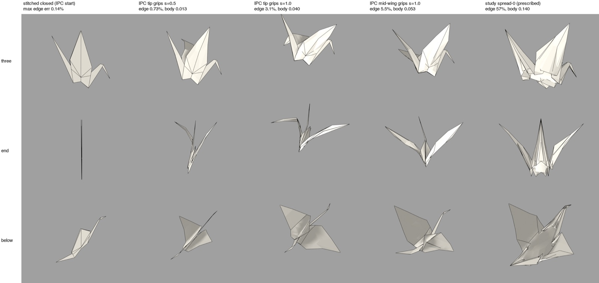

# X3. Opening the crane from a valid start

Experiment X3, run 2026-09-28 against `main` at `83fc960`, in a scratch
directory; nothing in the repository was changed. Scripts are in
[`scripts/X3-crane-opening/`](scripts/X3-crane-opening/). The verification pass
([V](V-verification.md), cluster V2) re-ran the linear program, the crossing
checks and one disputed step; its corrections are applied and marked **(V2)**.
Round two continues this experiment in [Y4](Y4-crane-v2.md).

## Question

The study reached its opened crane bodies by prescribing a target shape and
then repairing lengths and contact, and it stalled
([H1](H1-diagnosis.md) findings 1–3). The standard approach in simulation is
the reverse: start from a state in which no paper passes through paper, then
move in small steps along a path, never letting paper cross paper. Does that
approach open a crane body and spread its wings?

Two words used throughout. **IPC** (incremental potential contact, Li et al.
2020) is a contact method with two parts. A *barrier* energy grows without
bound as two separate pieces of surface approach each other. *Continuous
collision detection* (CCD) checks every straight step for a collision anywhere
along it, and shortens the step if there would be one. Together they guarantee
that no accepted state has paper crossing paper, **provided the start has
none** ([H3](H3-contact.md) findings 4–7). A **stitch** is a spring pulling two
copies of one material vertex together.

## Setup

- **Input.** The study's closed crane, `whole-crane/before.fold`: 448 triangles,
  237 vertices, all 202 mountain and valley creases folded to exactly 180°,
  and 10,051 triangle-pair layer orders.
- **Tools.** `ipctk` 1.6.0 (the Python binding of IPC Toolkit, MIT source) and
  SciPy, installed from wheels into a virtual environment made from Blender's
  Python 3.11. All other code is new.
- **Energy.** A stiff membrane (`k_m` = 1e5), hinge bending on panel joins
  (`k_b` = 1e-2), crease springs resting at the folded angle (`k_c` = 1e-3),
  stitch springs, grip springs, and the IPC barrier (`κ` = 1e11, activation
  distance `d̂` = 1e-4). **No paper thickness** was modelled as a minimum
  distance. All stiffnesses were chosen, not calibrated.
- **Solver.** Projected Newton with the step capped by CCD, ten load steps,
  40 iterations per step at most.

## Results

**1. On the one-piece sheet, no start exists that only moves layers up and
down.** A linear program asked for a height at every vertex that keeps every
ordered pair of overlapping layers at least a thickness `t` apart. It has no
solution, with or without a heuristic outward shift of the creases (smallest
total violation 5,510 `t` over 3,813 corners; with the shift 3,850 `t`).
**(V2)** The verifier reproduced this and proved the heights-only case
independently. If a crease joins faces f and g and a third face h lies between
them and touches the crease, then f and g meet at the crease, yet h must sit a
thickness above g and below f there: a contradiction. The verifier counts 60
such creases wrapped along a positive length, at most 10 faces deep; X3's 62
and 14 used a looser point-contact rule. **What this does not rule out** is a
start in which creases also move sideways around the layers they wrap, the
outward shift bookbinders call *creep* ([H3](H3-contact.md) finding 18). The
outward-shift variant tried here is one heuristic.

**2. A torn start works, and stitching it back together nearly closes it.**
Cutting the sheet along all 202 folds gives 52 flat pieces. Lifting each piece
by a linear program over the layer order gives a start with no crossings and no
strain, at heights 0–46 `t` (`ipctk.has_intersections` is false). Stitch
springs then pulled the copies back together under barrier contact, in four
stages of 150 iterations (601.7 s, one run):

| Stitched start | Value |
| --- | ---: |
| Largest stitch gap | 0.32 `t` (49 µm on a 15 cm sheet at `t` = 0.15 mm) |
| Median stitch gap | 5.8e-5 |
| Largest edge error | 0.144% |
| Largest principal stretch | 0.25% |

**(V2)** "Intersection-free" here means *among triangles that share no
material vertex*. Triangles on either side of a stitch are separate pieces to
the contact filter, and 172 such pairs cross; most lie within the stitch gap,
but 16 cross more than 2 `t` from their shared vertex and 2 more than 10 `t`.
`ipctk.has_intersections` on the stitched mesh is therefore true.

**3. Pulling the wings spreads them with little distortion, but the body barely
opens.** Two wing grips moved towards the More tucked sketch's wing-tip
positions in ten load steps:

| State | Wing-tip separation | Body opening, median / max | Max edge error | Max stretch |
| --- | ---: | ---: | ---: | ---: |
| Tip grips, s = 1 | 0.721 | 0.040 / 0.102 | 3.06% | 8.3% |
| Mid-wing grips, s = 1 | 0.714 | 0.053 / 0.140 | 5.45% | 7.9% |
| Mid-wing, +300 iterations | 0.759 | 0.056 / 0.154 | 7.5% | — |
| **More tucked sketch** | 0.774 | 0.140 / 0.213 | 57.3% | 107% |

*Body opening* is X3's own measure: the median and largest separation of 18
mirror-image pairs of material points near the body's centre. It compares
poses; it is not the study's "body depth".

- The body reached only 29–40% of the sketch's opening.
- Contact jammed from `s` ≈ 0.4 with mid-wing grips and ≈ 0.9 with tip grips:
  27–40 of 40 iterations per step were limited by CCD.
- The stitches at the body spine and corners opened to 4–7 `t`.
- Ten times softer creases changed the opening in none of its first three
  digits. More iterations at `s` = 0.5 closed the body slightly.
- Mid-wing grips give a symmetric crane with a narrow diamond body; single-point
  tip grips twist one wing flat.

**4. One guarantee failure, now attributed.** The mid-wing run has one crossing
pair (faces 2 and 212) at steps 6–7 and three from step 8. **(V2)** The
verifier re-ran step 6 from the saved step 5: with the *Additive* CCD routine
the crossing reappears; with *Tight Inclusion* CCD there is none (147 s against
54 s). The `+300 iterations` state behind row 3 of the table has four crossing
pairs, which the first report did not mention. The tip-grip runs and the
soft-crease run have none. **(V2)** Under ipctk's own check, which also counts
the stitched pairs, every state after the torn start intersects (172–251
pairs); at the final states 24–26 stitched pairs cross more than 10 `t` from
their shared vertex.

Collision detection over 50,421 candidate pairs took 0.194–0.201 s per call
with Tight Inclusion and 0.099–0.101 s with Additive (three runs each).

## What it shows

- The path approach reaches a crane-like spread at 3–7.5% edge error where the
  prescribed sketch has 57%. It never repaired a single contact pair.
- It does not, as run, open the body. The creases are not what limits it (ten
  times softer creases changed nothing); jammed contact and tearing stitches
  are. Opening the body needs its own load, as the photographed method uses:
  the hands support the underside and pull the wings down and out
  ([opening-a-crane.md](../../docs/notes/opening-a-crane.md)).
- The start has to be built, and that is a milestone of its own. Cutting at the
  folds and stitching under contact is how garment simulation starts, and it is
  what the study's four initialisation attempts (#379, #381, #383, #385) lacked.

## What it does not show

- No run converged to its tolerance: every stitch stage hit 150 iterations and
  every load step 40. These are path states, not certified equilibria.
- The sheet is not truly one piece: stitches are springs, and their gaps leave
  the vertex-sharing crossings in result 4 unguarded.
- No thickness as a minimum distance, no pressure, no body support, no finer
  mesh, no tension-field membrane. [Y4](Y4-crane-v2.md) adds them.
- All wall times are single runs, on a loaded machine.

## Reproduce

In a virtual environment from Blender's Python 3.11 with `ipctk` 1.6.0, `numpy`
and `scipy`: `build_start.py` (the linear programs), `torn.py` (the torn start),
`run_stitch.py`, `run_open.py` (tip or mid-wing grips, crease stiffness),
`metrics.py` and `remeasure.py`, `render_blender.py` and `contact_sheet.py`.
Input: `before.fold` from
`stack run senbazuru-material-study -- --whole-crane-start study/fold-material/fixtures/whole-crane-body.fold DIR`.
