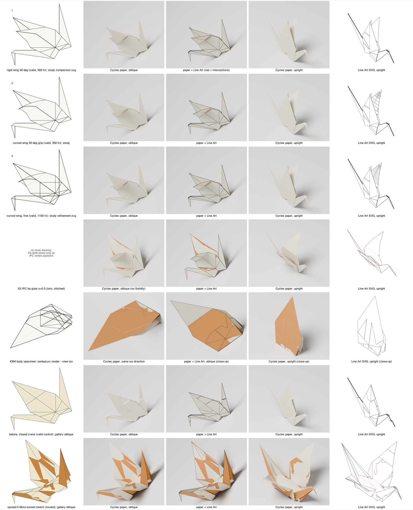

# Y1. Valid curved shapes in the new looks, and whether display smoothing is safe

Experiment Y1, run 2026-09-28 against `main` at `83fc960`, in a scratch
directory; nothing in the repository was changed. It is one of the second-round
experiments the [completeness critique](Z2-critic.md) proposed, and its
evidence feeds [PRD 11](../11-prd-refined-final-forms.md). Its scripts are in
[`scripts/Y1-valid-looks/`](scripts/Y1-valid-looks/); other outputs it names (renders, saved states,
logs) were not kept, except the contact sheet below. Paths it quotes are relative
to its scratch folder.



## Question

1. Does valid curved geometry, rendered well, look refined? In other words, does the owner's complaint reduce to geometry validity? (Round 1 rendered only flat or rigid valid shapes and the invalid sketch.)
2. Is display smoothing safe on stacked layers before thickness exists (critic conflict B8)? The candidates are Catmull-Clark/Loop with sharp creases, and Phong tessellation.

**Short answer.**
1. On every valid shape I could get, X1's Cycles recipe looks like clean photographed paper. Only invalid geometry shows the blotches.
   - The complaint does **not** reduce to validity alone. None of the valid shapes has the More-tucked pose (open, domed body).
   - The display mesh for stacked layers has its own defects on valid hinged or curved shapes:
     - X1's offsets create crossings;
     - Line Art draws the triangulation as a grid.
   - The committed #394 body specimen itself crosses (13 pairs, ipctk-confirmed).
2. Display smoothing is **not safe** before thickness exists.
   - Catmull-Clark on layer-separated stacks creates hundreds to more than a thousand new crossings and visible black slots.
   - On zero-thickness layers, both methods cross wherever a folded panel boundary is left untagged.
   - Phong is harmless only with every fold tagged, and then it changes nothing visible.

## Setup

All work is in `experiments/Y1-valid-looks/`; the repo is untouched (see caveats for the stray `--help` output I moved out).

**Shapes**

| Shape | Source | Triangles | Validity (my counter: crossing pairs deeper than 1e-7, and deeper than t; largest edge error) |
|---|---|---:|---|
| rigid spread (30° root) | `senbazuru-material-study --crane-spreading spread` | 392 | 0 / 0; 1e-11 |
| curved spread (50° grip) | same | 392 | 0 / 0; 2.9e-7 |
| fine spread | same | 1,192 | 0 / 0; 3.5e-7 |
| X3 IPC tip grips, s=0.5 | X3 `open-tip-step05.npy` + `torn.npz` | 448 torn (490 vertices) | 0 between triangles sharing no material vertex; 219 between stitched copies; 7,618 pairs closer than t; stretch 0.9985–1.0018 |
| #394 body specimen | `study/fold-material/fixtures/whole-crane-body.fold` | 120 | **13 / 5, deepest 31 t (ipctk has_intersections = True)**; 1.8e-5 |
| before (closed crane, control) | gallery | 448 | 0 / 0 |
| spread-0 (sketch, control) | gallery | 448 | 290 / 275, deepest 94 t; 57% |

The crane-spreading run printed rigid/curved/fine accepted and crossed-grip unaccepted. Single-run CPU solve times were 0.77, 10.98 and 166.0 s (the notes said about 6 s and about 64 s). The machine was loaded, and another agent was running the same command. Wall time was 488 s.

For X3, two-sidedness was recovered because the torn triangles T equal before.fold's faces F index for index (`mat[T] == F`), so the winding, and with it the cream/ochre sides, carries over.

**Rendering**
- Script: X1's `render.py`, copied to `scripts/render_y1.py`. The recipe is unchanged: Principled plus 12% translucent, Backfacing two-sided colours, Solidify 0.1 mm = t = 1/1500, faceOrders layer offsets of 1.1 t with fold walls, AgX, 128 samples plus OIDN, 1200×1000.
- Added to the copy:
  - an `npz` mesh input (sharp edges where the dihedral exceeds 30°);
  - Catmull-Clark via `subsurf`;
  - a separate Line Art intersection layer, whose length is measured.
- Cameras:
  - **upright**: forward (1, √2, −1), up −y. Identical to X1: MAE against X1's `before-2-paper.png` is 1.4e-7.
  - **oblique**: forward (−1, 1, √2), up z. This is the camera of the crane-spreading `comparison.svg` and the gallery's `*-oblique.svg`.
  - Both are framed on before plus spread-0, giving 1409 px per sheet side (t = 0.94 px).
  - The body specimen is framed on itself, and also rendered at the CLI's iso direction (−1, 1, −1).
- Line Art settings follow X1: bridges off, thickness 0, intersections on.

**Smoothing (part 3)**
- Crease tags: 1.0 on M/V/F/B edges, as specified. A second run also tags U: in the spreads, U is the 30° wing-root hinge.
- Catmull-Clark: Blender Subdivision Surface, level 2, `use_creases`, limit surface, quality 3. The control is Blender SIMPLE subdivision with identical topology and parent map.
- Phong: my own implementation, n=4, α=0.75, per-corner normals averaged over fans cut at sharp edges. The control is the same tessellation at α=0.
- Two input meshes:
  - **S0**: the FOLD as exported today (zero thickness, coincident stacked layers).
  - **S1**: X1's display mesh (layers 1.1 t apart, fold walls, wall edges tagged sharp).
- Counts are made at source-pair level: pairs that did not cross (or were at least t apart) before and do after, plus coplanar overlaps that did not exist in the source.
- The narrow phase is my own numpy code. On 3,000 random pairs it agrees with ipctk 1.6.0's `is_edge_intersecting_triangle`, `point_triangle_distance` and `edge_edge_distance` (0 disagreements).
- I also measured off-panel deviation: the distance from each smoothed vertex to its own source panel. This separates a real change of shape from vertices sliding within their own panel.

## Results

### Part 2: valid shapes under the paper recipe

| Shape | Cycles paper (both cameras) | Line Art intersections, upright / oblique (px) | Notes |
|---|---|---:|---|
| before (valid, flat) | clean paper | 0 / 0 | control, matches X1 |
| rigid spread | clean paper | 95 / 282 | the red lines come from the display offsets at the hinge |
| curved spread | clean paper; the curved wing reads as a smooth bend | 355 / 170 | Line Art draws a triangulation grid on the curved wing |
| fine spread | clean, same as curved | 292 / 187 | curved against fine: MAE 0.18–0.27%, 14–585 px differ by more than 3% |
| X3 s=0.5 | paper crane with spread wings, narrow closed body, fanned layer slivers | 1,093 / 1,554 | intersection lines are the stitched seams |
| body specimen | clean paper fragment, mostly ochre; small opening | 110 / 150 | the geometry crosses (13 pairs) |
| spread-0 (invalid) | blotches remain | 1,746 / 2,966 | control, matches X1 |

The display offsets themselves create crossings on valid shapes. With layers 1.1 t apart along each coplanar cluster's direction:

| Shape | Walls off | Walls on | Deepest |
|---|---:|---:|---:|
| rigid | 64 | 162 | 375 t |
| curved | 64 | 162 | 375 t |
| fine | 128 | 314 | 375 t |
| body | 38 | 52 | — |
| before | 0 | 0 | — |

Without separation, Line Art reports 17,000–20,000 px of false intersections on coincident layers.

Repeat timings (Cycles, 3 runs each, loaded machine; seconds):

| Render | Run 1 | Run 2 | Run 3 |
|---|---:|---:|---:|
| curved | 9.7 | 22.9 | 26.6 |
| fine | 10.0 | 27.2 | 20.3 |
| X3 | 20.0 | 30.6 | 21.9 |

### Part 3: smoothing safety

"new X" means source pairs newly crossing, deeper than 1e-7 and deeper than t.

| Run | Layers | Tags | Method | new X (>1e-7 / >t, deepest) | new pairs < t | new coplanar overlaps | off-panel deviation, max | crack |
|---|---|---|---|---|---:|---:|---|---|
| before | S0 | MVFB | Catmull-Clark | 0 / 0 | 133 | 2,426 | 22 t (0.21% of corners, in-plane across U lines) | 0 |
| before | S0 | MVFB | Phong | 0 (no change at all) | 0 | 0 | 0 | 0 |
| curved | S0 | MVFB | Catmull-Clark | 29 / 12, 3.3 t | 0 | 432 | 56 t | 0 |
| curved | S0 | MVFB | Phong | 14 / 13, 5.8 t | 0 | 10 | 17.6 t | 0 |
| fine | S0 | MVFB | Catmull-Clark | 52 / 15, 3.1 t | 28 | 442 | 59 t | 0 |
| fine | S0 | MVFB | Phong | 19 / 17, 6.3 t | 0 | 27 | 17.6 t | 0 |
| curved | S0 | MVFBU | Catmull-Clark | 0 | 0 | 671 | 0.52 t | 0 |
| curved | S0 | MVFBU | Phong | 0 | 0 | 10 | 0.57 t | 0 |
| fine | S0 | MVFBU | Catmull-Clark | 0 | 0 | 899 | 0.12 t | 0 |
| fine | S0 | MVFBU | Phong | 0 | 0 | 27 | 0.14 t | 0 |
| before | S1 | MVFB + walls | Catmull-Clark | 1,466 / 401, 62 t | 0 | 7 | — | 0 |
| before | S1 | MVFB + walls | Phong | 0 | 0 | 0 | — | 0 |
| curved | S1 | MVFB(U) + walls | Catmull-Clark | 598 / 146–153, 89 t | 2 | 22 | — | 0 |
| curved | S1 | MVFB(U) + walls | Phong | 2 / 3, 1.1 t | 450 | 0 | — | 0.57 t |
| before | S1, walls untagged | MVFB | Phong | 2,269 / 1,888, 57 t | 2,604 | 0 | — | 52 t |

- Catmull-Clark vertices slide up to 70 t *within* their panels in every run.
- Render change from smoothing:
  - Catmull-Clark: 1,488–2,249 px differ by more than 3% (130–559 px by more than 10%), concentrated in black slots at stacked fold walls (head, body).
  - Phong: 0 px differ by more than 3% against α=0.

## Images

- `contact-sheet.png`: 7 shapes × 5 treatments. Rows: rigid, curved, fine, X3, body, before, spread-0. Columns: the study's drawing, paper oblique, paper plus Line Art, paper upright, Line Art SVG upright.
- `smoothing-sheet.png`: unsmoothed against Catmull-Clark; new-crossing markers (Catmull-Clark 7,087 child pairs, Phong 13); head and body crops with black slots; closed crane under Catmull-Clark (14,350 child pairs); Line Art of the smoothed wing.
- `renders/*.png` (paper), `composite/*-paper-lineart.png`, `svg/*-lineart.svg|png`, `crops/cmp-*.png`, `diff/*-cross.png`, `study-png/*` (the study's drawings, rasterised).

## What it shows

- **Presentation works on valid geometry, and cannot fix invalid geometry.** Every valid shape looks refined; the sketch's blotches survive.
- **The valid shapes we have are not the pose the owner wants.** The spreads hold the body closed and X3 opens it only partly. The only doubly-curved valid sample, the #394 body, is a 10° fragment, and it crosses itself.
- **"Good presentation" includes a correct display mesh for stacks.**
  - X1's flat-stack offsets create deep crossings at hinges and on curved stacks.
  - Line Art needs separated layers and unsplit panels.
  - The study's own drawing already handles the curved wing cleanly.
- **Line Art intersection length is not a zero test.** On valid shapes it gives 95–355 px under these offsets, and it missed the crossings that smoothing created.
- **Approximating subdivision is unsafe on stacks.**
- **Phong tessellation needs every folded boundary tagged, by geometry rather than by assignment letter.** Even then it gives no visible benefit, because the panels are nearly flat.

## What it does NOT show

- No owner judgement, and no blind pairs.
- No valid open-body crane was available, so "valid and More-tucked looks refined" is untested.
- No real thickness model: smoothing was not tested with Solidify-thick or true offset layers.
- One smoothing level only. The closed crane was not rerun with U tagged.
- The magnitude of the new coplanar overlaps was not measured.
- Timings come from a loaded machine.

## Recommendation for the PRD

1. The gate is validity of the **displayed** mesh, checked with one checker (ipctk has_intersections, crossing counts thresholded by depth, strain). Re-audit the #394 body specimen against it.
2. Add a requirement for the stacked-layer display: offsets along local normals per layer, continuous across panels, validated like the geometry. X1's per-cluster offsets are for flat stacks only.
3. Keep the study's line drawing for book-style figures. Treat Line Art as optional, and use its intersection lines as a picture, not as an acceptance test.
4. No display smoothing until thickness exists. If any is added later, use Phong with sharp tags from dihedral angle or panel boundary, and run the validity check on the result. Do not use Catmull-Clark or Loop.
5. The next decisive work is pose: a valid state near More tucked. The paper recipe is ready to present it.

## Reproduce

Paths are relative to `experiments/Y1-valid-looks/`.

```sh
# from the repo root, with the built binary
.stack-work/install/aarch64-osx/6ae009cc.../9.6.7/bin/senbazuru-material-study --crane-spreading <Y1>/spread

# validity and narrow-phase checks (X3 venv: ipctk 1.6.0, scipy)
../X3-crane-opening/venv/bin/python test_geom.py

# render configs and all renders (skips finished ones)
python3 scripts/mkcfg_y1.py && python3 scripts/mkcfg_smooth.py
scripts/run_all.sh

# Phong display meshes
P=../X3-crane-opening/venv/bin/python
$P make_phong_npz.py curved spread/crane-spreading/curved.fold [MVFBU] [alpha]

# smoothing tests and tables
./run_smooth.sh; ./run_smooth3.sh   # smooth_test.py NAME FOLD 2 4 s0|s1 [MVFBU]
python3 summarise_smooth.py
$P deviation.py NAME FOLD
../X2-inflation/venv/bin/python overlay_cross.py out/NAME-cc.npz CONFIG RENDER OUT
../X2-inflation/venv/bin/python imgdiff.py A.png B.png

# contact sheets
scripts/contact.sh; scripts/contact_smooth.sh
```

Blender 4.4.1 (headless, Metal GPU, M1 Max); ImageMagick; rsvg-convert.

