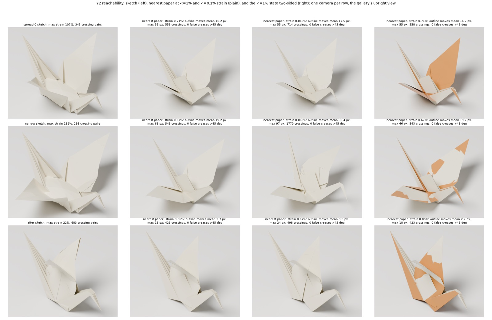

# Y2. Can "More tucked" be paper, and how far must it move?

Experiment Y2, run 2026-09-28 against `main` at `83fc960`, in a scratch
directory; nothing in the repository was changed. It is one of the second-round
experiments the [completeness critique](Z2-critic.md) proposed, and its
evidence feeds [PRD 11](../11-prd-refined-final-forms.md). Its scripts are in
[`scripts/Y2-reachability/`](scripts/Y2-reachability/); other outputs it names (renders, saved states,
logs) were not kept, except the contact sheet below. Paths it quotes are relative
to its scratch folder.



## Question

Can the owner's preferred "More tucked" crane (`spread-0`) be a real sheet of paper? If not, how far must its picture move to become one? The threshold set by the task: under about 5 px of movement means More tucked is a legitimate physical target. Tens of pixels means the owner must choose between the look (declared schematic) and paper. The same test was run on the first candidate (`after`, 5% edge error) and on `narrow`.

**Short answer: tens of pixels, and this is proven, not only simulated.**
- **Proof.** Any paper state must move some point of the upright picture by at least **17 px**.
- **Search.** The nearest clean paper found moves the outline **14.5-17.5 px on average and 54-57 px at worst** at 1% strain or less, and the crane's body refolds into a V.
- **The first candidate.** `after` is close to paper: 2.7-4.3 px mean.

## Setup

**Words.**
- *Principal strain* is a triangle's largest stretch or squash in any direction; paper tears at roughly 1-6%.
- An *isometry* is a deformation that changes no length on the sheet. Bending and folding are isometries; stretching is not.
- A *J edge* is a numerical join inside one panel, not a crease. Bending one sharply is a *false crease*.
- *Outline* is the boundary of the paper's projected area, including the boundaries of gaps seen through it. *Hausdorff* is the largest distance from any outline pixel of one picture to the other picture's outline. *Mean* is the average of both directions.
- All pixels are at the gallery's 600 px per sheet side, at the gallery's **upright** camera (forward (1, sqrt2, -1), up hint (0, -1, 0)), built exactly as `Render.Camera.basisFrom` builds it. It was checked against `spread-0-upright-colours.svg`.

**Inputs.**
- `gallery/whole-crane/{spread-0,after,narrow}.fold`: 237 vertices, 448 triangles, 684 edges (408 J, 120 M, 82 V, 42 F, 8 U, 24 B).
- Material coordinates come from `senbazuru:material_coords`.

**Metric check.** My measurements reproduce `checks.json` exactly:

| Model | Max stretch | Max squash | Edge error | Crossing pairs | Vertices, angle-sum change over 5 deg / over 20 deg | J edges over 45 deg |
| --- | ---: | ---: | ---: | ---: | ---: | ---: |
| spread-0 | +106.8% | -83.6% | 57.29% | 345 | 99 / 42 | 15 |
| after | | | | 683 | | |
| narrow | | | | 266 | | |

The crossing test is a re-implementation of `Senbazuru.Origami.Contact.crosses` (tolerance 1e-7).

**Method 1: a floor that needs no solver** (`src/bound.py`, `src/bound_lp.py`).
- Paper can bend, crease and crumple but cannot stretch. The flat sheet is a convex square. So in any paper state, two material points are at most as far apart in space as they are on the sheet: |x_i - x_j| <= |u_i - u_j|.
- If the sketch has |x*_i - x*_j| = |u_i - u_j| + e, then |d_i| + |d_j| >= e, so one of the two moves at least e/2.
- An orthographic projection never lengthens a distance, so the same holds in the picture.
- A linear programme over all stretched pairs (minimise the sum of a_i t_i subject to t_i + t_j >= e_ij) bounds the area-weighted mean movement. A second one bounds the area share of vertices that must move at least 5 px.
- This bound holds for any mesh, creasing or crumpling. It ignores contact.

**Method 2: isometry projection** (`src/solve.py`, `src/sweep.py`). Minimise one half of |r(x)|² with three residual blocks:
- **Membrane.** Per-triangle Green strain E = (FᵀF - I)/2 against the flat triangle, weighted by the square root of area. Zero means an exact isometry.
- **Bending on J edges only.** m1/2A1 - m2/2A2 (the two cross-product normals over their rest areas; equal to n1 - n2 on isometric triangles), with weight kb·3L²/(A1+A2).
- **Crease hinges (M, V, F, U) free.** This is the most permissive assumption.
- **Pull toward the sketch.** Weight λ times the vertex's area share, in 3D (`all3d`) or in the camera's picture plane only (`plane`, depth free).

The solve:
- λ is swept from 1e3 down to 1e-9 in half-decade steps, each solve warm-started from the last.
- Levenberg-Marquardt with an analytic sparse Jacobian and a direct sparse solve (SciPy SuperLU), 300 iterations per step at most.
- The Jacobian was checked against central differences: relative error 2e-11 (Green membrane) and 1.8e-10 (edge-length membrane).

Variants run:
- bending fixed at kb = 1e-3 or 1e-1;
- bending relative to the pull (`-rel`: kb·λ with kb in {1e-3, 1e-4, 1e-5}), so that as λ goes to 0 the solve tends to "closest shape plus bending, subject to isometry";
- an edge-length membrane instead of Green strain;
- a direct start without continuation;
- an 8-norm reweighted pull;
- strong anchors (wing tips 2 and 54, neck/tail tips 0 and 57, body top 24, weighted 20x; `anchbody` adds rim ends 13 and 35);
- anchors-only pull;
- a 1-to-4 material-space subdivision (1792 triangles);
- a start from X3's IPC-opened crane (welded `open-root-step10`).

After each step: strain, J bends, angle defects, the study's crossing test and outline distances (4x supersampled raster plus distance transforms).

**Tools.** The X2 venv (Python 3.11.11, numpy 1.26.4, scipy 1.17.1, matplotlib 3.11.2). Blender 4.4.1 Cycles through X1's `render.py`, unmodified: paper recipe, 900x750, 64 samples. Nothing was installed. The repository was not touched.

## Results

**1. Proven floors (any paper state, contact ignored).**

| Model | Stretched pairs (picture / 3D) | Some point moves at least, picture | …in 3D | Mean vertex movement at least (picture / 3D) | Sheet area that must move at least 5 px (picture / 3D) |
| --- | ---: | ---: | ---: | ---: | ---: |
| spread-0 | 347 / 1188 | **17.1 px** (17.2 on 3,633 points) | 20.0 px | 2.4 / 5.4 px | 11% / 26% |
| narrow | 453 / 1222 | **25.4 px** (26.1) | 28.7 px | 3.1 / 6.3 px | 13% / 26% |
| after | 58 / 794 | **1.0 px** (1.7) | 1.9 px | 0.05 / 0.28 px | 0 / 0 |

The worst 3D pair in spread-0 is the wing root, vertices 37 and 46: 0.336 apart against 0.269 on the sheet, **+25%**. The worst picture pair is vertices 46 and 182.

**2. Nearest paper found.** The first sweep step reaching at most 1% and at most 0.1% max principal strain. Each strain cell reads: strain | outline mean px | Hausdorff px | largest vertex movement in the picture px | crossing pairs | J edges over 45 deg | vertices with angle defect over 1 deg.

| Run | Tri | At most 1% | At most 0.1% |
| --- | ---: | --- | --- |
| spread-0 all3d, bending 1e-3 fixed | 448 | 0.54% \| 17.4 \| 55 \| 111 \| 526 \| 0 \| 0 | 0.086% \| 25.2 \| 75 \| 110 \| 1832 \| 0 \| 0 |
| same | 1792 | 0.57% \| 17.1 \| 55 \| 111 \| 1134 \| 0 \| 0 | 0.082% \| 25.4 \| 81 \| 109 \| 3885 \| 0 \| 0 |
| same, edge-length membrane | 448 | 0.75% \| 17.5 \| 55 \| 111 \| 578 \| 0 \| 0 | 0.057% \| 27.6 \| 87 \| 109 \| 1608 \| 0 \| 0 |
| spread-0 plane pull, fixed | 448 | 0.92% \| 15.3 \| 57 \| 111 \| 547 \| 0 \| 0 | 0.066% \| 24.8 \| 70 \| 110 \| 1816 \| 0 \| 0 |
| spread-0 all3d, bending 1e-3 x pull | 448 | 0.71% \| 16.2 \| 55 \| 110 \| 558 \| 0 \| 0 | 0.046% \| 17.5 \| 55 \| 110 \| 714 \| 0 \| 0 |
| spread-0 all3d, bending 1e-4 x pull | 448 | 0.54% \| 15.7 \| 56 \| 110 \| 619 \| 0 \| 0 | 0.096% \| 16.2 \| 56 \| 110 \| 661 \| 0 \| 0 |
| same | 1792 | 0.76% \| 15.4 \| 56 \| 110 \| 1255 \| 0 \| 0 | 0.078% \| 16.4 \| 56 \| 110 \| 1487 \| 0 \| 0 |
| spread-0 plane pull, 1e-4 x pull | 448 | 0.93% \| 14.5 \| 54 \| 110 \| 649 \| 0 \| 0 | 0.055% \| 16.1 \| 57 \| 111 \| 793 \| 0 \| 0 |
| spread-0 from X3 opened crane (start at λ = 1e-2) | 448 | 0.53% \| 15.5 \| 56 \| 110 \| 631 \| 0 \| 0 | 0.039% \| 16.1 \| 56 \| 110 \| 703 \| 0 \| 0 |
| spread-0, bending 1e-5 x pull | 448 | 0.71% \| 14.4 \| 75 \| 75 \| 773 \| **19** \| 0 | 0.056% \| 15.2 \| 72 \| 83 \| 853 \| **21** \| 0 |
| spread-0, strong anchors | 448 | 0.91% \| **10.9** \| 48 \| 93 \| 701 \| **37** \| 0 | 0.081% \| 10.8 \| 49 \| 94 \| 760 \| **40** \| 0 |
| spread-0, anchors plus rim ends | 448 | 0.041% \| 21.1 \| 72 \| 129 \| 405 \| **53** \| 0 | same |
| spread-0, anchors only (rest free) | 448 | 0.82% \| 26.1 \| 101 \| 169 \| 1515 \| 0 \| 0 | 0.059% \| 27.9 \| 107 \| 163 \| 2138 \| 0 \| 0 |
| narrow all3d, fixed 1e-3 | 448 | 0.67% \| 19.2 \| 66 \| 113 \| 543 \| 0 \| 0 | 0.083% \| 30.4 \| 97 \| 111 \| 1770 \| 0 \| 0 |
| narrow, 1e-4 x pull | 448 | 0.57% \| 17.5 \| 64 \| 110 \| 626 \| 0 \| 0 | 0.097% \| 17.9 \| 66 \| 110 \| 678 \| 0 \| 0 |
| narrow, 1e-4 x pull | 1792 | 0.85% \| 17.3 \| 64 \| 110 \| 1308 \| 0 \| 0 | 0.080% \| 18.3 \| 68 \| 111 \| 1545 \| 0 \| 0 |
| after all3d, fixed 1e-3 | 448 | 0.76% \| 3.9 \| 29 \| 30 \| 538 \| 0 \| 0 | 0.062% \| 7.2 \| 40 \| 41 \| 771 \| 0 \| 0 |
| after, 1e-4 x pull | 448 | 1.0% \| 3.0 \| 26 \| 26 \| 481 \| 0 \| 0 | 0.077% \| 5.2 \| 31 \| 32 \| 600 \| 0 \| 0 |
| after, 1e-5 x pull | 448 | 0.86% \| **2.7** \| 18 \| 19 \| 423 \| 0 \| 0 | 0.070% \| 3.0 \| 24 \| 24 \| 498 \| 0 \| 0 |
| after, 1e-5 x pull | 1792 | 0.52% \| 3.1 \| 24 \| 25 \| 876 \| 0 \| 0 | 0.065% \| 4.0 \| 29 \| 30 \| 1188 \| 0 \| 0 |

Crossing counts on 1792 triangles are not comparable with those on 448. The anchor runs keep the body open and show no angle defects; the false creases absorb the curvature.

**3. What moves** (`src/shape_stats.py`; body opening uses X3's definition, re-implemented: 18 mirror pairs near (1.0, 0.4)).

| State | Rim ends 13-35 distance | Body top y (vertex 24) | Body opening median / max | Wing-tip separation |
| --- | ---: | ---: | ---: | ---: |
| closed crane | 0 | 0.293 | 0 / 0 | 0 |
| spread-0 sketch | **0.414** | 0.395 | 0.140 / 0.213 | 0.774 |
| clean projections at at most 1% | 0.003-0.008 | 0.239-0.242 | 0.040-0.079 / 0.158-0.197 | 0.683-0.706 |
| clean projections at at most 0.1% | 0.0004-0.004 | 0.239-0.248 | 0.013-0.068 / 0.109-0.187 | 0.649-0.708 |
| strong anchors, at most 1% | 0.139 | 0.315 | 0.122 / 0.222 | 0.690 |
| after sketch / projection at at most 1% | 0.008 / 0.004 | 0.293 / 0.294 | 0.056 / 0.043 | 0.340 / 0.289 |

**4. X3's physical states against spread-0** (`src/weld_x3.py`).

| X3 state | Strain | Outline mean | Hausdorff |
| --- | ---: | ---: | ---: |
| open-root-step10 | 7.9% | 26.0 px | 84 px |
| open-tip-step10 | 8.3% | 44.7 px | 166 px |
| conv-root10-step10 | 10.6% | 33.0 px | 110 px |

**5. Cost.**
- Full 25-step sweep, spread-0, 448 triangles: 1101 LM iterations in each of 3 repeats. Solver time 27.5 / 40.1 / 32.3 s; wall 64.4 / 102.1 / 75.3 s including measurements; user CPU 19.8 / 21.2 / 19.9 s. Load average was 170-250, so the wall times are noisy.
- 1792-triangle sweeps: 2021-3421 iterations, 550-1213 s wall (single runs).
- Proven floor: about 1 s for all three models, including the linear programmes.
- Renders: 7.2-14.7 s each (single runs).

## Images

- `img/Y2-contact-sheet.jpg`: contact sheet.
  - Rows: spread-0, narrow, after. Columns: sketch; nearest paper at at most 1%; nearest paper at at most 0.1% (plain paper); the at-most-1% state two-sided.
  - Each row uses one upright camera, in Cycles with X1's paper recipe.
  - The projected spread-0 reads as a clean crane with raised wings and a closed V body. The tucked, boxy body is gone. `after` barely changes.
- `.../Y2-reachability/img/tradeoff.png`: outline mean (top) and Hausdorff (bottom) against max principal strain for every variant.
  - Also shown: 1% and 0.1% lines, the 5 px line, and the proven floor.
  - For spread-0 and narrow, every clean curve levels off at 15-19 px mean and 55-66 px Hausdorff. For after the mean stays at 3-9 px.
- `.../Y2-reachability/img/variants-sheet.png`: spread-0 against clean paper, cheap bending (19 false creases; a wing folds over) and strong anchors (body about 86% open, 37 false creases), all at one camera.
  - Top row plain paper, bottom row two-sided.
  - Back-side patches in the projections come from layers passing through each other.
- `.../Y2-reachability/img/ov-spread0-rel-01pct.png`: spread-0 at 0.046% strain, in three panels: the sketch; the projection with the sketch outline in red; per-point picture movement on the flat sheet.
  - The largest movements (80-110 px) lie on the diagonal through the paper centre.
- `.../Y2-reachability/img/ov-after-rel-1pct.png`: after at 0.86% strain. Only the upper-right wing tip moves (the arch flattens). Outline mean 2.7 px.
- `.../Y2-reachability/img/ov-narrow-1pct.png`: narrow, the same mechanism as spread-0. Outline mean 19.2 px, Hausdorff 66 px.
- Also on disk: `renders/*.png` (all Blender stills, `-plain` variants) and `fold/*.fold` (the projected states as FOLD, with the sketch's other keys).

## What it shows

1. **More tucked is not paper within 5 px, and this is proven.** Every paper state must move some point of the upright picture at least 17 px (26 px for narrow). At least 11% of the sheet must move at least 5 px. The proof is geometric: it needs no solver and holds for any mesh, creasing or crumpling.
2. **The nearest clean paper is far.** Its outline moves about 15-17 px on average and 55 px at worst, and single points move about 110 px. The stretched part of the sketch is the wing roots, 25% too long.
3. **The body keel refolds.** The sketch lays the sheet diagonal through the paper centre flat along the crane's length: vertices 13 and 35, which coincide in the closed crane, are 0.414 sheet units (248 px) apart. Clean paper cannot hold this next to the wing roots. It refolds the diagonal into a V: the ends come back to within 0.008, the body top rises 93 px, and the body opening falls to 10-56% of the sketch's. The crane then contracts toward the body, which is the uniform 20-50 px shift seen elsewhere.
4. **Keeping the body open costs false creases.** Holding the body open (86%) with crease-only freedom is impossible. It needs 37-40 J edges bent over 45 degrees, which is crumpled paper, and still leaves 10.9 px mean and 48 px Hausdorff.
5. **The answer is robust across everything tried.** It is the same under mesh refinement (448 and 1792 triangles), under either membrane model, across bending weights, with a 3D or a picture-plane pull, with or without continuation, and from X3's physically opened crane. The last two land on the same state to 1e-11 px.
6. **The first candidate is nearly legitimate.** The proven floor for `after` is 1-2 px and the found mean is 2.7-4.3 px. Its one real discrepancy is a wing tip (18-33 px) whose arch the projection flattens.

## What it does NOT show

- **No contact.** Projected states have 526-649 crossing pairs, up from 345. They are not poses to ship, and their layer order is meaningless: the two-sided renders show inner layers outside.
- **No global optimality.** The found numbers are upper bounds on the minimum movement. The proven floors are lower bounds: 17 px for the worst point, 2.4 px for the mean. A cleverer path could in principle find paper with a smaller mean outline movement than about 15 px. None was found from two very different starts and nine solver variations.
- **One camera.** Other gallery views were not measured. 3D movements are larger (123-125 px).
- **Paper model.** 'Paper' is small principal strain (1% and 0.1%) with free creases and a chosen, uncalibrated J-bending weight. There is no thickness, gravity or inflation, and wrinkling at the paper's own scale is not modelled; the tension-field route is X2/H4.
- **Mesh size.** 7168 triangles was used only for the floor. Nothing checks this against a physical crane (the photogrammetry experiment X9 would).

## Recommendation for the PRD

1. **Decide explicitly: the More-tucked look is schematic.** It cannot be reached by paper within 5 px: at least 17 px is proven, and about 16 px mean and 55 px worst was found. Either label it a declared schematic target, or replace it as the physical target with the nearest-paper crane (V body, raised wings), or with an after-like state (at most 4 px mean from its sketch).
2. **Add the no-stretch floor as a gate for every authored or constructed pose.** It is max over pairs of (|x_i - x_j| - |u_i - u_j|)/2 x 600 px, in 3D and in the picture. It is S-sized, runs in milliseconds, is sound, and flags spread-0 and narrow immediately while passing after. A companion linear programme gives the share of the sheet that must move.
3. **Keep the isometry projection as a 'nearest paper' measuring tool (S), not as a pose generator.** It gives any authored pose a single honest number: how far the picture must move. It takes about 30 s CPU at 448 triangles. Its output must go through contact or path solving (X3's route) before anyone sees it as a model.
4. **An open, boxy body needs a mechanism other than flat panels and creases.** The candidates are inflation with crimps (X2's tension-field membrane) or a declared schematic. Budget the body work accordingly.
5. **Start path-based targets from the after family,** and model the wing arch as a developable curl. That is the one place `after` departs from paper.

## Reproduce

All from `scripts/Y2-reachability/`, with `PY=../X2-inflation/venv/bin/python`:

```sh
$PY src/gradcheck.py                         # Jacobian vs central differences
$PY src/bound.py; $PY src/bound_lp.py        # proven floors -> out/bound.json, out/bound_lp.json
$PY src/sweep.py spread-0 all3d 1e-4 0 -rel  # one sweep: MODEL VARIANT(all3d|plane|anchors) KB LEVELS [TAG] [START_LAM]
# TAG: -rel (bending = KB x lam), -edge (edge-length membrane), -anch / -anchbody, -p8, _ (none)
./batch.sh jobs1.txt 7; ./batch2.sh jobs2.txt 8; ./batch2.sh jobs3.txt 4; ./batch6.sh jobs6.txt 7   # sweep matrix
$PY src/weld_x3.py                           # X3 states welded -> out/x3-*-welded.npy
Y2_X0=out/x3-open-root-step10-welded.npy $PY src/sweep.py spread-0 all3d 1e-4 0 -rel-fromX3-s1e-2 1e-2
$PY src/summarize.py                         # -> out/summary.md
$PY src/plots.py; $PY src/shape_stats.py     # img/tradeoff.png, out/shape_stats.json
$PY src/overlay.py out/spread-0-all3d-kb0.001-L0-rel 3.2e-5 img/ov-spread0-rel-01pct.png
$PY src/mkrender.py render-spec.json > logs/render-names.txt && ./render.sh   # Blender 4.4.1 + ../X1-render/scripts/render.py
./render2.sh logs/render-names-plain.txt     # plain-paper variants (configs/*-plain.json)
$PY src/mkrender.py render-spec2.json        # variants group, then render2.sh
$PY src/contact.py contact-spec.json logs/captions.json contact-sheet.png
./timing.sh                                  # three repeated sweeps -> logs/timing.out
```

Per-step states are in `out/<run>/X_lam*.npy`, and each run's `out/<run>/sweep.json` holds its rows. Logs are in `logs/`.

