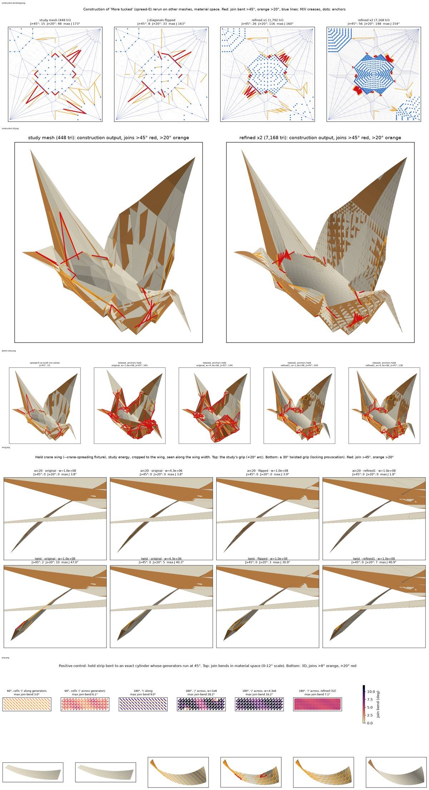

# Y3. Are the false creases caused by locking?

Experiment Y3, run 2026-09-28 against `main` at `83fc960`, in a scratch
directory; nothing in the repository was changed. It is one of the second-round
experiments the [completeness critique](Z2-critic.md) proposed, and its
evidence feeds [PRD 11](../11-prd-refined-final-forms.md). Its scripts are in
[`scripts/Y3-locking/`](scripts/Y3-locking/); other outputs it names (renders, saved states,
logs) were not kept, except the contact sheet below. Paths it quotes are relative
to its scratch folder.

## Question

Are the false creases (joins bent more than 45°) and the angular wing roots in the "More tucked" crane (spread-0) caused by locking? Locking is the claim of H1 finding 10 and H2 finding 13: nearly unstretchable linear triangles (length weight 1e8, 4-12 triangles per panel) can bend only along their own edges. Neither note tested it.

If locking is the cause, the kinks should vanish, and the drawing stay put, under a softer membrane or a finer or re-triangulated mesh. If they stay, the kinks come from how the pose was authored.

**Answer: they come from how the pose was authored, not from locking.**

## Setup

- **Nothing in the repo was changed or rebuilt.** Everything is in `experiments/Y3-locking/`: `src/`, `out/`, `img/`, `logs/`, `study-out/` and `contact-sheet.png`.
  - I ran the built study binary once from the repo root, writing only into my folder: `senbazuru-material-study --crane-spreading <Y3>/study-out`.
  - My own code runs in the X2 venv: Python 3.11.11, numpy 1.26.4, scipy 1.17.1, matplotlib 3.11.2, Pillow 12.3.0.
- **The study's energy, re-expressed from its source** (`src/sheet.py`, `src/relax.py`):
  - The energy is `E = w·Σ(l−l0)² + Σ k_h·wrap(θ−rest)²`.
  - Joins (J) and flat creases (F) are panel bends: `k = 0.2·2l²/(twice area)`, rest 0. F is treated like J because that is what the study does; checks.json confirms it for all 660 spread-0 hinges.
  - M/V/U creases: `k = l`, rest ±π.
  - Weight staging follows the study: 1e2, 1e4, 1e6, then the final weight.
  - The solver is Gauss-Newton / Levenberg-Marquardt with a sparse direct solve, exact holds and no contact. It refuses any step where a triangle's smallest principal stretch drops below −0.95.
- **Validation:**
  - Hinge angles and stiffnesses match checks.json for all 660 spread-0 hinges (7.6e-16 and 8.9e-16).
  - My solve of the study's `--crane-spreading` "curved" problem matches the study's accepted endpoint to 4.7e-8 sheet units (3.4e-5 px), with energy agreeing to 1e-10 relative.
- **Measures:**
  - Count of joins bent >45° and >20°, and the largest join bend.
  - Principal strains, max edge error and the share of area strained >10%.
  - **Drawing displacement**: how far the same material point moves, ×600 px per sheet. It is an upper bound on outline movement in any view (`src/metrics.py`).
  - A rasterised silhouette Hausdorff distance at 600 px (`src/sil.py`), kept as secondary because it is unreliable for surfaces seen edge-on.
  - `Σ length×angle` over joins bent >45°. It separates folds, which keep it under refinement, from sampled curvature, which loses it.
- **Mesh variants:**
  - *flipped*: a greedy flip of J diagonals inside one panel, keeping the quad convex and no new angle below min(20°, 0.7×old). That is 161 of 408 J edges on the whole crane and 149 of 400 on the wing.
  - *refined*: a 1-to-4 midpoint split; creases keep their assignment on both halves.
- **Weights:** 1e8 (the study's), 4.3e6 (H2 finding 2's physical value) and 4.3e5 (a bracket).

Four experiments:

1. **C, construction.** I reimplemented `WholeCrane.pillowCraneWith`:
   - cushion-formula anchors on the core (bodyWidthScale 0.5);
   - arch anchors on the wings (root tangent −70°, 30° arch);
   - a weighted graph-Laplacian fill of the other vertices, weight 1/rest length per edge, with a 1e-12 diagonal.
   
   It reproduces spread-0, spread-25 and spread-100 to 2e-15. I then reran it on the flipped and refined meshes.
2. **S, sketch relaxation.** spread-0 relaxed with the study's energy while holding exactly the construction's 72 anchors (229 on the refined mesh).
3. **W, wing.** The study's held-wing problem, rebuilt from its rigid endpoint: body and root strip held, grip strip on the +20° arc. Plus a 30° twisted grip as a provocation.
4. **P, positive control.** A strip 1 × 0.25 with square cells and one diagonal each, both end columns of cells held on an exact cylinder whose generators run at 45°. Total turns of 60°, 180° and 270°, with cells cut along the bend (`\`) or across it (`/`), at n = 16 or 32.

## Results

### C: the construction's kinks are folds, fixed in the material, at every resolution

**Corrected 2026-09-29:** they are not folds. Made again by the study's own
construction at 28,672 and 114,688 triangles, their turning past 45° falls to
95.5 and 20.0 (#438, [fold-or-curve.md](../../docs/notes/fold-or-curve.md)).
They are bends narrower than the triangles of the meshes below, which three
levels could not tell from folds. That the construction makes them, not
locking, stands.

| mesh | triangles | joins >45° | joins >20° | largest join bend | Σ len×angle, joins >45° | length of joins >45° | max distance to nearest anchor |
|---|---:|---:|---:|---:|---:|---:|---:|
| study (spread-0 exactly) | 448 | 15 | 48 | 172.6° | 145 | 1.92 | 0.137 |
| flipped | 448 | 8 | 33 | 163.2° | 83 | 1.02 | 0.137 |
| flipped, reverse order | 448 | 14 | 41 | 172.6° | 129 | 1.73 | 0.144 |
| refined ×1 | 1,792 | 26 | 116 | 160.5° | 142 | 1.70 | 0.077 |
| refined ×2 | 7,168 | 56 | 148 | 154.1° | 141 | 1.87 | 0.048 |

- **Where the kinks are:** all 15 study-mesh kinks touch an anchored vertex.
- **What happens under refinement:**
  - Each kink stays a fold: its bend stays at 150-173°.
  - Its turning is conserved: Σ len×angle holds at 141-145.
  - **Corrected 2026-09-29:** the turning holds over these three meshes only. Two finer ones lose it, so the kinks are not folds (above).
  - It moves onto the rim of the prescribed cushion core and the ends of the wing strips.
- **Drawing displacement, study mesh vs refined ×2:** median 1.2 px, p95 3.8 px, max 22.8 px. Against flipped: p95 9 px.
- **Strain:** 71-74% of the area is strained >10% in every variant.

### S: relaxing the sketch with its anchors held crumples it, whatever the weight or mesh

| mesh | w | joins >45° (before → after) | joins >20° | largest join bend | max stretch / squash | area >10% | drawing moves (max / p95) |
|---|---|---:|---:|---:|---|---:|---|
| study | 1e8 | 15 → 165 | 244 | 179.2° | +57% / −95% (guard) | 26% | 106 / 68 px |
| study | 4.3e6 | 15 → 144 | 235 | 175.8° | +52% / −67% | 22% | 124 / 91 px |
| refined | 1e8 | 26 → 149 | 389 | 176.8° | +153% / −95% | 36% | 57 / 35 px |
| refined | 4.3e6 | 26 → 138 | 364 | 173.7° | +166% / −95% | 37% | 57 / 35 px |

None of these converged: the gradient stayed at 5e1-5e5 and the collapse guard was active. Edges between two anchors carry up to 50% error that no solver can remove.

### W: the study's held wing shows no locking kinks

| grip | mesh | w | joins >45° / >20° | largest join bend | max edge error | drawing displacement vs study (max / p95) |
|---|---|---|---|---:|---:|---|
| +20° arc | original | 1e8 | 0 / 0 | 3.80° | 2.9e-7 | 0 (the study's own endpoint) |
| +20° arc | original | 4.3e6 | 0 / 0 | 3.80° | 4.0e-6 | 0.00 px |
| +20° arc | original | 4.3e5 | 0 / 0 | 3.79° | 3.4e-5 | 0.01 px |
| +20° arc | flipped | 1e8 / 4.3e6 / 4.3e5 | 0 / 0 | 3.85 / 3.91 / 3.95° | ≤1.0e-4 | 0.03 / 0.07 / 0.13 px |
| +20° arc | refined (1,568 tri) | all three | 0 / 0 | 1.82° | ≤3.3e-5 | 0.16 px |
| twist 30° | original | 1e8 / 4.3e6 / 4.3e5 | 2 / 10, 0 / 5, 0 / 4 | 47.0 / 40.3 / 24.0° | 1.2-1.7% | 0 / 1.6 / 3.2 px |
| twist 30° | flipped | 1e8 / 4.3e6 / 4.3e5 | 0 / 3, 0 / 3, 0 / 1 | 30.9 / 29.4 / 20.2° | 1.5% | 2.9 / 2.9 / 4.0 px |
| twist 30° | refined | 1e8 (not converged) / 4.3e6 | 0 / 7, 0 / 6 | 40.9 / 29.4° | 1.8-2.0% | 1.6 / 1.9 px |

The study's own "fine" solve (1,192 triangles) has a largest join bend of 1.8°, against 3.8° on its 392-triangle mesh, and differs by 0.16 px. Halving the per-edge bend when the mesh halves is how a coarse mesh samples a smooth curve.

### P: locking exists, and this control shows what it looks like

Cells "along" run parallel to the generators; cells "across" do not. Error is the largest vertex deviation from the exact cylinder, in px at 600 px per sheet.

| turn (radius) | cells | n | w | largest join bend | joins >20° | error | membrane / bending energy |
|---|---|---:|---|---:|---:|---:|---|
| 60° (0.84) | along | 16 | 1e8 | 3.0° | 0 | 0.07 px | 0.03 / 0.07 |
| 60° | across | 16 | 1e8 / 4.3e6 / 4.3e5 | 6.1 / 4.8 / 4.7° | 0 | 1.64 / 0.85 / 0.81 px | 1.36 / 0.20 at 1e8 |
| 60° | across | 32 | 1e8 | 2.35° | 0 | 0.28 px | 0.04 / 0.20 |
| 180° (0.28) | along | 16 | 1e8 | 9.0° | 0 | 0.20 px | 2.7 / 0.63 |
| 180° | across | 16 | 1e8 / 4.3e6 | 28.2 / 16.2° | 8 / 0 | 7.55 / 4.26 px | 109 / 2.0 at 1e8 |
| 180° | across | 32 | 1e8 / 4.3e6 | 7.1 / 7.0° | 0 | 1.23 / 0.75 px | 3.4 / 1.8 at 1e8 |
| 270° (0.19) | along | 16 | 1e8 | 13.5° | 0 | 0.30 px | — |
| 270° | across | 16 | 1e8 / 4.3e6 | 43.5 / 26.2° | 58 / 46 | 12.4 / 8.2 px | 550 / 4.9 at 1e8 |
| 270° | across | 32 | 1e8 / 4.3e6 | 10.7 / 10.5° | 0 | 2.16 / 1.35 px | — |

With cells cut along the bend, the curve is sampled cleanly. With cells cut across it, membrane energy dominates and ridges appear. The physical weight about halves them, one refinement cuts them about 4×, and no strip run passed 45°.

### Cost

Timings are for the +20° wing on the study mesh, repeated 3 times:

| when | w | run 1 | run 2 | run 3 |
|---|---|---:|---:|---:|
| load ~20-37 | 1e8 | 0.29 s | 0.80 s | 0.56 s |
| load ~20-37 | 4.3e6 | 0.41 s | 0.23 s | 0.63 s |
| load ~220 (other agents) | 1e8 | 13.6 s | 11.7 s | 9.5 s |
| load ~220 (other agents) | 4.3e6 | 11.3 s | 7.4 s | 6.7 s |

All other timings are single runs under load:
- twisted grip on the refined mesh: 586-653 s;
- the study binary's own `--crane-spreading`: 622 s wall and 237 s user; the study reports 14.3 CPU s for curved and 160.2 CPU s for fine.

## Images

- `contact-sheet.png`: every figure below, stacked.
- `img/construction-bendmaps.png`: the construction on the study, flipped, refined ×1 and refined ×2 meshes, in material space. Kinks close in on the rim of the anchored core and the wing-strip ends.
- `img/construction-3d.png`: the study mesh and refined ×2, same camera. Same silhouette, same rim folds. Highlighted joins are drawn over the surface even where hidden, and coincident layers z-fight.
- `img/sketch-relax.png`: spread-0 as built, then relaxed with its anchors held, four ways. Crumpling everywhere.
- `img/wing.png`: the held wing, seen along its width. The +20° arc is smooth in all variants; the twisted grip has kinks near the grip.
- `img/strip.png`: the positive control. Material-space join bends and 3D views, from smooth (cells along the bend) to ridged (cells across it at 1e8) to softened (4.3e6) to cured (refined).

## What it shows

1. **spread-0's false creases were never touched by a solver.** It is a pure construction (`newSolves: 0`), so locking of a solve cannot have made them. Rerun on flipped and 4× and 16× finer meshes, the construction makes the same folds (154-173°). They carry the same total turning (Σ len×angle 141-145) and pin to the anchor boundary. **Corrected 2026-09-29:** not folds: at 64× and 256× finer (28,672 and 114,688 triangles) the turning falls to 95.5 and 20.0 (#438). The construction, not locking, still makes them. They are the slope breaks where the Laplacian fill meets the prescribed cushion and wing arches. That is also where the "angular wing roots" come from: the fill meets the arch strips at y = 0.25 and the core rim.
2. **A stiff solver holding the author's anchors makes things much worse, not better.** Holding the construction's anchors gives 138-165 joins >45° at both weights and both meshes. The anchors are mutually incompatible with paper, with 50% error between anchors.
3. **The study's actual solver regime does not produce kinks on a feasible bend.** On the held wing, joins stay under 4°, and weight, triangulation and refinement change the drawing by at most 0.16 px.
4. **Locking is real, but mild, and only where curvature is tight and runs across the mesh lines.** The positive control shows joins of 6° (60° turn), 28° (180° turn) and 43° (270° turn) against 3°, 9° and 13.5° with cells along the bend. The drawing error is 1.6-12 px.
   - The physical weight about halves it; one refinement nearly removes it.
   - Joins past 45° appeared only when the held points force strain (the twisted grip: 47° falling to 24° as the weight drops) or when the anchors are incompatible (S).

## What it does NOT show

- It does not show what the owner's More-tucked silhouette would look like as real paper. That is the critic's X2, a projection with few holds, which I did not run.
- No contact was modelled. The twisted-grip and sketch-relaxation results may pass layers through each other.
- The sketch relaxations and the refined 1e8 twisted-grip run did not converge.
- The per-triangle StVK membrane (H2 R2) was not tested; only edge springs at different weights were.
- There is no owner review of the images.
- The weight 4.3e6 was taken from H2 finding 2 without recalibrating it.

## Recommendation for the PRD

- **Record the finding:** the false creases in spread-0 come from the construction, not from locking. Stop building target poses by pinning incompatible anchors and filling between them with a length-blind Laplacian. Reach poses from paper (a path solve) or project them to near-isometry before drawing.
- **Downgrade H2 R2 and R7 from "the fix for false creases" to "hygiene for tight or oblique bends":**
  - use the physical weight (it halves locking and changes feasible drawings by ≤0.01 px);
  - use meshes without slivers;
  - refine once where the curvature radius falls below about 0.3 sheet or bends run across the mesh lines.
- **Add a fold-versus-curve acceptance check:** Σ length×angle over joins bent past a threshold, compared at two mesh levels. Constant means a fold (a defect unless it is a crease); vanishing means sampled curvature. **Corrected 2026-09-29:** constant over two or three levels does not show a fold; spread-0's turning held over three and fell over the next two (#438).
- **Measure shape change as drawing displacement at matched material points, not as rasterised silhouette distance.** The silhouette measure reported 6 px for a strip seen edge-on whose vertices moved 0.18 px.

## Reproduce

From `experiments/Y3-locking/src`, with `V=../../X2-inflation/venv/bin/python`, `G=../../../gallery/whole-crane` and `D=../study-out/crane-spreading`:

1. From the repo root, run the study's wing fixture:
   `.stack-work/install/aarch64-osx/<hash>/9.6.7/bin/senbazuru-material-study --crane-spreading <Y3>/study-out`
2. Construction on the four meshes: `$V run_construction.py $G ../out`
3. Sketch relaxation: `$V run_sketch_relax.py $G ../out`
4. Wing matrix, one part per process:
   `$V run_wing.py $D ../out 30 <grips> <meshes> <weights> <tag>`
   Grips are `arc20` and/or `twist`, meshes `original`, `flipped` and/or `refined1`, weights e.g. `1e8,4.3e6,4.3e5`. Then merge: `$V merge_wing.py ../out $D`
5. Strip control: `$V run_strip.py ../out` and `$V run_strip_tight.py ../out`
6. Figures: `$V fig_construction.py ../out ../img` and `$V fig_rest.py ../out ../img $D wing strip sketch`
7. Contact sheet: `$V contact.py ../img construction-bendmaps.png construction-3d.png sketch-relax.png wing.png strip.png`

Logs are in `logs/`; results are in `out/*.json` and `out/*.npz`.

