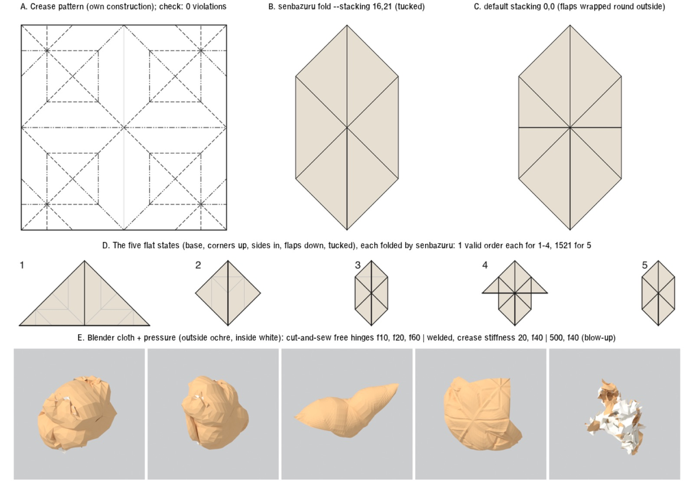

# Y5. The water bomb, flat and inflated

Experiment Y5, run 2026-09-28 against `main` at `83fc960`, in a scratch
directory; nothing in the repository was changed. It is one of the second-round
experiments the [completeness critique](Z2-critic.md) proposed, and its
evidence feeds [PRD 11](../11-prd-refined-final-forms.md). Its scripts are in
[`scripts/Y5-waterbomb/`](scripts/Y5-waterbomb/); other outputs it names (renders, saved states,
logs) were not kept, except the contact sheet below. Paths it quotes are relative
to its scratch folder.



## Question

Can senbazuru produce the traditional flat-folded water-bomb balloon? If not, where does it stop? And what does a tension-field inflation of it look like next to H4's closed cube (faces bulge about 21% of the half-width, edge midpoints drawn in about 8%)?

**Answer:**
- **The flat water bomb is ready now.** Only authoring it as a sequence and choosing the tuck by name wait on M4 and the D11 relations.
- **The inflated water bomb is not reachable yet.** Pressure on free hinges unfolds the model. Crease springs in Blender either still unfold it or blow the solver up.

## Setup

**Crease pattern.** I wrote the pattern myself: `src/wbcp.py` (Python 3, exact fractions on a 1/8 grid).
- Every face carries an affine map into the folded plane and a height z.
- Each traditional step reflects a chosen set of faces across a line and re-stacks them:
  1. waterbomb base (diagonals V, horizontal midline M, vertical midline F, as in `examples/waterbomb-base.fold`);
  2. front and back: bottom corners of the outer flaps up to the apex;
  3. front and back: side corners of the diamond to the centre line;
  4. front and back: the loose top points down along the side triangles' top edges;
  5. the tuck. The flap goes into the side triangle's pocket (between layers 3' and 2'), and the part that overhangs wraps round the side triangle's outer fold, between the unfolded layers 2 and 3.
- M/V is read from the final state: a crease is a valley where the two faces' top sides end up facing each other.
- No diagram, tutorial file or GPL source was copied. The step order is paraphrased from public step lists.

**Tools.**
- senbazuru, current build (see caveats). `stack exec` picks a stale build.
- Blender 4.4.1: cloth with pressure, sewing and self-collision.
- Python 3 (stdlib) and the X2 venv (numpy).
- ImageMagick 7.1.2 and rsvg-convert for the pictures.

**Meshes for inflation.**
- **Cut-and-sew** (`src/mesh.py`): each of the 48 faces becomes its own piece, lifted by its layer level (longest path over faceOrders, 24 levels, gap 0.001 sheet side). Each face triangle is cut into 6² triangles. Every folded crease is closed by zero-length sewing springs. Size: 1666 vertices, 2304 triangles, 462 springs, 0 crossing triangle pairs at the start.
- **Welded** (`src/mesh_welded.py`): one vertex per material point. Points on a crease sit at the mean height of their two faces, pushed outward so nested folds become nested U shapes, and carry a "crease" vertex group for bending stiffness. Size: 1225 vertices, 2304 triangles, 243 crossing pairs at the start, all at pattern vertices where up to 24 layers meet.
- **Both:** triangle normals point out of the paper's bottom side, so a positive pressure pushes on the top side.
- **Scale and settings:** sheet side = 10 Blender units; tension 1000, compression 0.1, shear 5, panel bending 0.05, quality 10, self-collision distance 0.003, collision quality 4, no gravity.

## Results

### 1. Flat state

| Stage | Creases B/M/V/F | Overlapping pairs | Valid orders |
| --- | --- | ---: | ---: |
| 1 base | 24/2/16/50 | 72 | 1 |
| 2 corners up | 24/10/24/34 | 200 | 1 |
| 3 sides in | 24/18/32/18 | 328 | 1 |
| 4 flaps down | 24/22/36/10 | 392 | 1 |
| 5 tucked | 24/26/40/2 | 552 | **1521** (3 components; 39 × 39) |

Later creases are kept as flat F lines in the earlier stages.

- **Pattern:** 45 vertices, 92 edges, 48 faces. `check`: 21 interior vertices, **0 violations**.
- **Fold:** `fold` writes 552 faceOrders in 0.15 / 0.13 / 0.20 s over 3 runs. `render --fold`, `render --steps --arrows` and `export --fold` (15,656-byte GLB) all work.
- **The tucked state is `--stacking 16,21`.** Its faceOrders agree **552/552** with my simulation.
  - Front to back where the flap sits: `F4' F3' F2f F1f F2' F1' F1 F2 F1tip F2tip F3 F4 | B4 B3 B2tip B1tip B2 B1 B1' B2' B1f B2f B3' B4'` (24 layers).
- **The default 0,0 is not the tucked state.** It agrees on 448/552 orders. There the front flap lies on top of everything and its tip at the very back, wrapped round the whole model, and a horizontal edge shows on the front.
- **The other 38 choices on each side** place the flap and its tip in other gaps: on top, in the groove, or round the outside.
- **Relations needed:** 4 neighbour relations per side single out the tuck (1 leaves 18 of 39, 2 leave 6, 3 leave 3). One such set, in material points: `layers (0.667,0.75) above (0.833,0.958)` (layer 3' over flap 2f), `layers (0.688,0.938) above (0.958,0.917)` (layer 2 over tip 1f), and the two back-side mirrors.
- **`crease --folded` cannot author step 2.** On the waterbomb base it writes N M, Eu V, El M, S V. The model needs N M, Eu V, El V, S M: the back pair folds away from the viewer. Folding only some layers is M4.

### 2. Which side faces the air (`src/cavity.py`)

On 2700 points × 2 stackings:
- 14,280 gaps have the pattern's top side on both faces;
- 11,580 have the bottom side on both;
- **0 are mixed**;
- the air outside touches only the bottom side.

So the balloon's inside is exactly the top side of the sheet, and it meets the outside air only at raw edges.

### 3. Inflation (Blender cloth)

| Run | Frame | Extent (sheet units) | Max / p99 edge stretch | Crossings (start → end) | Wall |
| --- | ---: | --- | --- | --- | ---: |
| cut-and-sew, free hinges, p=5 | 10 | 0.29×0.41×0.33 | 18% / 7.7% | 0 → 0 | 386 s (60 frames) |
|  | 20 | 0.35×0.47×0.47 | 20% / 7.2% |  |  |
|  | 60 | 1.05×0.78×0.76 | 7.2% / 0.9% |  |  |
| welded, crease stiffness 2, p=5 | 40 | 0.68×0.44×0.72 | 26% / 11% | 243 → 618 | 243 s |
| welded, stiffness 20, p=5 | 40 | 1.00×0.42×0.97 | 3.1% / 1.6% | 243 → 5 | 280 s |
| welded, stiffness 500, p=1 | 40 | 0.47×0.42×0.41 | 162%; 756% at frame 30 | 243 → 778 | 130 s |
| welded, stiffness 5000, p=0.5 | 40 | 0.65×0.83×0.70 | 2038%; 2662% at frame 20 | 243 → 2290 | 126 s |

The flat start is 0.50×0.25×0.023. An extent near 1 means the sheet has unfolded.

## Images

- `contact-sheet.png`:
  - A: the crease pattern;
  - B: tucked state (16,21);
  - C: default state (0,0), flaps wrapped outside;
  - D: the five states;
  - E: the Blender runs.
- `img/steps-arrows.png`: senbazuru's own step page with inferred arrows.
- `img/cy-strip.png`: Cycles renders, outside ochre and inside white:
  - free hinges at frame 10 give a lumpy ball, with specks of inside showing;
  - frame 60 is a two-lobed pillow of the whole sheet;
  - welded at stiffness 20 is an unfolded pillow with the crease pattern showing as ridges;
  - stiffness 500 is a crumpled blow-up with the inside exposed.
- `img/sew-strip.png` and `img/weld-strip.png`: Workbench frame sequences.

## What it shows

- **senbazuru can hold and draw the traditional flat water bomb today.** The layer solver finds the tucked arrangement among 1521 and checks it. Every ambiguity comes from the tuck: stages 1-4 are unique.
- **A tuck is a stacking choice, not a new crease.** Four relations per side pin it. The default stacking is a valid but wrong model.
- **The balloon's inside is the top side of the sheet everywhere.** Pressure needs no hand-named cavity faces.
- **Pressure on free hinges does not make a balloon.** Nothing holds the folds, so the paper unfolds to the size of the sheet, passing through a ball on the way. Crease memory is required, not an optional refinement.
- **A welded thick start self-intersects** where many layers meet a pattern vertex. Cut-and-sew avoids that but loses crease memory.

## What it does NOT show

- The inflated shape: I have no equilibrium and no bulge or draw-in numbers, so no comparison with H4's cube.
- That the Blender runs model paper: the stiffnesses are uncalibrated, and pressure on an open mesh is a follower load.
- Which creases a real blown water bomb opens. That the E/W midline creases must open like a paper bag's side folds is reasoned, not measured.
- That my tuck matches every traditional variant.
- IPC or X2's own solver on this model: not tried.
- Timings: the Blender runs were single runs under load.

## Recommendation for the PRD

1. **Keep the flat model.** Add the constructed water bomb as a flat fixture candidate (pattern plus tucked folded state), with the provenance above.
2. **Name the M4 dependency.** Authoring it as a sequence waits on M4 (folding only the front or back layers). Selecting the tuck waits on D11 relations: 4 per side, a second acceptance case next to the crane's tail tuck.
3. **Refuse `stacking first` on tucked models**, or warn when a relation-free default picks a wrapped-outside order.
4. **For inflation, the author must specify:**
   - the pattern or sequence;
   - the tuck relations;
   - which creases keep their rest angle, and how stiff they are relative to p̂;
   - the puff amount;
   - ball or hand-shaped cube (British Origami Society page).

   The mouth and cavity can be derived from the pattern's top side.
5. **Build the solver as X3's recipe.** Cut and lift by layer order, stitch under IPC with a thickness minimum distance, crease hinges with rest angles, tension-field panels. Gate it on reaching a held equilibrium before comparing with H4's cube. Inflation stays R (D18).

## Reproduce

From `experiments/Y5-waterbomb/`, with `B` the current `senbazuru` build (`stack run --` from the repository root; in the researcher's checkout `stack exec` found a stale binary, [V](V-verification.md)):

```
python3 src/wbcp.py out/waterbomb-balloon.fold            # pattern + -sim.json
for k in 1 2 3 4; do python3 src/wbcp.py out/stage-$k.fold $k; done
$B check out/waterbomb-balloon.fold; $B info out/waterbomb-balloon.fold --fold
$B fold out/waterbomb-balloon.fold --stacking 16,21 -o out/waterbomb-balloon-tucked.fold
python3 src/compare.py out/waterbomb-balloon-sim.json out/waterbomb-balloon-tucked.fold
python3 src/stackat.py out/waterbomb-balloon-sim.json out/stack/s-16-21.fold   # (cd src)
python3 src/cavity.py out/waterbomb-balloon-sim.json out/waterbomb-balloon-tucked.fold out/waterbomb-balloon.fold
$B render out/waterbomb-balloon.fold --fold --stacking 16,21 --rotate 90 -o img/folded-tucked-front.svg
$B export out/waterbomb-balloon.fold --fold --stacking 16,21 -o out/waterbomb-balloon-tucked.glb
for k in 1 2 3 4; do $B fold out/stage-$k.fold -o out/stage-$k-folded.fold; done
cp out/waterbomb-balloon-tucked.fold out/stage-5-folded.fold
python3 src/steps.py; $B render out/waterbomb-steps.fold --steps --arrows --columns 5 --rotate 90 --width 1000 --height 300 -o img/steps-arrows.svg
$B crease the repository root examples/waterbomb-base.fold --folded --from 0.5,0 --to 0.75,0.25 --valley -o out/base-creased.fold
../X2-inflation/venv/bin/python src/mesh.py out/waterbomb-balloon-tucked.fold out/waterbomb-balloon.fold out/mesh-n6.npz n=6 gap=0.001 scale=10
../X2-inflation/venv/bin/python src/mesh_welded.py out/waterbomb-balloon-tucked.fold out/waterbomb-balloon.fold out/weld-n6.npz n=6
Blender -b --factory-startup --python src/bl_inflate.py -- out/mesh-n6.npz bl/n6-p5.npz pressure=5 frames=60
Blender -b --factory-startup --python src/bl_inflate.py -- out/weld-n6.npz bl/weld-n6-p5-cb20.npz pressure=5 frames=40 crease_bend=20
Blender -b --factory-startup --python src/bl_view.py -- bl/n6-p5.npz img/cy-sew frames=10,20,60 engine=CY samples=16 res=420
```

For the stacking scan, loop `$B fold ... --stacking A,B` and run `compare.py` on each result (outputs in `out/stack/`, summary in `out/right-stacks.txt`). Logs are in `logs/`, results in `bl/*.npz`.

