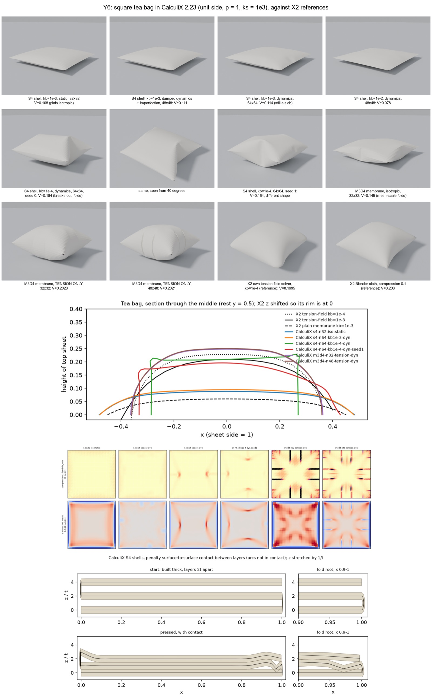

# Y6. General shell finite-element analysis, as an answer or an oracle

Experiment Y6, run 2026-09-28 against `main` at `83fc960`, in a scratch
directory; nothing in the repository was changed. It is one of the second-round
experiments the [completeness critique](Z2-critic.md) proposed, and its
evidence feeds [PRD 11](../11-prd-refined-final-forms.md). Its scripts are in
[`scripts/Y6-fea-oracle/`](scripts/Y6-fea-oracle/); other outputs it names (renders, saved states,
logs) were not kept, except the contact sheet below. Paths it quotes are relative
to its scratch folder.



## Question

The owner explicitly asked for "finite element analysis". This experiment asks three things.

1. Can a general nonlinear shell finite-element (FE) code be installed and run on this Mac? If so, does it reproduce the square tea-bag numbers that X2 and H4 found?
   - Tea bag: two squares joined at the rim and inflated.
   - Tension-field volume V = 0.1995 to 0.2027 × side³. A tension-field membrane is one where compression costs nothing.
   - Plain elastic membrane: about 0.09.
   - Also: installation time, run time, whether wrinkles appear, and whether results are deterministic.
2. What do the papers the critic flagged actually say?
   - Melancon et al. 2021.
   - Airbag folding and its reference geometry.
   - Solomon et al. 2012, Schreck et al. 2015, Burgoon et al. 2006.
   - Recent origami simulation and rendering work.
3. When does general shell FE beat the discrete-shell + IPC route for senbazuru, and when does it not? (IPC: incremental potential contact.)

## Setup

### Tool survey (checked 2026-09-28)

| Tool | Licence (source) | macOS arm64 here | Relevant features | Run? |
|---|---|---|---|---|
| CalculiX 2.23 | GPL-2.0-or-later (conda-forge metadata) | No Homebrew core formula (`brew info calculix-ccx`: none). The conda-forge `osx-arm64` build exists. | **Shells:** S3, S4, S4R, S6, S8, S8R, each expanded to 3D solids (C3D6, C3D8I, C3D8R, C3D20R). **Membranes:** M3D3, M3D4, M3D6, M3D8. **Pressure:** `*DLOAD` follower load. **Contact:** `*CONTACT PAIR` node-to-surface, surface-to-surface (penalty) and mortar. **Material:** built-in TENSION ONLY. **Procedures:** implicit HHT dynamics and explicit dynamics. | **Yes** |
| Code_Aster 18.1.7 | GPL-3.0-only AND CECILL-C AND Apache-2.0 AND LGPL-3.0-only (conda-forge) | conda-forge builds for linux-64 and win-64 only. The Docker daemon was not running. | Shells, contact | No |
| Kratos 10.4.4 | BSD-style licence with an advertising clause (repo `license.txt`; PyPI lists BSD-4-Clause) | PyPI wheels only for manylinux x86_64 and win_amd64 | **Shells:** MITC4 thick, DSG3, isotropic thin. **Membranes:** `membrane_element`. **Pressure:** `surface_load_condition_3d`. **Contact:** ContactStructuralMechanics, ALM mortar (all names from the GitHub tree). | No |
| FEniCSx (dolfinx 0.11.0) | LGPL-3.0-or-later | conda-forge osx-arm64. Dry run: 123 packages, 221 MB. | A PDE toolkit with no built-in shell element; you write the formulation yourself. | No |
| Abaqus, LS-DYNA | Commercial | Unavailable | What the airbag industry uses | No |

### Installation

- `brew install micromamba` took 53.7 s and installed formula 2.9.0 into `/opt/homebrew`. This is the only change to the system.
- `micromamba create -p env -c conda-forge calculix` took 4.7 s. It installed:
  - calculix 2.23 (build pl5321hd17ca8b_8), with SPOOLES solver;
  - arpack 3.9.1;
  - OpenBLAS 0.3.34;
  - llvm-openmp.
- Both timings are single runs.

### Model

The tea bag follows X2's model:
- unit side, internal pressure p = 1;
- `ks` = E·t/(p·L) = 1e3 (membrane stiffness);
- `kb` = D/(p·L³) (bending stiffness), with D = E·t³/12 and Poisson's ratio ν = 0;
- so t = √(12·kb/ks), and E = ks/t.

Because the bag is symmetric top to bottom, only the top sheet is modelled.
- Every rim node gets u_z = 0 and nothing else. On a CalculiX shell node, constraining translations only is a hinge (manual §6.2.14), which is how the real seam behaves.
- Two nodes remove rigid in-plane motion: the centre node has u_x = u_y = 0, and the rim midpoint (1, 0.5) has u_y = 0. Any wrinkle pattern is still allowed.

Starting and rest geometry:
- The rest shape is X2's starting dome, z = 0.02·sin(πx)·sin(πy).
- Some runs add a smooth random imperfection: a sum of Fourier modes up to 12 or 16, with amplitude 1·t.

Measurements:
- V = 2 × the volume under the top sheet (the bottom sheet mirrors it).
- Thickness = 2 × the highest z.
- Strains are measured against the flat unit square, as X2 did.

Meshes: 32², 48² and 64² quadrilaterals (1,024 to 4,096 elements).

Solution procedures, with the pressure ramped over time 0 to 1:
- `*STATIC` with large-displacement geometry (NLGEOM); or
- `*DYNAMIC` using the HHT time integrator (α = −0.3), with mass-proportional damping α_R = 100, followed by a hold at full pressure of 0.5.

Machine: M1 Max, 10 cores. Other agents kept the load average between 8 and 250 throughout.

### Own code (all in `experiments/Y6-fea-oracle/`)

| File | Purpose |
|---|---|
| `gen.py` | Writes the CalculiX input deck |
| `post.py` | Measures V, strains and angles between neighbouring triangles |
| `run.sh` | Runs one deck |
| `repeat.sh` | Runs a deck 3 times single-threaded, compares outputs byte for byte |
| `history.py` | Volume history of a run |
| `fold_test.py` | Crease test |
| `stack_test.py`, `stack_post.py`, `stack_fig.py` | Three-layer contact test |
| `figs.py`, `contact.sh` | Figures and contact sheet |

Renders use X2's `bl_render.py` unchanged (Blender 4.4.1). Python is X2's virtual environment.

## Results

### 1. Tea-bag volume

V is in units of side³. Thickness is the gap between the two sheets at the centre.

**X2 references**

| Model | V | Thickness |
|---|---|---|
| Own tension-field solver, kb 1e-4, 24² | 0.1995 | 0.497 |
| Own tension-field solver, kb 1e-3, 24² | 0.1800 | 0.454 |
| Own tension-field solver, kb 1e-2, 24² | 0.1012 | 0.256 |
| Own plain membrane, kb 1e-3 / kb 1e-2 | 0.0920 / 0.0482 | 0.157 / 0.101 |
| Blender cloth, compression stiffness 0.1, 2,304 triangles | 0.2027 | |
| Published maximum-volume bounds | 0.2055 to 0.217 | |

**CalculiX runs**

| Run | Elements | Material | kb | Procedure | V | Thickness | Notes |
|---|---|---|---|---|---|---|---|
| m3d4-n32-tension-dyn | M3D4, 32² | tension-only | (membrane) | dynamic | **0.2023** | 0.4957 | Largest compression 75%, gathered in single element rows. Median stretch 0.14%; largest 9.3%, at the corners. |
| m3d4-n48-tension-dyn | M3D4, 48² | tension-only | (membrane) | dynamic | **0.2021** | 0.5002 | Converged with mesh to 0.1% |
| m3d4-n32-tension-dyn-hold3 | as above | tension-only | | hold of 3 instead of 0.5 | 0.2021 | | Converged in time to 0.1% |
| m3d4-n32-iso-dyn | M3D4, 32² | isotropic | (membrane) | dynamic | 0.1449 | 0.2421 | Mesh-scale folds, largest angle 82.7° |
| s4-n32-iso-static | S4, 32² | isotropic | 1e-3 | static | 0.1075 | 0.1765 | Compression p99 1.1%, no wrinkles |
| s4-n32-iso-static-imp1 | S4, 32² | isotropic | 1e-3 | static, 1t imperfection | 0.1078 | 0.1766 | |
| s4-n48-iso-dyn | S4, 48² | isotropic | 1e-3 | dynamic + imperfection | 0.1112 | 0.1823 | |
| s4-n64-iso-static | S4, 64² | isotropic | 1e-3 | static | 0.1119 | 0.1826 | |
| s4-n64-kb1e-3-dyn | S4, 64² | isotropic | 1e-3 | dynamic + imperfection | 0.1140 | 0.1896 | Still a slab |
| s4-n48-kb1e-2-dyn | S4, 48² | isotropic | 1e-2 | dynamic + imperfection | 0.0782 | 0.1461 | |
| s4-n32-kb1e-4-static | S4, 32² | isotropic | 1e-4 | static | 0.1220 | 0.1903 | Still a slab |
| s4-n64-kb1e-4-dyn, seed 0 | S4, 64² | isotropic | 1e-4 | dynamic + imperfection | **0.1836** | 0.4570 | Breaks out into sharp folds. Largest angle 58.6°. Edge-midpoint pull-in (left, right, bottom, top) 0.21 / 0.23 / 0.08 / 0.08. |
| same, seed 1 | S4, 64² | isotropic | 1e-4 | dynamic + imperfection | **0.1839** | 0.3985 | Pull-in 0.17 / 0.07 / 0.17 / 0.17: a different shape |

**Runs that diverged** (step size fell below the minimum):

| Run | Stopped at |
|---|---|
| M3D4 isotropic, static | 23% of load |
| M3D4 tension-only, static | 0.2% of load |
| S4 with 5t imperfection, static | 32% of load |
| S4, kb 1e-4, 48², static | 69% of load |
| S4 with tension-only material, dynamic | 80% of load, after 1,042 s |

**Comparisons**
- The CalculiX tension-only membrane is 1.4% above X2's own solver, 0.2% below Blender, and 1.6% below the lower published bound.
- The plain shell at kb 1e-3 reaches 63% of the tension-field volume.
- The plain shell at kb 1e-4, once it breaks out, reaches 92%.

### 2. Determinism and cost

| Deck | Threads | Repeats | Increments | User CPU (s) | Wall (s) | Output |
|---|---|---|---|---|---|---|
| s4-n32-iso-static | 1 | 3 | 57 each | 18.4 / 19.7 / 19.6 | 69 / 75 / 79 | byte-identical |
| m3d4-n32-tension-dyn | 1 | 3 | 330 each | 119.6 / 121.0 / 114.7 | 437 / 497 / 285 | byte-identical |
| m3d4-n32-tension-dyn | 2 | 2 | 330 each | | 231 / (lost) | differ by ≤ 1e-7 (7th digit) |

Single-run wall times for other decks:

| Deck | Wall time | Conditions |
|---|---|---|
| S4 32² static | 21 s | |
| S4 64² static | 146 s | |
| S4 64² kb 1e-3 dynamic | 262 s | 3 threads, low load |
| S4 64² kb 1e-4 dynamic | 2,186 s | seed 0, heavy load |
| S4 64² kb 1e-4 dynamic | 595 s | seed 1, lighter load |
| M3D4 48² dynamic | 1,053 s | |

### 3. Creases: does a shared-node fold behave as a hinge?

The test strip is 1 × 0.2 and folded back on itself, with layer B 0.01 above layer A. Layer A is held, and B's free end is lifted by a prescribed 0.3 in a static run.

| Fold line built as | Reaction force | Largest sag of B off its chord |
|---|---|---|
| Shared nodes | 1.80e-4 | 0.047 (B bends like a cantilever; the fold angle barely changes) |
| Doubled nodes tied by `*EQUATION` on translations only | 2.0e-13 | 0.0095 (the initial kink: B swings rigidly) |

A shared node where two shells meet with normals about 170° apart becomes a CalculiX "knot", a rigid body (manual §6.2.14).
- A crease needs node doubling plus constraint equations to act as a hinge, and then it has no stiffness at all. I did not attempt to add a rotational spring.
- Each shell is expanded into a solid of thickness t, so a fold of radius below t/2 would make inverted solid elements. A flat fold with zero gap cannot be built.

### 4. Contact between three stacked layers

A strip is Z-folded into three layers, built the airbag way:
- each fold is a half circle of radius g/2, with layers g = 2t apart;
- 576 S4 elements;
- penalty surface-to-surface contact, contact stiffness 1e5;
- the fold arcs are not part of the contact surfaces;
- pressure p = 1 on the top layer; the bottom layer is held.

Results:
- **With contact:** 24 increments, 84 s. The spacing is 1.00 t at 97.6% of stations. At the fold root (x = 0.975) layer 1 sinks to **0.569 t** above layer 0, an overclosure of 43% of t. Layers 1 and 2 are 0.919 t apart at x = 1.
- **Without contact:** diverged at 0.7% of load.

### 5. CalculiX gotchas, each verified by a run

- The manual says a tension-only material's name must start with "TENSION ONLY". CalculiX strips blanks from names, so that name fails ("no user material subroutine"). `TENSION_ONLY_...` works.
- On M3D4 membranes, `*DLOAD` label `P` is silently ignored: zero load, zero residual, and the job still reports "finished". Label `P1` works. On shells, a positive `P` pushes along the element normal.
- Static Newton iteration does not get through membrane inflation or the onset of wrinkling. Damped implicit dynamics does.

### 6. Literature

These were fetched and read on 2026-09-28 unless marked otherwise.

- **Melancon, Gorissen, García-Mora, Hoberman, Bertoldi, Nature 592 (2021).** The main text is behind a paywall (idp redirect; the Harvard DASH links returned an error page). The abstract says the design was guided by geometric analyses and experiments. I read the full Supplementary Information: https://static-content.springer.com/esm/art%3A10.1038%2Fs41586-021-03407-4/MediaObjects/41586_2021_3407_MOESM1_ESM.pdf
  - Design is by the inscribed-angle theorem and a measure of geometric incompatibility for each triangle.
  - Validation is experimental: pressure-volume curves from a syringe pump, with energy obtained by integrating them.
  - Hinges are made by scoring or engraving thinner material.
  - It contains **no finite-element analysis at all** (0 hits for Abaqus or finite element).
  - `docs/related-projects.md:56` and `docs/notes/the-puff-is-a-drawing.md:162` attribute an Abaqus model with shells, pressure and self-contact to this work. The Supplementary Information does not support that.
- **LS-DYNA Keyword Manual vol. I, v960**, `*AIRBAG_REFERENCE_GEOMETRY` (p. 1.42): https://lsdyna.ansys.com/wp-content/uploads/2025/02/ls-dyna_960_manual_k_vol-1.pdf
  - Using the folded bag as its own reference would let the stretching and compression from folding distort the deployed shape.
  - So the unstretched configuration is supplied separately, and stresses are measured against it.
  - A reference geometry smaller than the folded one induces no initial tension.
  - Options exist to delay it (BIRTH) and to base the time step on it (RDT).
- **LS-DYNA support, "Airbag contact"**: https://www.dynasupport.com/tutorial/contact-modeling-in-ls-dyna/airbag-contact
  - For airbag self-contact it recommends the soft-constraint option (SOFT=2), because of the many initial penetrations in a folded bag.
  - Alternatively, a contact thickness that grows over time from very small, or tracking of initial penetrations (IGNORE=1).
  - A minimum fabric contact thickness of 1 mm.
- **LSTC FAQ slides**, read through the mirror https://slidetodoc.com/modeling-airbags-in-lsdyna-airbag-simulation-two-approaches/
  - LS-PrePost folds along mesh lines: thin, thick, tuck and spiral folds.
  - Folding can stretch elements, hence the reference geometry.
  - Folded-state penetrations are sometimes unavoidable and are ignored by segment-based soft contact.
  - `*MAT_FABRIC` uses an optional thin elastic liner that takes a little compression, which is effectively a tension-field membrane.
- **d3VIEW, TSRFAC**: https://www.d3view.com/tsrfac-gradual-introduction-of-strains-in-bag-when-using-reference-geometry/ The reference-geometry strains can be brought in gradually through a scale-factor curve.
- **Sharma, Mukherjee, Chawla, "A Mechanism of Meshing a Folded Airbag"** (IIT Delhi), §1–5: https://web.iitd.ac.in/~achawla/PDF%20Files/A%20Mechanism%20Of%20Meshing%20A%20Folded%20Airbag.pdf
  - Folds are geometric transformations of stacked planar layers joined by inclined layers.
  - Critical points are placed by an optimisation that preserves area.
  - The user sets a fold width: the gap between the innermost layers.
  - Outer layers take a larger circumference than inner ones.
  - Internal penetration is treated as catastrophic for the unfolding simulation.
  - The folded mesh is then inflated in PAM-CRASH.
- **Abaqus `*INITIAL CONDITIONS, TYPE=REF COORDINATE` and `*FABRIC` (STRESS FREE INITIAL SLACK):** search summaries only. The documentation pages returned 403, a TLS mismatch, or refused the connection. **Unverified.**
- **Solomon, Vouga, Wardetzky, Grinspun, "Flexible Developable Surfaces", SGP/CGF 2012**: http://ddg.math.uni-goettingen.de/pub/discrete_developables.pdf
  - The flat sheet is cut into convex pieces along folds and rulings, and each piece is placed by a rigid motion, so the surface is exactly developable.
  - A discrete mean-curvature bending energy relaxes the surface.
  - Subdivision gives smoothed bends that stay developable, and the paper says the scheme does not lock.
  - Limitations it states: projection onto admissible shapes is a nonlinear optimisation, interactive only at moderate scale, and prone to local minima. Heavily folded shapes are hard.
  - It handles no contact.
  - This is the "smoothing without stretching" tool the notes ask for, not a contact solver.
- **Schreck, Rohmer, Hahmann, Cani, Jin, Wang, Bloch, TOG 35(1) 2015**: https://inria.hal.science/hal-01202571
  - Physical steps on a coarse mesh use Narain's FEM code: Green strain, discrete flexural energy, implicit integration, and collisions by impact zones plus repulsion springs.
  - These alternate with procedural developable geometry: flat regions, generalised cones and singular vertices.
  - Speed is 1 to 10 fps. Their Table II: 89 triangles and 100 ms of simulation, against 1,668 triangles and 14,700 ms for standard FEM, and 4,640 ms for Narain's method.
  - It is about crumpling, not origami. Collisions are not handled on the procedural geometry, and pressure inside a curved region is not supported.
- **Burgoon, Wood, Grinspun, "Discrete Shells Origami", CATA 2006**: https://users.csc.calpoly.edu/~zwood/research/pubs/origamiCATA06.pdf
  - Uses Grinspun's discrete shells with Newmark integration.
  - A fold inserts mesh edges along a line drawn in flat coordinates, then changes their rest angle gradually.
  - A tangent term strengthens forces near 180° to make up for having no collision handling; the example folds are ±170°.
  - Folds near 180° produced excessive forces, and sliver triangles forced small steps.
  - The authors report they were "not able to ... even make a modest paper crane".
- **Recent work, 2023–2026:**
  - C-IPC (Li, Kaufman, Jiang; arXiv 2012.04457, abstract read): thickness offsets for shells, and strain limiting as a barrier energy.
  - Progressive Shell Quasistatics (Zhang et al., TOG 42(6) 2023): intersection-free wrinkling and folding of shells with friction. Search summary only.
  - Maeda et al., "An Origami Simulator for Papers with Nonzero Thickness", Origami8 (2026): metadata only.
  - FoldingAgent (arXiv 2609.00377, Aug 2026): turns videos into folding programs. The abstract says nothing about the physics or rendering.
  - In the time box I found nothing that simulates a multi-layer model like the crane with contact and shows refined renders.

## Images

- `experiments/Y6-fea-oracle/contact-sheet.png`: the 12 renders, the mid-section profile, the compression and wrinkle maps, and the contact stack.
- `img/profiles.png`: the section at y = 0.5 against X2's curves.
- `img/maps.png`: compression and wrinkle-residual maps.
- `img/stack.png`: the three-layer contact test, before and after pressing.
- Individual renders:
  - `img/s4-n64-kb1e-4-dyn.png`, `img/s4-n64-kb1e-4-dyn-high.png`, `img/s4-n64-kb1e-4-dyn-seed1.png`: the fold break-out; same volume, different shapes.
  - `img/m3d4-n48-tension-dyn.png`: correct mean shape, but slack collapses into grooves that are mesh artefacts.
  - `img/s4-n64-kb1e-3-dyn.png`: still a slab at kb 1e-3.

## What it shows

1. **CalculiX is a workable external oracle for inflation.** It installs in about a minute on this Mac and runs a text deck. Single-threaded, it is byte-deterministic. With its built-in tension-only material it reproduces X2's tension-field tea bag to 1.4%, it converges with mesh (0.2023 → 0.2021) and in time (0.2023 → 0.2021). Three independent codes now agree: X2's own solver, Blender, and CalculiX.
2. **General FE does not decide the tension-field question.** The tension-field answer appeared only after I chose the tension-only material, the same decision X2 made. A plain isotropic shell at kb = 1e-3 stays a slab at 0.108 to 0.114 across 32², 48² and 64² meshes and both static and dynamic procedures. At kb = 1e-4 on 64², damped dynamics resolves sharp folds and reaches 92% of the tension-field volume. The static runs could not get past the instability at 69% of the load.
3. **Once wrinkling starts, only the volume is reliable.** The two seeds agree on V to 0.2% but differ by 15% in thickness and in the pattern of pull-in. The folded bags look more like creased paper than the smooth tension-field cushion does, which is a hint for the look work. They are not unique, though.
4. **FE has no model of a crease.** Shared-node folds are rigid (reaction 1.8e-4 against 2e-13). Hinges must be made by hand for each crease, and folds tighter than radius t/2 cannot be meshed. The discrete-shell hinge energy gives a crease for free.
5. **Penalty contact gives no guarantee against crossing.** Where layers are flat it holds a 1 t spacing, but at a fold root one layer sinks to 0.57 t. The airbag industry accepts initial penetrations (soft contact, contact thickness ramped from small). senbazuru's gate is no crossings, which only barrier contact (IPC) guarantees.
6. **Two repository docs misattribute Melancon et al. 2021.** The Supplementary Information has no FE model.

## What it does NOT show

- It does not show FE on the crane or on any multi-layer inflation. It does not show contact starting from a truly flat-folded state (zero gap), and CalculiX's ADJUST option was not tried.
- It does not show FE with bending plus tension-field behaviour: the S4 shell with the tension-only material diverged. X2's kb = 1e-3 tension-field value of 0.180 therefore has no FE check.
- It does not show whether the kb = 1e-3 slab would break out with a finer mesh, larger or different imperfections, or other damping.
- It does not show convergence of the wrinkle wavelength. Some mesh-scale striations are visible.
- It does not show which answer real paper gives. No calibration to real paper was done, and the X2/H4 estimate for kami (kb 5e-3 to 5e-2) is exactly where the plain-shell and tension-field answers differ most.
- Code_Aster, Kratos and FEniCSx were not run, and Abaqus and LS-DYNA were not available.
- Wall times are dominated by other agents' load; see the determinism table for user CPU.

## Recommendation for the PRD

1. **Route.** Do not use general shell FE for the crane. Keep discrete shells plus IPC with a paper-thickness minimum distance, as X3 recommended, and build the thick start as its own milestone.
2. **Oracle.** List CalculiX (conda-forge, GPL, run only, outside the repo and CI, like Blender) as the external FE oracle for smooth single-layer checks:
   - inflation mean shape, with a tension-only M3D4 membrane and damped dynamics;
   - resolved-wrinkle checks at small kb, with S4 elements, damped dynamics and a stated seed.

   A FOLD-to-.inp writer is small; `gen.py` here is about 150 lines. Name the gotchas in its notes.
3. **Benchmark.** Gate any in-repo inflation solver on the tea bag: V = 0.202 ± 2% and thickness about 0.50 in the tension-field limit, plus X2's Mylar balloon. Gate on volume, not on shape.
4. **Non-uniqueness.** State in the PRD that wrinkled or folded inflation is not unique: a physically based puffed pose needs a stated path and seed. Put the choice between tension-field and plain membrane, or a measured paper bag, to the owner as an explicit decision.
5. **Docs.** Fix or mark unverified the Melancon claims at `docs/related-projects.md:56` and `docs/notes/the-puff-is-a-drawing.md:162`.
6. **From airbags.** Take two things: build the start geometrically with fold widths and keep the flat sheet as the stress-free reference. Consider scheduling the minimum contact distance (small at first, growing) as the IPC counterpart of the contact-thickness ramp, to ease X3's contact jam. Do not take the industry's tolerance for initial penetration.
7. **Literature for the notes.** Solomon et al. 2012 is the reference for smoothing panels without stretching them. Burgoon et al. 2006 is the precedent showing that discrete shells without contact cannot fold a crane.

## Reproduce

Run from `experiments/Y6-fea-oracle/`. PY is `../X2-inflation/venv/bin/python`.

```bash
brew install micromamba                          # formula 2.9.0
export MAMBA_ROOT_PREFIX=$PWD/mamba
micromamba create -y -p $PWD/env -c conda-forge calculix

# tea bag (runs/NAME.meta.json records every parameter)
NT=2 ./run.sh m3d4-n32-tension-dyn --elem M3D4 --n 32 --mat tension --proc dynamic --rayleigh 100 --hold 0.5 --inc 1e-3 --incmax 5e-3
NT=2 ./run.sh s4-n32-iso-static --n 32 --inc 1e-3
NT=3 ./run.sh s4-n64-kb1e-4-dyn --n 64 --kb 1e-4 --imp 1 --kmax 16 --proc dynamic --rayleigh 100 --hold 0.5 --inc 1e-3 --incmax 5e-3   # add --seed 1
NT=3 ./run.sh s4-n64-kb1e-3-dyn --n 64 --kb 1e-3 --imp 1 --kmax 16 --proc dynamic --rayleigh 100 --hold 0.5 --inc 1e-3 --incmax 5e-3
./repeat.sh s4-n32-iso-static                     # 3x single-threaded, timing + byte comparison

# crease and contact tests
$PY fold_test.py shared; $PY fold_test.py hinge; (cd runs && ../env/bin/ccx -i fold-shared && ../env/bin/ccx -i fold-hinge)
$PY stack_test.py stack-g2-contact 2 contact -1; (cd runs && ../env/bin/ccx -i stack-g2-contact); $PY stack_post.py stack-g2-contact; $PY stack_fig.py

# figures
./render.sh NAME smooth=0 elev=14; $PY figs.py RUN ...; ./contact.sh
```

Defaults in `gen.py`: ks = 1e3, kb = 1e-3, ν = 0, dome height 0.02, pressure sign +1, initial increment 1e-3, largest increment 0.02. The CalculiX manual (ccx_2.23.pdf), the LS-DYNA 960 manual volume I and the open papers are in `lit/`; nothing was vendored and the repository was not modified.

