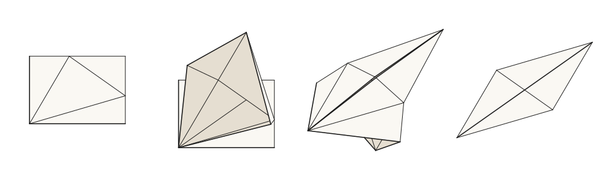
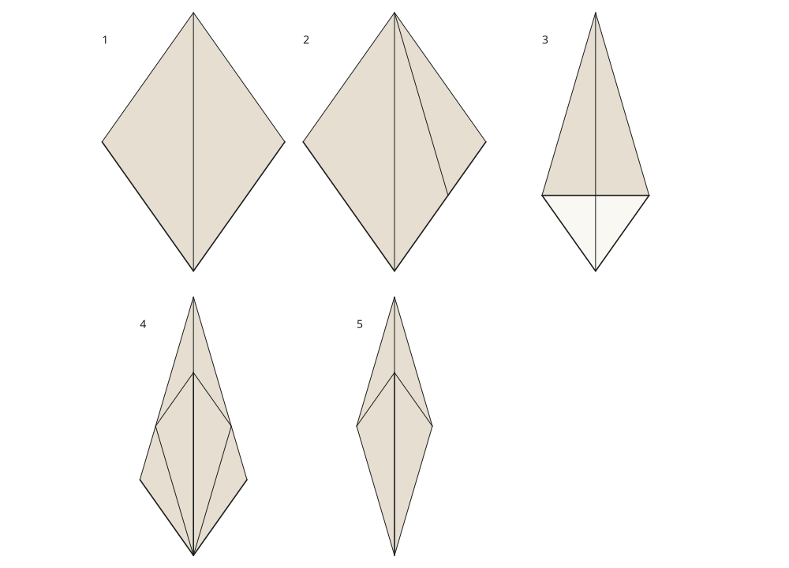
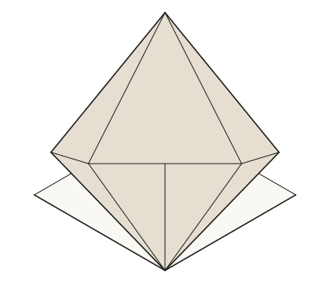

# senbazuru

[](https://github.com/avalonalex/senbazuru/actions/workflows/ci.yml)
[](LICENSE)
[](https://www.haskell.org/)

**Origami diagrams from [FOLD](https://github.com/edemaine/FOLD) files.** Hand it
a crease pattern — FOLD, or the `.cp` and `.opx` the desktop editors write — and
get back the picture a book would print.

*Senbazuru* (千羽鶴) is the practice of folding a thousand paper cranes. This is
the version where you fold none of them and still get the pictures.

<p align="center">
  
</p>

One sheet becoming a [bird base](docs/glossary.md), from left to right: square base, first petal
lifted, second petal lifted underneath, both pressed flat. These four checkpoints
come from a [sixteen-state FOLD sequence](examples/bird-base-sequence.fold),
drawn by the main renderer with one camera and scale. Material lengths, shared
vertices, crease angles, contact and layer order are checked at the supplied
states. The [study](study/fold-material/README.md) explains their construction;
the checks do not certify collisions between checkpoints.

> **Status: early**, and moving. Crease patterns, folding, layer order, hidden
> lines, two-sided paper, opened-out stacks, fold arrows, step-by-step pages, a
> flat-foldability checker, a 3D export, the `.cp` and `.opx` readers, and the
> first authoring verbs. Checked intermediate folds and exported sequences work
> today. A general vocabulary for writing instructions, arbitrary fold-motion
> solving, and operations to spread wings or inflate bodies are still ahead.
> [Roadmap](#roadmap) · [everything that works, at length](docs/tour.md)

## Try it

You need [Stack](https://docs.haskellstack.org/).

```bash
git clone https://github.com/avalonalex/senbazuru && cd senbazuru
stack build
stack run -- render examples/crane.fold --fold --rotate 180 -o crane.svg
```

Then keep going:

```bash
stack run -- render examples/crane.fold --fold --view bottom --rotate 180 -o underside.svg
stack run -- render examples/quarter-fold-steps.fold --steps --arrows -o steps.svg
stack run -- render examples/bird-base-sequence.fold --steps --columns 4 --view iso --width 1000 --height 1000 -o bird-steps.svg
stack run -- render examples/quarter-fold.fold --fold --offset 6 -o stack.svg
stack run -- render examples/bird-base.cp --fold -o bird-base.svg
stack run -- check examples/crane.fold
stack run -- export examples/crane.fold --fold -o crane.glb
stack run -- fold examples/crane.fold -o crane-folded.fold
```

`stack test` runs the suite, including the material-study checks. Every flag
is in [docs/usage.md](docs/usage.md).

## The interesting part is that paper is opaque

Drawing a crease pattern is easy: the coordinates in the file are already the
coordinates on the page. Drawing a *folded* model is not, and the reason is
layers.

Fold a crane and press it flat, and all seventy-two of its faces lie in the same
plane. Something has to be on top of something else, and nothing in the
coordinates says which — there is no depth left to compare. So senbazuru works
it out, from four local rules about how paper can and cannot interleave, and
finds that the crane has **five** valid answers. All of them are real paper.
Two of them are different pictures. Ku's pinwheel pockets has forty-seven, and
one model in the reference corpus has more than 10⁸³, which is more layer
orders than there are atoms in the observable universe.

Then there are the ones that stack in a *circle*. The four flaps of a twist lie
A over B over C over D over A, with no paper passing through any other and no
order at all to paint four faces in. That model cannot be drawn face by face
however carefully you sort them, so senbazuru draws what is *visible* instead:
over any one point of the page the layers are perfectly well ordered, even when
the whole model is not.

None of that shows in the output, which is rather the point.

## Three pictures a book would print

**A frog base, one checkpoint at a time.** Five verified folding states show
the square base, one pocket flattened, all four flattened, one long flap
lifted, and the completed frog base. Each picture has the same camera and scale;
the [folding guide](study/fold-material/README.md) explains the operations.

<p align="center">
  
</p>

**The underside.** Origami paper is coloured on one side, and `--view bottom`
on a flat-folded model is a different picture rather than the same one upside
down: a different set of faces is on top, and they show the other side of the
sheet. This is the twist whose flaps stack in a circle.

<p align="center">
  
</p>

**A flap in mid-fold.** The first bird-base flap rises while the packet below
it stays folded. The positions come from linked crease angles, with material
lengths and contact checked at this state. SVG projects the same material
surface that the glTF exporter lets you turn over.

<p align="center">
  
</p>

## What it does

- **Draws crease patterns** in the Yoshizawa–Randlett notation every book uses:
  solid for the edge of the paper, dashed for a valley, dash-dot-dot for a
  mountain.
- **Folds them.** Give it a pattern and its fold angles and it computes where
  every face ends up, then draws that from above, below, the front, the side,
  or an isometric angle.
- **Works out which layer is on top** when the file does not say, and tells
  you how many other answers there were so you can ask for a different one.
- **Draws only what you can see**, in two paper colours, with hidden edges
  removed.
- **Opens the stack out**, infers the arrows, and lays a sequence out as one
  numbered page at one scale.
- **Exports a 3D model.** glTF (`.glb`), both sides of the paper in their two
  colours. Two scenes share the same material positions: exposed paper for
  stable viewing and the complete sheet for inspection. Creases stay joined;
  graphics corners retain their material references.
  [Preview both scenes](study/gltf/README.md).
- **Checks flat-foldability** at every interior vertex by Maekawa's theorem and
  Kawasaki's, and says which vertex fails and why — including the failure that
  is neither theorem, a crease that stops in the middle of the paper.
- **Draws a crease and writes the pattern back out.** `crease` is the one
  command that produces a crease pattern rather than a picture of one. With
  `--folded` it draws the line on the *folded model* and writes the creases it
  makes on the sheet, one per face it crosses — and because alternate layers lie upside
  down, asking for one valley across four layers comes back as mountain,
  valley, mountain, valley, which is what the paper would do.
- **Reads what people actually share.** Most patterns in the wild are not FOLD
  files but Orihime and Oriedita's `.cp` or ORIPA's `.opx`: a flat list of
  creases with the vertices left out. It rebuilds the vertices and carries on.
- **Works out what a file leaves unsaid.** Most patterns record no faces, but a
  crease pattern is a planar graph and its faces are the regions the creases
  cut the sheet into, so it traces them. Creases that cross with no vertex, or
  stop part-way along another, are cut where they meet first — one real ORIPA
  design has seventy-one of those and could not be folded here until it was.

Each of those has a section in [the tour](docs/tour.md), with the command and
the reasoning.

## Current limits and future work

- **Automatically turn a crease pattern into instructions.** The project is
  building a vocabulary so a person can author a sequence; a general sequence
  solver remains outside its scope ([why](docs/notes/no-sequence-solver.md)).
- **Spread wings or inflate a body.** These are future goals, including the
  traditional waterbomb balloon. A connected mesh lets us represent the paper,
  but opening it also needs compatible crease motion, contact checks and,
  where panels curve, bending behaviour. Start with a controlled opening
  amount; a pressure-driven model would additionally need a defined cavity
  and treatment of its openings. See [wing motion](https://github.com/avalonalex/senbazuru/issues/54),
  [body opening](https://github.com/avalonalex/senbazuru/issues/106) and
  [the connected-surface plan](docs/notes/connected-paper-surface.md).
- **Model every paper treatment.** Wet-folding, damage and detailed crease
  ageing are not current goals. The shared surface can store physical thickness;
  mechanics that use it for packing and clearance are future work.
- **Guess.** A model with no valid layer order is refused with the reason, not
  drawn as something plausible. A file whose faces cannot be traced draws as a
  crease pattern and declines to fold. A mirrored model folds perfectly well
  and is not the model in the file, so the camera turns and the paper does not.

## Why the crane is upside down

Because nothing in a FOLD file says which way up a crease pattern is meant to
be read, and this one lands on its head. `--rotate` turns the *camera*, which
matters more than it sounds: a *mirrored* drawing would look just as right, and
would be a picture of the other crane — the one whose creases are these
reflected, whose mountains and valleys are swapped, and which folds perfectly
well from a square of its own. It is simply not the model in the file.

## Why Haskell, and why so many words

Senbazuru is a learning project as well as a tool, and it is written for a
programmer who is comfortable with Haskell and has never folded anything. So it
is optimised for clarity over cleverness, and it explains itself: every module
header says why the module exists and what a newcomer would get wrong in it,
and [docs/notes/](docs/notes/) holds the theorems, algorithms and traps it runs
on, one idea per file with references. If you know Haskell and not origami,
start with [the primer](docs/fold-primer.md). If you know origami and not
Haskell, start with [the tour](docs/tour.md); the pictures are the same either
way.

## Roadmap

Roughly in order. Each item is an issue tagged
[`roadmap`](https://github.com/avalonalex/senbazuru/labels/roadmap), where the
approach and the acceptance criteria are written out; this list is the map, the
issues are the detail, and the smaller pieces in between are the rest of the
[issue tracker](https://github.com/avalonalex/senbazuru/issues).
[docs/roadmap.md](docs/roadmap.md) is the state of play behind this list,
with every open issue tiered by how hard it is.

1. **[One connected paper surface for folding and rendering.](https://github.com/avalonalex/senbazuru/issues/146)**
   The shared surface and study refinement are now in the library, with SVG
   and glTF entry points. The glTF replacement now preserves crease positions
   and material identities, with visible and complete scenes. Physical thickness
   remains optional; bending resistance and crease preferences are later work.
   This is an alpha: obsolete internal paths can be replaced as verified cases
   pass through their replacements.
   → [connected-paper-surface](docs/notes/connected-paper-surface.md)
2. **[A vocabulary of folds, so a sequence can be authored.](https://github.com/avalonalex/senbazuru/issues/60)**
   FOLD output came first, since nothing else can be built without it, and the
   first move is built: `crease` draws a line on a pattern, or through the
   layers of a folded model, and writes the result out. What is missing is the
   rest of the vocabulary — turning the model over, rotating a flap, and the
   named moves a book uses — and a way to write a whole sequence down. Not a
   sequence *solver*; see above.
   → [huzita-hatori](docs/notes/huzita-hatori.md),
   [round-trips](docs/notes/round-trips.md)
3. **[Folding in three dimensions.](https://github.com/avalonalex/senbazuru/issues/55)**
   Specific square/waterbomb collapses, fish folds and bird petals already have
   checked intermediate states. Generalise those constructions to authored
   flap and wing motion, with layers staying out of each other. Follow with
   [controlled body opening](https://github.com/avalonalex/senbazuru/issues/106),
   adding panel bending where the rigid model cannot reach the intended form.
   A mesh supplies the geometry; it does not choose the motion by itself.
   → [fold-angles-are-the-state](docs/notes/fold-angles-are-the-state.md),
   [folding-by-transforms](docs/notes/folding-by-transforms.md)
4. **[A schematic side view of the stack.](https://github.com/avalonalex/senbazuru/issues/50)**
   What a book draws when a model has too many layers to show them all at once,
   and the answer to where `--offset` runs out. It should use the shared
   surface's layer relationships, with any display separation labelled as a
   drawing aid rather than a physical thickness.
   → [paper-thickness](docs/notes/paper-thickness.md)

## Documentation

| Where | What |
| --- | --- |
| [docs/tour.md](docs/tour.md) | Every feature at length, with the command and the reasoning behind it |
| [docs/usage.md](docs/usage.md) | Building it, running it, and every flag of every command |
| [docs/architecture.md](docs/architecture.md) | The pipeline, what each module holds, and the rules about which may know about which |
| [docs/fold-primer.md](docs/fold-primer.md) | The place to start if origami or the FOLD format are new to you |
| [docs/fold-reference.md](docs/fold-reference.md) | Every FOLD key, its type, and whether senbazuru supports it |
| [docs/glossary.md](docs/glossary.md) | Every term the docs and the code assume, in one place |
| [docs/notes/](docs/notes/) | One idea per file, with references: the theorems, algorithms and techniques this leans on or is heading towards |
| [docs/related-projects.md](docs/related-projects.md) | The other tools in this space, their licences, and what each one means for us |
| [docs/roadmap.md](docs/roadmap.md) | Where the project stands, dated: what is done, what is open, how hard each open issue is, and an order |
| [AGENTS.md](AGENTS.md) | The shared working conventions for Claude Code and Codex |
| [docs/agent-workflow.md](docs/agent-workflow.md) | Using either agent, handing off work, and running concurrent tasks |

## Credits and licence

The FOLD format is by Erik Demaine, Jason Ku and Robert Lang. The example files
in `examples/` marked as such come from the
[reference FOLD repository](https://github.com/edemaine/FOLD) (MIT),
[Flat-Folder](https://github.com/origamimagiro/flat-folder) (MIT) and
[Oriedita](https://github.com/oriedita/oriedita) (MIT); each one's provenance is
in [examples/README.md](examples/README.md). The `.cp` format is Orihime's and
`.opx` is [ORIPA](https://github.com/oripa/oripa)'s; senbazuru's readers for
them were written from the formats, not from either implementation.

senbazuru is MIT licensed, the same as the FOLD reference implementation. See
[LICENSE](LICENSE).
