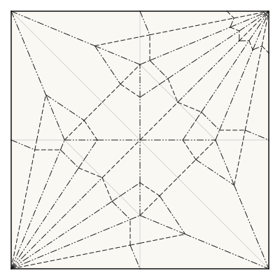
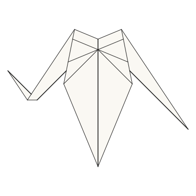
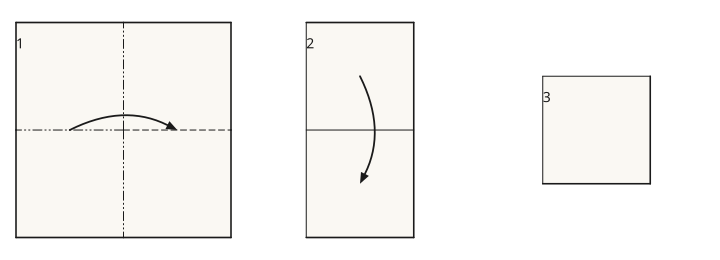
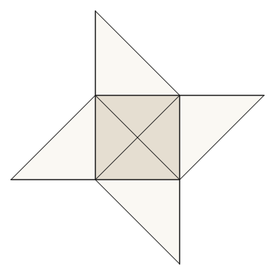
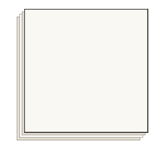

# senbazuru

[](https://github.com/avalonalex/senbazuru/actions/workflows/ci.yml)
[](LICENSE)
[](https://www.haskell.org/)

**Origami diagrams from [FOLD](https://github.com/edemaine/FOLD) files.** Hand it
a crease pattern — FOLD, or the `.cp` and `.opx` the desktop editors write — and
get back the picture a book would print.

*Senbazuru* (千羽鶴) is the practice of folding a thousand paper cranes.

<table>
<tr>
<td align="center"></td>
<td align="center"></td>
</tr>
<tr>
<td align="center"><em>what the file says</em></td>
<td align="center"><em>what senbazuru made of it</em></td>
</tr>
</table>

```bash
stack run -- render examples/crane.fold          --rotate 180   -o pattern.svg
stack run -- render examples/crane.fold --fold   --rotate 180   -o crane.svg
```

Same file both times, and the same half turn, so that a corner of the square on
the left can be followed to a wing tip on the right. For the second picture
senbazuru folded the sheet along its own angles, worked out which of the
seventy-two faces ends up on top of which, and then drew only the parts you
could actually see.

`--rotate` is there because a folded model lands whichever way up its crease
pattern happened to be drawn, and nothing in a FOLD file says which way up it
ought to be read. This crane lands upside down. It turns the camera rather than
the paper, which matters more than it sounds: a *mirrored* drawing would look
just as right, and would be a picture of the other crane — the one whose creases
are these reflected, whose mountains and valleys are swapped, and which folds
perfectly well from a square of its own. It is simply not the model in the file.

> **Status: early**, and moving. Crease patterns, folding, layer order, hidden
> lines, two-sided paper, offset views, fold arrows, step-by-step pages, a
> flat-foldability checker and a 3D export all work, and it reads the `.cp` and
> `.opx` files the desktop editors write as well as FOLD. What it cannot yet do
> is show a model part-way through a fold, or write a folding *sequence* — it
> can now draw a crease on a pattern and write the result back out, which is
> the first move of that. The roadmap goes there.
> [Roadmap](#roadmap) · [what works in detail](docs/tour.md)

## The interesting part is that paper is opaque

Drawing a crease pattern is easy: the coordinates in the file are already the
coordinates on the page. Drawing a *folded* model is not, and the reason is
layers.

Fold a crane and press it flat and all seventy-two of its faces lie in the same
plane. Something has to be on top of something else, and nothing in the
coordinates says which — there is no depth left to compare. Work it out and you
find the crane has **five** valid answers, all of them real paper, two of them
different pictures. Ku's pinwheel pockets has forty-seven. One model in the
reference corpus has more than 10⁸³, which is more layer orders than there are
atoms in the observable universe.

Then there are the ones that stack in a *circle*: the four flaps of a twist lie
A over B over C over D over A, no paper passing through any other, and no order
at all to paint four faces in. That model cannot be drawn face by face however
carefully you sort them — the drawing has to be made of what is visible instead.

None of that shows in the output, which is rather the point. What comes out is a
picture that looks like it came from a book.

## What it does

- **Draws crease patterns** in the Yoshizawa–Randlett notation every instruction
  book uses — solid for the edge of the paper, dashed for a valley, dash-dot-dot
  for a mountain.
- **Folds them.** Give it a pattern and its fold angles and it computes where
  every face ends up, then draws that from any of five viewing angles.
- **Works out which layer is on top**, when the file does not say, from four
  local rules about how paper can and cannot interleave — and tells you how many
  other answers there were, so you can ask for a different one.
- **Draws only what you can see.** Hidden edges are removed, and the two sides
  of the paper come out in different colours, because origami paper is coloured
  on one side and a flap folded over shows its back.
- **Opens the stack out.** Where a model's layers land exactly on top of one
  another, `--offset` steps them apart on the page the way a book does, so four
  squares in the same place read as four squares.
- **Infers the arrows.** FOLD records no arrows, so it subtracts one frame from
  the next to find what moved where, and lays a whole sequence out as one
  numbered page at one scale.
- **Exports a 3D model.** `export` writes a folded form as glTF (`.glb`), the
  paper's two sides in their two colours, with a flat-folded model's layers
  lifted apart so a 3D viewer can tell them apart at all — paper has no
  thickness, and a depth buffer needs it to.
- **Checks flat-foldability** at every interior vertex, by Maekawa's theorem and
  Kawasaki's, and says which vertex fails and why — including the one failure
  that is neither theorem, a crease that stops in the middle of the paper.
- **Draws a crease and writes the pattern back out.** `crease` is the one
  command that produces a crease pattern rather than a picture of one: the new
  line joins the corners it lands on, cuts whatever it crosses, and the faces
  are worked out again — so what comes out is in the same good order as what
  went in. The first move of an authoring vocabulary rather than the whole of
  one.
- **Reads the formats crease patterns are actually shared in.** Most patterns in
  the wild are not FOLD files but Orihime and Oriedita's `.cp` or ORIPA's
  `.opx`, both of them a flat list of creases with the vertices left out. Give a
  command one of those and it rebuilds the vertices and carries on.
- **Works out what a file leaves unsaid about its own creases.** Most patterns
  record no faces and no `.cp` can, but a crease pattern is a planar graph and
  its faces are the regions the creases cut the sheet into — so folding and
  exporting trace them. Creases that cross with no vertex where they meet, or
  that stop part-way along another, are cut at the point they imply first: one
  real ORIPA design has 71 of the latter and could not be folded here until it
  was. Drawing a pattern flat does neither, because some drawings cannot be
  traced however much is worked out, and those still have to draw.

<p align="center">
  
</p>

Each of those has a section in [the tour](docs/tour.md), with the command and
the reasoning. Every flag is in [usage.md](docs/usage.md).

## The paper has two sides

`--view bottom` looks at the underside, which for a flat-folded model is a
different picture rather than the same one upside down: a different set of faces
is on top, and they show the other side of the sheet.

<p align="center">
  
</p>

```bash
stack run -- render examples/thirds-pinwheel.fold --fold --view bottom -o under.svg
```

That is the same twist as above — the one whose flaps stack in a circle and
cannot be painted face by face at all.

## When the honest picture is one square

Fold a square into quarters and the four quadrants land exactly on top of one
another. Hidden-line removal has nothing to reveal — nothing is *partly* hidden
— so the picture is one square and the reader learns nothing. `--offset` steps
the layers apart on the page instead, the way a book does.

<p align="center">
  
</p>

```bash
stack run -- render examples/quarter-fold.fold --fold --offset 6 -o stack.svg
```

The step is in page units, so it is the same six points whether the sheet is one
unit across or four hundred, and the page does not rescale to make room for it.

## Building it

Requires [Stack](https://docs.haskellstack.org/). `stack build` and `stack test`
are the whole of it; `make check` is what CI runs.

## Documentation

| Where | What |
| --- | --- |
| [docs/tour.md](docs/tour.md) | Every feature at length, with the command and the reasoning behind it |
| [docs/usage.md](docs/usage.md) | Building it, running it, and every flag of every command |
| [docs/architecture.md](docs/architecture.md) | The pipeline, what each module holds, and the rules about which may know about which |
| [docs/fold-primer.md](docs/fold-primer.md) | The place to start if origami or the FOLD format are new to you |
| [docs/fold-reference.md](docs/fold-reference.md) | Every FOLD key, its type, and whether senbazuru supports it |
| [docs/glossary.md](docs/glossary.md) | Every term the docs and the code assume, in one place |
| [docs/notes/](docs/notes/) | One idea per file, with references: the theorems, algorithms and techniques this leans on or is heading towards |
| [CLAUDE.md](CLAUDE.md) | The working conventions |

## Roadmap

Roughly in order. Each item is an issue, tagged
[`roadmap`](https://github.com/avalonalex/senbazuru/labels/roadmap), where the
approach and the acceptance criteria are written out; this list is the map, the
issues are the detail.

1. **[A vocabulary of folds, so a sequence can be authored.](https://github.com/avalonalex/senbazuru/issues/60)**
   FOLD output ([#19](https://github.com/avalonalex/senbazuru/issues/19))
   came first, since nothing else can be built without it. The first move is
   built too — `crease` draws a line on a pattern and writes it out. What is
   missing is the rest of the vocabulary. The one hard thing in it is done:
   a book gives its instructions on paper that is *already folded*, and
   `crease --folded` draws a line on the model and writes the creases it makes
   on the sheet — one per face it crosses, each of the kind that layer's own way
   up asks for, so asking for a single valley across four layers comes back as
   mountain, valley, mountain, valley. Not a sequence *solver* — see below.
   → [huzita-hatori](docs/notes/huzita-hatori.md),
   [round-trips](docs/notes/round-trips.md)
2. **[Folding in three dimensions.](https://github.com/avalonalex/senbazuru/issues/55)**
   A model part-way through a fold, honestly: angles solved for rather than read
   off, so the paper never stretches and never tears. Measure what real angles
   look like first, then the degree-4 closed form, then rotating a flap — which
   covers 41 of the crane's 48 interior vertices without a solver at all — then
   the general solve, then animation over each face's rigid transform rather
   than over moving vertices
   ([#53](https://github.com/avalonalex/senbazuru/issues/53),
   [#52](https://github.com/avalonalex/senbazuru/issues/52),
   [#54](https://github.com/avalonalex/senbazuru/issues/54),
   [#56](https://github.com/avalonalex/senbazuru/issues/56)).
   Somewhere along it the layers have to stay out of each other
   ([#61](https://github.com/avalonalex/senbazuru/issues/61)), or a
   spread wing sweeps through the body.
   → [fold-angles-are-the-state](docs/notes/fold-angles-are-the-state.md),
   [folding-by-transforms](docs/notes/folding-by-transforms.md)
3. **[A schematic side view of the stack.](https://github.com/avalonalex/senbazuru/issues/50)**
   What a book draws when a model has too many layers to show them all at once,
   and the answer to where `--offset` runs out. The 3D export already gives
   paper a thickness; this should reuse it rather than invent a second one.
   → [paper-thickness](docs/notes/paper-thickness.md)

**Deliberately not on it.** Turning a crease pattern *into* instructions is
something nobody can do, and the obstacle is not compute: the move vocabulary a
solver would search has no formalisation to search over
([no-sequence-solver](docs/notes/no-sequence-solver.md)). Inflating a waterbomb
is outside the model rather than merely hard — every face here is a flat
polygon, and an inflated balloon's are not. Wet-folding and shaping are outside
it too. Spreading a crane's wings, which looks like the same problem, is not:
that is angles, and it is item 2.
[#64](https://github.com/avalonalex/senbazuru/issues/64) is where that
boundary gets written down properly.

## Credits and licence

The FOLD format is by Erik Demaine, Jason Ku and Robert Lang. The example files
in `examples/` marked as such come from the
[reference FOLD repository](https://github.com/edemaine/FOLD) (MIT),
[Flat-Folder](https://github.com/origamimagiro/flat-folder) (MIT) and
[Oriedita](https://github.com/oriedita/oriedita) (MIT); each one's provenance is
in [examples/README.md](examples/README.md). The `.cp` format is Orihime's and
`.opx` is [ORIPA](https://github.com/oripa/oripa)'s; senbazuru's readers for
them were written from the formats, not from either implementation.

senbazuru is MIT licensed, the same as the FOLD reference
implementation. See [LICENSE](LICENSE).
