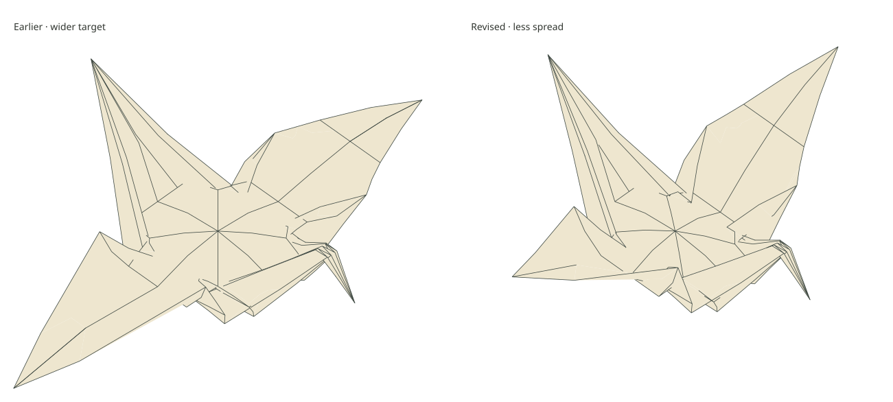

# A pillow-shaped visual target for the whole crane

The owner found [the first whole-crane drawing](whole-crane-candidate.md)
broken and identified both the viewing angle and unfinished body opening.
[#399](https://github.com/avalonalex/senbazuru/issues/399) compares further
**shape sketches**, retaining the first candidate. They do not produce valid
paper geometry: the new silhouette comes with much worse local distortion.

[Tinygami's photographs](https://tinygami.wordpress.com/2016/02/10/how-to-open-an-origami-crane/)
show the wings moving down and outward while the body fills out like a pillow;
the underside opens too.
[Hans Bodlaender's top and side views](https://webspace.science.uu.nl/~bodla101/d.origami/traditional/crane/crane3.html)
distinguish a broad body top from leaving its point standing up. The
[International Crane Foundation's instructions](https://savingcranes.org/origami-cranes/)
also connect outward wing movement to opening the body. These inform a visual
target, not measured dimensions or evidence for our mathematical construction.
The photographs are not vendored.

There is also a presentation error in the first gallery. The fixture's wings
stand up along **negative Y**, whereas its earlier cameras treated Z as up.
X runs between head and tail; Z separates the two wings. The new three-quarter
and side views use negative Y up. The above/underside cameras have an 8.53°
tilt so the closed, flat crane is not exactly edge-on. Old camera choices remain
available. Both figures share one camera, scale and box, taken over all nine
shapes, so changing the comparison cannot silently enlarge one crane.
The 3D viewer's explicit `up=z` option accounts for the export's axis conversion
with a rigid display rotation; exported coordinates are unchanged.

The pillow recipe releases the first candidate's 49 fixed central vertices.
It spreads their original material coordinates into a shallow cushion with
half-width `(sqrt 2 - 1) / 2`, rim at `y=0.44` and centre at `y=0.395`.
A product of two quadratic profiles rounds the top. The wider target’s outer
wing strips follow circular arches, turning from −15° to +15°, with their roots
aligned to that rim. After the owner found the opening too wide, a second
target narrows the body across the wings by 25% and raises each arch by 35°.
The same arch length and 30° turn remain; its tangent now runs from −50° to
−20° relative to horizontal, with negative angles pointing up. The body’s
head-to-tail extent and 27 px rise stay unchanged. This reduces horizontal
reach by turning the wing, without shrinking the entire mesh or drawing.
The latest body-only revision changes its width factor from 0.75 to 0.5,
another one-third reduction, while retaining those raised wing arches. The
wings move inward with their roots; their angle, curve and outer-strip
shape stay fixed. The body’s height and head-to-tail extent remain unchanged.
A five-stop wing-spread slider now keeps that slimmer cushion fixed while
turning the wing arches from a −70° root tangent (more tucked) to −30°
(more spread), in 10° steps. The middle setting is exactly the saved narrower
body target. Each position is constructed separately in Haskell from its
anchors, including the attached neck and tail; the browser selects its SVG,
measurements and complete-sheet downloads. It does not interpolate vertex
positions. “More tucked” does not mean the fully closed crane, and the slider
is not a percentage of physical inflation. It only compares wing orientations.
Opposite-side and lower three-quarter views, plus slightly tilted views from
the head and tail, supplement the previous cameras. The legacy Z-up views
remain labeled as such. These controls are authored, not recovered from a
pressure model.
Remaining vertex displacements come from a linear graph calculation: neighbouring
material vertices prefer similar displacement, weighted by the inverse square
of their original separation. This avoids assigning most movement to a tiny
edge, but **does not preserve its length**. Neck/head and tail follow through
those shared vertices. No weld joins touching layers; no additional material
relaxation or folding motion is run.

The new cameras exposed a preview defect: two almost identical corners of a
clipped polygon could each qualify for removal while the other existed.
Deleting both at once could erase a real corner and let a farther triangle
show through. Cleanup now removes one redundant corner and rechecks its
neighbours. A regression uses the actual opposite-side overlap; the mesh and
contact criteria are unchanged.

| Measurement, 600 drawing pixels per sheet side | Wider pillow | Raised wings | Narrower body |
| --- | ---: | ---: | ---: |
| Body width across wings (Z range) | 248.53 px | 186.40 px | 124.26 px |
| Wing-tip separation | 841.70 px | 672.29 px | 610.16 px |
| Largest edge error | 110.06 px / 104.48% | 64.22 px / 60.96% | 57.42 px / 58.04% |
| Largest local stretch / compression | +261.46% / −96.17% | +164.60% / −81.93% | +152.17% / −82.10% |
| Strict crossing pairs | 257 | 314 | 266 |

The spread control varies wing-tip separation from 464.49 to 697.22 px, with
the cushion fixed at 124.26 px across all five settings. Maximum edge errors
range from 57.29% to 76.13%, so none is accepted paper geometry. Turning the
wings also carries their attached paper; it is not a rigid rotation of the
whole crane.

The body-only revision moves the two held outer wing strips inward by
31.07 px each, with no rotation or change of their shape. Its area is 3.46%
smaller than the sheet; neck/head and tail tips move 60.74 and 58.66 px from
the closed crane. The remaining distortion and crossings still make this
an unaccepted visual target.

The earlier raised-wing revision reduces wing-tip separation by **20.13%**. Its lower distortion
still does not make valid paper, and its crossing count rises. Its area is
3.04% larger than the sheet; neck/head and tail tips move 61.03 and 58.67 px
from the closed crane. These are diagnostic results, not acceptance criteria.

The wider pillow's authored rise is 27 drawing pixels. Its area is 10.31% larger than
the sheet, and the neck/head and tail tips move 58.61 and 55.27 pixels from the
closed crane. All 237 shared vertices, 448 triangles, material coordinates and
source identities remain, but connected topology is not enough to make this
paper. Fewer crossing pairs also do not compensate for stretching or crushed
triangles. The gallery puts the invalid-geometry warning before the images.
Plain and two-sided views use identical geometry.

Independent NumPy calculations reproduce lengths, local strains, area,
landmarks and crease angles. GEOS checks silhouette coverage; independent
point/triangle calculations check the nearest surface at visible-piece centres.
The raised-wing revision keeps all pairwise distances between the held samples in each
outer wing strip (maximum difference below 3e-16 sheet units); its shorter
horizontal span comes from raising those strips. The body-only revision is
a pure translation of those held samples (residual below 2e-16 sheet units).
Fresh generation reproduces 226 archives/exports byte for byte. All 198
single SVGs share their camera bounds, and independent nearest-surface
samples pass for all 99 shape/view combinations after the clipping fix.
Moving the slider cannot silently refit the drawing.
The GLB coordinates agree with FOLD within 0.00068 pixels, bounded by the
existing span-dependent export rounding. The first candidate and wider target
retain their positions. Original holds and the raw failed correction remain
unchanged. The tests exercise
connected material, finite positions and distinct wings without a material solve.

Regenerate the comparison with `--whole-crane-view build/fold-material`, or
create a fresh archive using the committed body fixture and `--whole-crane-start`
command in the [study README](../../study/fold-material/README.md). The gallery
now defaults to the saved middle-spread pose versus **More tucked**, the owner's
preferred target. Both keep the same narrower body. Wing spread is available when the candidate selector says
“Adjust wing spread”; earlier shapes remain selectable.
`whole-crane/body-width-comparison.svg` and `body-width-top-comparison.svg`
export that pair; `narrow-comparison.svg` compares the closed crane with the
latest target. The earlier pillow and compact files remain.
FOLD/GLB exports retain the full sheet.

The linked 3D page, `whole-crane/spread.html`, loads these same nine GLBs. Its
five-stop wing slider selects the exported shapes without interpolating their
vertices. All poses determine one centre and the fit for each view button;
changing the pose preserves camera rotation, zoom and pan. Otherwise a shrinking
wing could be mistaken for a camera moving farther away. Four view buttons reset
the camera, earlier shapes remain selectable, and the download always names the
selected file. Plain-paper colour affects the preview only. This complete-sheet
view retains buried layers and may show touching-surface flicker; it does not
replace the depth-clipped drawing or certify the paper's material state.
The viewer's verification checks all nine files with Khronos's glTF validator
(zero errors or warnings), unchanged archive hashes, and a downloaded pose
against its source file. A browser round trip through the five spread settings
returns a pixel-identical canvas after rotation and zoom.

The owner selected More tucked after #402. The next
[lighting comparison](crane-panel-lighting.md) separates subdivision seams
from actual crease and attachment defects, preserving the selected silhouette.
The shape still needs accommodating with the attached folded paper;
this experiment has not shown that these exact dimensions are achievable.
Do not resume microscopic pair repairs or mistake this drawing for a successful
inflation. Pressure, physical calibration and a checked route remain open.
