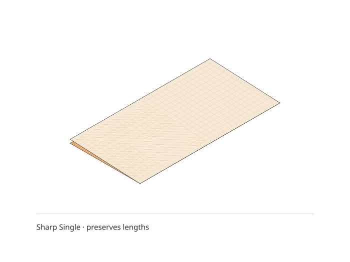
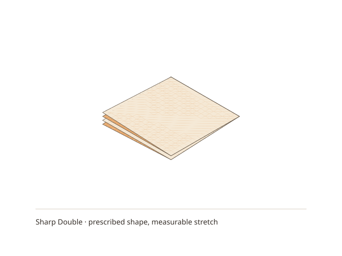

# A sharp crease does not require parallel panels

A slightly opened folded packet has gaps that grow towards its free edges.
Translating four faces into parallel planes cannot show that: the gap remains
open at the crease too. The sharp comparison in
[the material study](../../study/fold-material/README.md) instead makes adjacent
panels meet at a line and lets their directions change abruptly there. This is
an ideal zero-width crease, not a claim that real paper has zero bend radius.
The broad cylindrical bends in [the rounded comparison](two-bends-need-more-than-radii.md)
serve a different purpose: making the material consumed by a bend measurable.

For the single fold, rotate one rigid half of a unit square about `u = 0.5`.
Here `(u,v)` labels a point on the original sheet, and `(x,y,z)` is its folded
position. Let `h = 0.025` and `delta = asin(2h)`. The stationary half keeps
`(u,v,0)`; the moving half uses:

```
x = 0.5 - (u-0.5)*cos(delta)
y = v
z = (u-0.5)*sin(delta)
```

The opening reaches height `h` at the free edge and closes at the crease.
Rotation preserves lengths exactly, including in the triangle mesh because its
edges never cross the crease without a vertex there.

For the double fold, a small prescribed shape gives us a visual target before
we have a physics solver. Reflect both material coordinates into the folded
quarter square: `x = min(u,1-u)` and `y = min(v,1-v)`. Write
`s = 2*max(0,u-0.5)` and `t = 2*abs(v-0.5)`. Choose heights:

```
v <= 0.5: z =  h*s*t
v >  0.5: z = -h*(1+s)*t
```

At the second crease `t = 0`, so both sides meet. At the first crease `s = 0`,
the two sides also agree: zero below the second crease, and `-h*t` above it.
Away from the creases, one panel stays flat, one tilts and two curve. For
example, at the free corner `(x,y) = (0,0)`, their heights are
`0, 0.025, -0.025, -0.05`. At the intersection `(0.5,0.5)` they all meet at zero.
This is a connected, sharply creased surface with nonparallel panels.

**It still stretches.** Keeping `x` and `y` as reflections while adding a
varying `z` lengthens the surface. If `z_u` and `z_v` are its height slopes,
the largest local length multiplier is `sqrt(1 + z_u² + z_v²)`.
At the most distorted corner they are `2h` and `4h`, giving about **0.623%**
maximum analytic extension. The sampled mesh reports **0.538%** along its edges
and an area ratio of **1.00135**. Mesh edges sample only three directions, so
even refinement need not make their maximum equal the maximum over *all*
directions. The viewer's heat map uses the latter formula at triangle centres;
its numerical cards use actual mesh edges. Neither is a material tolerance or
a claim of physical validity.

The meshes and images are generated by:

```bash
stack run senbazuru-material-study -- build/fold-material
```





The SVG preview uses the known bottom-to-top order of these almost-flat packets
and then sorts triangles within each layer. Sorting all triangles by centre
depth alone produces a checkerboard of wrong overlaps: a triangle's centre
cannot represent its depth across the whole projected area. The browser's depth
buffer resolves visibility per pixel and is the view to rotate and inspect.
Lighting normals are split at crease lines, but material vertex indices remain
shared. Otherwise averaging the normals would make a sharp crease look rounded.

The mesh also needs care at the crease intersection. A diagonal joining points
on two zero-gap crease lines cuts off a triangle lying exactly on the layer
beneath it. It shows up as a wrong-color triangle at the corner. Running that
diagonal into the crease intersection makes both triangles include a point
away from the crease, preserving the opening. A regression test checks that
every top-panel triangle has positive height at its centre.

This example records a drawing target and a geometric failure, both derived
here. It does not reproduce the opened diagonal flap in a squash-fold diagram:
that is a later step with additional creases. For #114, the remaining task is to
find how panels can bend and layers can slide while satisfying material lengths
and contact. Sharp-looking creases and small measured distortion are useful
checks, but neither replaces that solve.
