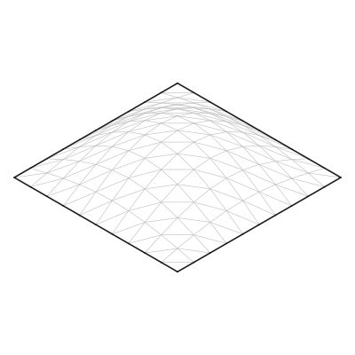

# The puff is a drawing, not a simulation

This note records the earlier schematic-puff proposal. As of 2026-09-11,
material-constrained body opening is a future goal in
[#106](https://github.com/avalonalex/senbazuru/issues/106), following the
[connected-surface representation](connected-paper-surface.md). The bump
construction below remains a rendering example, not a valid folding state.

The last step of a paper crane is not a fold. The model is finished flat, and
then you hold the two wings, pull them gently apart, and blow into the small
hole at the base of the body, which rounds out from a flat pocket into a solid.
Traditional diagram sheets end there, and the finished figure — the one with
the rounded body — is the crane people recognise. A crane drawn flat is a crane
that is not finished.

senbazuru does not yet compute that opening. Rigid panels describe some
opening motions; curved panels additionally need bending. A surface mesh can
represent both, but it needs material/contact constraints and an opening
control to determine the motion. Pressure-driven behaviour would require an
additional loading and cavity model. The boundary described by
[#64](https://github.com/avalonalex/senbazuru/issues/64) concerns the current
rigid algorithm, not a permanent limit on the project.

This note is the other half of that boundary. **A state senbazuru cannot
compute can still be drawn, and drawing this one does not need the physics.**

## What the finished figure actually contains

Three things are worth noticing in the last figure of a crane diagram, and each
one lowers the bar.

- **It is an outline, not a surface.** The rounded body is carried by its
  silhouette and a handful of structural creases. No mesh, no shading, no
  gradient.
- **It is not checked against anything.** No printed diagram has been compared
  with a simulation. A reader needs to know that the body is round and where to
  blow, and both survive any bulge of roughly the right size.
- **It is drawn from a different angle from every step before it.** The flat
  steps are seen face-on; the finished crane is seen from three-quarters,
  because a solid seen face-on is a flat shape again.

So the bar is *convincing*, not correct, and convincing is a bump function.

That third point is a real problem for `Senbazuru.Render.Steps`, which draws
every figure of a page through one camera on purpose: a sequence that changes
viewpoint between figures moves the reader around the model without telling
them. A book breaks that rule exactly once, at the step where the model stops
being flat, and gets away with it because the shape changed too — which is the
announcement. A page of crane steps ending in a puff needs that exception, and
nothing in senbazuru has one.

## The method, in miniature

`examples/puffed-square.fold` is the whole idea at the smallest size that shows
it: a unit square on a 10×10 grid, each cell cut into two triangles, every
vertex lifted by

```
z = 0.25 sin(πx) sin(πy)
```

121 vertices, 320 edges, 200 flat faces. The interior edges are marked `F` and
the sheet's edge `B`, because none of them is a crease: they are the mesh a
curve is drawn with, not folds. It is generated rather than simulated, so the
shape is known exactly and it carries no design.

```bash
stack run -- render examples/puffed-square.fold --view iso -o puffed.svg
```

<p align="center">
  
</p>

**Nothing in the pipeline had to change to draw that.** A folded form with
paper in the air is painted face by face from its coordinates, and a fine mesh
of flat faces with 3D coordinates is one of those. A frame does not have to
have come from a fold, which is the sentence this whole note rests on.

A crane's body is the same recipe applied to one region instead of the whole
sheet, and [#106](https://github.com/avalonalex/senbazuru/issues/106) is that
work: subdivide the faces of the body, displace each vertex along the sheet's
normal by a bump that is zero at the creases bounding the region, and give each
layer of the stack its own height, so that the body encloses a volume rather
than two bulges lying on one another.

**It stretches the paper, and that is the price.** Senbazuru refuses this
everywhere else — [#52](https://github.com/avalonalex/senbazuru/issues/52) is
why a half-folded state is never drawn by interpolating vertex positions, since
straight-line vertex paths change edge lengths and tear the sheet. What differs
here is not that stretching became acceptable; it is that the result is offered
as a schematic and says so. The precedent is `--offset`, which steps a stack of
layers apart across the page: a picture no fold produces, drawn because the
reader needs to see the layers and there is otherwise nothing to see.

## The same move, in many models

The crane is not a special case. Rounding out a flat pocket is a standard
finishing move, and it is the last step of a great many everyday models.

The [waterbomb](../glossary.md), the traditional paper balloon, is the
limiting case — the finished model, not the base of the same name. It is folded
flat and then blown up into something close to a cube, so the puff is not a
finishing touch on it: the puff *is* the model, and a waterbomb drawn flat is a
drawing of a triangle. The frog, the lily and the puffed star all end the same
way on a smaller scale.

That is the argument for an operation that takes a **region and an amount**
rather than one that knows what a crane is. The region is the parameter: a
crane's body is one value of it, and a waterbomb's whole sheet is another.

## What the drawing still needs

The picture above is convincing while its mesh lines show, and they are doing
all the work.

Hide them, with `--hide-flat`, and the dome vanishes. Of 320 drawn paths 40
remain, which are exactly the sheet's boundary, and that boundary lies flat on
the ground where the bulge is zero. Seen from the front it is a straight line.

A curved surface's outline is not an edge in its mesh. Every face is painted in
the one paper colour with no shading, and the edges between faces are hidden as
asked, so nothing marks where the hump ends against the page. The missing line
is the **silhouette**, where a face turned towards the reader meets one turned
away — the question hidden-line removal asks, asked of a curve. It is a
property of the view and not of the mesh, which is why no file can hold it.
[#104](https://github.com/avalonalex/senbazuru/issues/104) is that pass.

It is not a nicety. The finished crane on a diagram sheet has no mesh at all;
the outline *is* the picture. Until senbazuru can draw a silhouette, a puffed
body can only be shown with its construction lines showing, which no book would
print.

## The same route, for the states in between

Everything above applies to a model part-way through a fold, which is
[#55](https://github.com/avalonalex/senbazuru/issues/55)'s problem and a hard
one. If the angle solver proves intractable, the fallback is the same route:
frames from outside. A simulator's folded state at 30% and 60% is coordinates,
written as folded-form frames and drawn face by face
([#53](https://github.com/avalonalex/senbazuru/issues/53)). So is a sequence a
person edits by hand.

One thing the fallback cannot be is hand-edited *angles*. `foldFrame` closes
every loop and refuses a set of angles that tears the paper, and a set of
angles that closes every loop part-way through a fold is precisely what #55
solves for. Coordinates from outside sidestep that; angles do not.

## What accuracy would cost

For a pressure-driven model, the related problem is an airbag: a
thin sheet folded flat, creases as plastic hinges, pushed apart by internal
pressure with every layer in contact with its neighbours. The tools that solve
it, and what each would take, are in
[related-projects.md](../related-projects.md#simulators-that-could-inflate-a-crane).
A controlled opening can come first, without predicting airflow. Either
approach needs measurements of material deformation and contact to distinguish
a valid shape from the schematic bump above.

## References

- Melancon, Gorissen, García-Mora, Hoberman, Bertoldi, *Multistable inflatable
  origami structures at the metre scale*, Nature 592 (2021) — inflatable
  origami as shells, pressure and self-contact. https://dash.harvard.edu/bitstream/handle/1/37376741/s41586-021-03407-4.pdf?sequence=1
- Liu and Paulino, *Nonlinear mechanics of non-rigid origami: an efficient
  computational approach*, Proc. R. Soc. A 473 (2017) — the MERLIN
  bar-and-hinge model, whose nodes are a FOLD file's vertices. http://www2.coe.pku.edu.cn/faculty/liuke/papers/latest/16Liu_merlin.pdf
- Narain, Pfaff, O'Brien, *Folding and crumpling adaptive sheets*, SIGGRAPH
  2013 — ArcSim, cloth simulation written for paper.
- [no-sequence-solver.md](no-sequence-solver.md) and
  [fold-angles-are-the-state.md](fold-angles-are-the-state.md), the two notes
  this one sits between.
