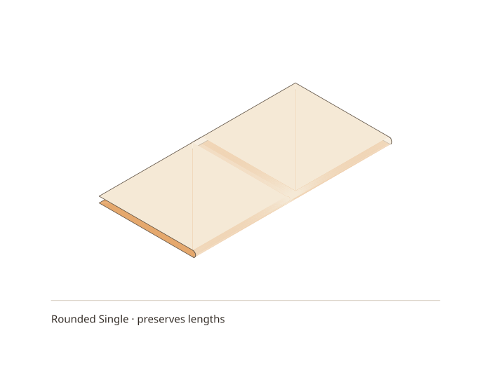
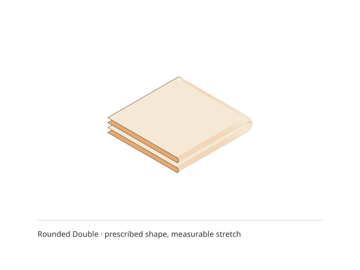

# Two rounded bends need more than their radii

Take a square, fold it in half, then fold the rectangle in half across the first
fold. [Issue #114](https://github.com/avalonalex/senbazuru/issues/114) asks for the
continuous paper around those folds. A rounded surface can look right while
using more paper than the square contained. The executable in
[study/fold-material](../../study/fold-material/README.md) makes that failure
visible, alongside a single fold that does preserve the material.

We label each point on the original unit square by `(u,v)`. These are **material
coordinates**: the label stays with that bit of paper after it moves. A
**mid-surface** is a surface running through the middle of the sheet's thickness;
we model only that surface here, with no solid volume. We prescribe a bend radius
`r = 0.015`, making the space between adjacent flat layers `2r = 0.03`.
This is an exaggerated inspection scale, not a measurement of real paper.

For the first fold, reserve a band of width `pi*r` centred at `u = 0.5`.
Let `a = 0.5 - pi*r/2` and `b = 0.5 + pi*r/2`. Within the band:

```
theta = (u-a)/r
x = a + r*sin(theta)
z = r*(1-cos(theta))
y = v
```

Outside it the two straight parts have lengths `a` each. They join the band
without a gap or a change of tangent direction, and
`a + pi*r + a = 1`: the curved part spends existing paper. Differentiating with
respect to `u` gives `(cos(theta), 0, sin(theta))`, a vector of length one.
The `v` direction stays perpendicular to it and of length one too. That is
**isometry**, preserving lengths measured along the surface. A cylinder can
therefore model this isolated bend without stretching its mid-surface. It
still does not tell us which radius actual paper would choose.

Now turn the folded packet downwards about a perpendicular axis. At each point
of the first fold, keep its existing `x` and height `z`. Reserve the *same*
material band `a <= v <= b` for the second bend:

```
phi = (v-a)/r
X = x
Y = a + (r+z)*sin(phi)
Z = -r + (r+z)*cos(phi)
```

The **plus z** is intentional: the upper layer goes around the outside of the
lower one. On the lower layer `z = 0`, giving radius `r`. On the upper layer
`z = 2r`, giving radius `3r`. After both bends the four flat layers sit at
heights `-4r, -2r, 0, 2r`. They are joined by a continuous surface and look like
a plausible stack.

But differentiating along `v` now gives a vector of length `(r+z)/r`.
On the upper layer that is **three**, not one. Its bend band has become three
times as long: **200% extension**. The unchanged `u` direction is perpendicular
to it, so integrating their length product gives a total smooth-surface area
of `1 + pi*r`, or about **4.71% more material** than the original square.
The maximum extension does not shrink when `r` is reduced; the affected band
gets narrower instead. This failure is not confined to the crease intersection.
It includes the upper layer's entire second bend band.

The generator samples each bend with 32 straight segments and writes the same
vertices to an indexed OBJ surface, a FOLD surface, an SVG preview and an offline
3D viewer. It records edge lengths before and after folding and counts connected
components from shared indices. Straight chords are shorter than curved arcs,
so the single-fold mesh has a small compression error; refinement reduces it.
The double fold's extension persists under refinement. Tests check both facts,
the known layer heights and the independently derived total area.

```bash
stack run senbazuru-material-study -- build/fold-material
stack test --test-arguments='--match fold-material'
```

Choose “Rounded bends” in the viewer for this construction;
[the sharp comparison](sharp-creases-and-opening-panels.md) shows nonparallel panels.
The two static previews below are generated by that command. Rotate the models
in `build/fold-material/index.html`, then choose “Stretch on original sheet” to
inspect the material deficit without layers hiding it. The original-sheet map
uses the analytic extension at each triangle's centre; the numerical report
uses actual mesh edges.





This is a controlled counterexample, not a double-fold physics model. Giving
the upper band three times as much original paper would remove this particular
extension, but move its tangent points and affect the first bend where they
meet. Finding a compatible shape is the next question: allow the surrounding
panels to bend and the layers to move against one another, with material-length
and contact constraints. Merely joining separated faces, or checking that the
mesh is connected, cannot establish that result.

The physical motivation for allowing panels to bend is studied in
[Lechenault, Thiria and Adda-Bedia](https://arxiv.org/abs/1404.1243);
[Liu and Paulino](https://doi.org/10.1098/rspa.2017.0348) describe a numerical
model with deformable panels. This experiment implements neither paper. Its
formulas and test surfaces were derived here, and its measurements establish
only the geometric claims above.
