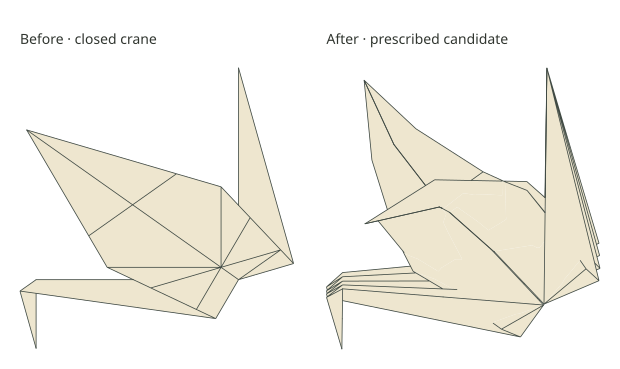

# Put the opening back into a whole crane

The owner accepts the [small body intersection](body-intersection-context.md)
as intermediate evidence, but the goal is a recognisable crane with spread
wings and an opened body. [#397](https://github.com/avalonalex/senbazuru/issues/397)
therefore constructs **one complete static candidate**. It is a shape proposal
for review, with substantial remaining material defects, not a solved paper pose.



The drawing uses plain paper of the same colour on both sides. The gallery also
shows cream/ochre sides on the identical geometry: those views expose large
reverse-side patches. Plain colouring does not repair or approve those crossings.
The body is fuller and both wings spread; this does **not** simulate inflation.

The saved 10-degree body checkpoint supplies 87 material correspondences on the
whole sheet. Material coordinates locate paper on the original square, so
coincident folded layers remain distinct. All 49 central body vertices are
copied exactly. A fitted plane continues each wing's attachment orientation;
remaining displacement is spread through neighbouring vertices by a linear
graph calculation. Both wings receive a circular bend below original folded
`y = 0.30`, with zero added turn there and 60 degrees at their tips. The final
surface is 448 flat triangles with 237 shared vertices, one connected disk.
The curve is sampled by that mesh; no curved SVG conceals different geometry.
This construction can stretch paper and describes no folding path.

| Measurement at 600 px per sheet side | Closed | Prescribed candidate |
| --- | ---: | ---: |
| Body depth, world-Z range | 0 px | 43.49 px |
| Distance between wing tips | 0 px | 204.09 px |
| Neck/head tip movement | 0 px | 0.93 px |
| Tail tip movement | 0 px | 2.14 px |
| Largest absolute material-edge error | below 1e-9 px | 4.86 px |
| Largest relative edge error | below 1e-8% | 5.26% |
| Local stretch / compression | effectively zero | +22.30% / −5.73% |
| Strict crossing pairs | 0 | 683 |

Local stretch measures the most stretched direction inside a triangle; it can
exceed every edge's error, especially in a narrow triangle. The area of the
entire candidate is only 0.53% larger, which also does not bound local distortion.
These are material defects, not the earlier subpixel body-only exception.

One bounded adjustment holds the 49 body vertices and both wing tips, leaving
the neck and tail free. Original mountain/valley creases retain signed 180-degree
preferences, the earlier artificial wing root prefers zero, and internal panel
edges prefer flatness. It uses the existing bending weights (1 / 0.2), length
penalty `1e8`, contact penalty `1e10`, and at most 40 corrections. These are
preferences and numerical penalties, not calibrated physical stiffnesses.

**That adjustment fails and is excluded from the comparison.** Nineteen moves
lower its weighted cost, then correction 20 cannot find a decreasing trial.
Its last retained shape has 745% maximum edge error and 431 px absolute error.
A decreasing cost is not a geometry acceptance test. This control reuses the
world-Z packet contact policy; it does not establish that the policy is suitable
for every region of this whole-crane deformation. All proposals, refusals,
angles and separate energies remain in `run.json` and `checks.json`.
No second solve, parameter sweep or tolerance change follows this result.

The ordinary illustration audit still refuses the candidate. For review, a
separate depth preview clips each projected triangle by the portions of other
triangles actually nearer the camera. At an intersection, which triangle is
nearer changes across a line. Drawing that change does not certify contact.
Coincident planes use inherited order at arithmetic tolerance `1e-9`, with a
counted face-id fallback if an order is missing; no fallback was needed here.
Real crease and boundary lines are clipped; numerical triangle joins are not
drawn. The four views share camera and scale between closed/opened poses.

The closed baseline uses the existing resolved illustration visibility. The
opened preview requires cleaning almost repeated clipping corners: their tiny
connecting edge can otherwise name a wrong cutting plane and leave a false
foreground sliver. This removes only 2D rounding noise within `1e-12` model
units, not a piece of 3D paper or a physical collision. The gallery records
uncovered area and marks any such uncertainty in pink.

NumPy independently reproduces lengths, local stretch/compression, area,
landmarks and crease angles, and confirms the 49 copied body positions are
unchanged. It also checks the nearest original triangle plane at every visible
piece's centroid in all four cameras. The GLB vertices agree with the FOLD
positions within 0.00043 drawing pixels after the existing export rounding.
Shapely independently checks silhouette coverage. A small fixture regenerates
the same candidate without any material solve; a regression covers the clipping
corner failure.

The next decision is **visual review of this whole-crane target**, including its
two-sided view. If the silhouette is useful, improve how its attached layers
accommodate the opening, concentrating on visible defects and local strain.
Do not resume individual microscopic contact repairs or call this an accepted
inflated crane. Pressure, a checked flexible route and production integration
remain separate work.

The committed `study/fold-material/fixtures/whole-crane-body.fold` is the exact
saved body endpoint from #394, checked against its raw checkpoint before copying
(SHA-256 `e5d8de70382b186d1ad6e343e9ea4abe6609e969d33a9baf0ffac0ef6e71ec3e`).
Generate the visual candidate without another solve:

```bash
stack run senbazuru-material-study -- --whole-crane-start study/fold-material/fixtures/whole-crane-body.fold build/fold-material
```

Open `whole-crane.html`. `--whole-crane-view build/fold-material` redraws an
existing archive. `--whole-crane-correct build/fold-material` explicitly requests
the optional bounded control and refuses to overwrite `run.json`. It is not
part of CI; tests exercise saved-material attachment and depth clipping only.
