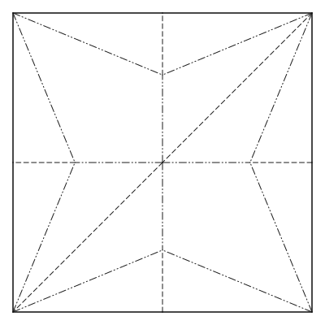

# A tour of what senbazuru does

Every feature, with the command that produces it and the reasoning behind it.
The [README](../README.md) is the short version; this is the long one.

For running any of it, [usage.md](usage.md). For the ideas underneath,
[notes/](notes/). For a word you do not recognise, [glossary.md](glossary.md).

## What it draws

Given a `.fold` file, it draws every edge using the standard
Yoshizawa–Randlett line vocabulary: solid for the edge of the paper, dashed for
valley folds, dash-dot-dot for mountain folds, and a light line for creases that
exist but are not folded. Those dashes are instructions, so they belong to crease
patterns. A folded form is drawn the way a book draws the model itself, with
every edge solid.

```bash
stack run -- render examples/unit-square.fold -o unit-square.svg
```

produces a unit square with a valley fold down the middle, a mountain fold
across it, and a faint diagonal reference crease. That file records no faces, so
what comes out is exactly those lines on a blank page.

A file that *does* record `faces_vertices` gets its faces filled with a paper
tint, so the sheet reads as an object rather than as lines floating on the page:

```bash
stack run -- render examples/quarter-fold.fold -o quarter-fold.svg
```

`--no-fill` turns that off.

A folded form is filled when its visible layers can be determined.
FOLD records touching layers in `faceOrders`, and `examples/simple.fold` carries one:

```bash
stack run -- render examples/simple.fold --view iso -o simple.svg
```

The stacking is a fact about the paper rather than about the picture — it says a
face lies on the side another face's *normal* points to — so the drawing order
depends on where you are looking from, and the same model seen from behind
stacks the other way up. A folded form with no `faceOrders` gets one worked out,
if it lies flat; see [What it stacks](#what-it-stacks). Open folds with convex
planar panels compare actual depth over their projected overlaps. Touching
panels still need explicit order; unresolved cases retain the wireframe fallback.

Folded forms take a viewing angle:

```bash
stack run -- render examples/squaretwist.fold --view iso -o squaretwist.svg
```

## What it reads

Most crease patterns in the world are not FOLD files. FOLD is from 2016 and was
written for research; the patterns people actually share were saved by the two
desktop editors, in formats that predate it by a decade. senbazuru reads both,
and every command takes one wherever it takes a `.fold`.

```bash
stack run -- render examples/bird-base.cp -o bird-base.svg
stack run -- check  examples/bird-base.cp
```

<p align="center">
  
</p>

That is `examples/bird-base.cp`, a traditional bird base as Oriedita saved it —
twenty-six lines of text, each one `type x1 y1 x2 y2`. ORIPA's `.opx` is the
same list of creases serialised as a Java bean in XML. Neither has a version, a
unit, a title or a face; both are a **flat list of segments with a colour**, and
`check` passes all five of that base's interior vertices.

What neither has is *vertices*. A `.fold` file numbers them and its edges point
at the numbers, so two creases meeting at a corner say so. A `.cp` only puts two
endpoints at the same coordinates — and not even that, quite. Six creases meet
at the centre of this bird base and the file spells that one point three
different ways, none of them zero, because the editor computed them by
reflecting other points across creases and never rounded:

```
9.094947017729283E-15   9.094947017729283E-15
9.094947017729283E-15  -0.0
1.2246467991473534E-14  9.094947017729283E-15
```

Its 52 endpoints are 22 distinct spellings of 13 vertices. Rebuilding that list
is the whole of reading one of these files, and it needs a tolerance — a
billionth of the pattern's own diagonal, which for the 400-unit square both
editors draw on is about half a millionth of a unit.

One more thing worth knowing is visible in the picture above. The valley along
the diagonal runs from the lower left to the upper right — and plot the file's
own numbers with `y` upwards and it runs the other way, because both formats
measure `y` *downwards*: they are Java desktop applications storing screen
coordinates. senbazuru turns that the right way up on the way in, which is a
correction and not a preference: a crease pattern read upside down is the
mirror image, which is a model that folds perfectly well and is not the one in
the file — exactly the argument the README makes about `--rotate`.

The formats are set out, with the type-code tables and how each was established,
in [notes/cp-and-opx.md](notes/cp-and-opx.md).

Neither format stores faces, and that turns out not to matter for folding: the
faces are determined by the creases, so `--fold` and `export` trace them — see
[What it folds](#what-it-folds) below. A `.cp` folds like a `.fold` does.

Drawing one flat is the exception, and stays a wireframe. Not an oversight:
some drawings cannot be traced however much is worked out — a crease that stops
in the middle of the paper has no face round it — and those still have to draw,
so the fill follows what the file says rather than what could be derived.

## What it folds

Before any of that, the creases are cut at the points where they meet. A file
may draw two creases crossing and record no vertex where they cross, or end one
crease part-way along another without cutting it — and then the regions between
the creases are not the faces of anything, so nothing can be folded. Both are
recovered rather than refused: the crossing is on the paper already, and only
the vertex the drawing implies was missing.

`examples/unit-square.fold` is the small case, three creases through the middle
of the sheet becoming six through one new vertex. The instructive one is
ORIPA's own `turkey2015.opx`, which needs no new vertex at all — every one of
its 231 was already there — and yet has 71 creases that stop on another crease
that ORIPA never cut. Cutting them turns 429 creases into 500, and turns a file
senbazuru could not fold into one that folds and stacks 672 ways. Editors are
tidier than hand-written files, but not as tidy as you would assume.

`--fold` computes the folded form rather than reading one. Given a crease
pattern and a fold angle for every crease, paper does not stretch, so each face
moves rigidly and the whole state is one rigid motion per face — walk the faces,
compose one turn per crease, and every vertex is a lookup.

```bash
stack run -- render examples/quarter-fold.fold --fold -o quarter-folded.svg
stack run -- render examples/diagonal-cp.fold --fold -o diagonal-folded.svg
```

The first folds a square into quarters and produces a quadrant with four layers;
the second folds a square along its diagonal and produces a triangle. Neither
needs `--view`: both fold *flat*, and the view is chosen from the coordinates, so
they are drawn from above. Forcing `--view iso` on a flat-folded model shears a
correct picture into a wrong one; leave the camera alone unless the fold really
does leave the plane. Fold angles
come from `edges_foldAngle`, or from the assignments if the file records none —
an assignment names a direction and not an amount, and a flat fold is the only
amount consistent with naming no number.

Not every set of angles describes something a sheet of paper can do. Walk round
an interior vertex and the turns must compose back to nothing, and the obvious
algorithm never checks: it reaches each face by one path and silently *tears* the
model when they disagree. `--fold` compares the places each face puts a shared
vertex and refuses rather than drawing the tear:

```console
$ senbazuru render bent.fold --fold
senbazuru: cannot fold bent.fold: vertex 6 is placed 0.707107 apart by the faces
meeting at it, so these fold angles tear the paper rather than folding it
```

The threshold for "disagree" admits arithmetic noise and nothing more, so angles
that are a fraction of a degree short of closing are refused too — the message
quotes the distance, which is how you tell a tear from a typo in the fourth
decimal place.

## What it stacks

Folding says where every face went and nothing about which is in front, and in
a model folded flat every face lies in the same plane, so the coordinates cannot
say either. FOLD keeps the answer in `faceOrders`, which a computed folded form
does not have. So senbazuru works one out.

Deciding which layer is on top is a constraint problem, and in general a hard
one, but every constraint the paper imposes is local. Two faces joined along an
edge of the folded form are either a *taco* — the paper folded back on itself,
both faces on one side of the edge — or a *tortilla*, paper continuing flat
across the line. A face that runs across a taco's fold line cannot lie between
the taco's two faces; two tacos on one line must nest or stay apart; two
tortillas cannot cross each other; and a valley puts the face that turned over
on top where a mountain puts it underneath. Generate those rules for every pair
of faces that share a patch of paper, satisfy them, and the result is a
`faceOrders` the renderer already knows how to draw. The rules are written up in
[notes/taco-taco.md](notes/taco-taco.md).

```bash
stack run -- render examples/letter-fold.fold --fold -o letter-folded.svg
```

folds a square in three like a letter, with panels of different widths so the
order shows: the long third panel is painted last and covers most of the other
two. Fold a strip of paper the same way and look. The quarter fold above comes
out four layers deep in the one order its three mountains and one valley allow.
The traditional crane works too:

```bash
stack run -- render examples/crane.fold --fold --rotate 180 -o crane.svg
```

`--rotate` because the crane lands upside down. A folded model sits whichever
way up its crease pattern happened to be drawn, and no FOLD file says which way
up it should be read, so turning the drawing is the reader's to do.

That file, and a few others in `examples/`, come from
[Flat-Folder](https://github.com/origamimagiro/flat-folder), an independent
solver for the same problem, whose published counts of constraints per model
senbazuru's test suite checks itself against, kind by kind.

Not every set of creases has a stacking. Make both of the letter fold's creases
valleys and the third panel has to slide between the first two, but it is longer
than the pocket and the pocket is closed at the far end:

```console
$ senbazuru render rolled.fold --fold
senbazuru: cannot render rolled.fold: the layers cannot be stacked without the
paper passing through itself; the constraint between faces 0, 1, 2 is the one
that could not be met
```

Folding cannot see this — the coordinates are identical to the accordion's — and
neither can `check`, whose theorems are about one vertex at a time.
`examples/big-little-big.fold` passes `check` and is refused here, for exactly
the reason [its note](notes/big-little-big.md) gives.

Two limits, both deliberate. The layer solver covers models folded *flat*;
`info` reports open folds as outside its scope even when SVG can determine
visibility directly from their depths. Every face the solver handles must
also be convex, which the faces of a flat-foldable pattern are whenever the sheet is.

### Which stacking

There is rarely just one. The crane has five valid layer orders, the kabuto
nine, and one of Flat-Folder's dragons more than 10⁸³ — the counts are products,
because the constraints fall into independent components and the choices in them
multiply. `info --fold` says how the model divides up:

```console
$ senbazuru info examples/crane.fold --fold
...
    layers:   (none in the file; 892 overlapping pairs in 2 components, 5 valid orders)
    stacking: 1 component with a choice; --stacking takes 0-4
```

The two counts differ by one on purpose: the first counts components the way
Flat-Folder does, with the pairs that were settled outright among them, so its
published figures can be compared with these. The second counts what you can
actually choose. `--stacking` takes one index per component with a choice in it:

```bash
stack run -- render examples/crane.fold --fold --stacking 3 -o crane-3.svg
```

which puts a different flap on top of the crane's right wing. Most of the
difference between orders is buried, though: all sixteen of the 2×2 grid's are
the same picture from either side, and all nine of the kabuto's are one picture
from above and four from below. A count of orders is a count of *models*, not of
pictures.

The same split is what keeps the search finishing. Each component is solved on
its own, so the cost adds up over them rather than multiplying, and each is
given a budget of guesses — `--layer-budget`, a thousand by default — so that a
model propagation cannot settle says it gave up instead of running on. The most
any model here needs is eight, and both models that cannot be stacked at all are
refused without a single guess. The reasoning is in
[notes/several-stackings.md](notes/several-stackings.md).

## What it hides

Knowing which layer is on top is not the same as having a picture, for two
reasons that are really one.

A valid layer order can run in a **circle**. The four flaps of a twist lie A
over B over C over D over A, and no paper passes through any other, because no
point of the sheet is under all four at once. There is simply no order to paint
four whole faces in. And painting whole faces hides nothing anyway: every crease
is drawn afterwards, including the ones ten layers down.

So a model folded flat is not drawn face by face. Each face is cut down to what
is left of it once every face nearer the viewer has been taken away, and each
edge is kept only over the stretches where the paper differs across it. The
result has its hidden lines gone, and its **two sides in different colours** —
origami paper is coloured on one side, and a flap folded over shows its back.

```bash
stack run -- render examples/thirds-pinwheel.fold --fold -o pinwheel.svg
stack run -- render examples/thirds-pinwheel.fold --fold --view bottom -o under.svg
```

The first is a twist, which could not be drawn at all until this arrived. The
second is the same model from underneath, which is a different picture and not
the first one upside down: a different set of faces is on top, and they show the
other side of the paper. How it works is in
[notes/visible-regions.md](notes/visible-regions.md).

An open fold with convex planar panels uses
[projected visibility](notes/projected-panel-visibility.md): compare depths
over each overlap, then remove covered regions and creases. Coplanar ties
need `faceOrders`. Intersecting depths, unsupported faces or free edge-on
outlines retain the older whole-face fallback when orders are supplied,
or a wireframe otherwise. `--no-fill` always draws every crease.

One caveat on the colours. Which side of the sheet a patch of paper shows is
read from the order its corners are listed in, which FOLD says is
counterclockwise and which real files sometimes get backwards. A file that wound
*every* face backwards is drawn with its layers right and its two colours
swapped, silently — the layer order survives it because its signs were written
against those same windings, and the paper side has nothing to cancel against.

## What it opens out

Hidden-line removal makes the picture honest, and sometimes honest is useless.
Fold a square into quarters and the four quadrants land exactly on top of one
another: the silhouette is one square, the only visible region is one square,
and the reader is told nothing at all about the four layers underneath. There is
nothing partly hidden to reveal.

Books answer this by drawing the stack slightly opened, and so does `--offset`:

```bash
stack run -- render examples/quarter-fold.fold --fold --offset 6 -o stack.svg
stack run -- render examples/letter-fold.fold  --fold --offset 6 -o letter.svg
stack run -- render examples/kabuto.fold       --fold --offset 6 -o kabuto.svg
stack run -- render examples/crane.fold --fold --rotate 180 --offset 1.5 --margin 60 -o crane.svg
```

Every face is drawn whole and each layer sits a few points further up and to the
right than the layer below it, the way an exploded drawing separates the parts
of an assembly. The quarter fold becomes four stepped squares in the order the
solver found, bottom-left quadrant lowest; the letter fold shows its middle
panel, which the ordinary picture buries whole; and the kabuto's twelve layers
open into a band of stepped sheets down its diagonal.

The step is in **page units**, which is the two-unit rule doing real work: six
points is six points whether the sheet is one unit across or four hundred, so
the model's own coordinates are never touched and the page does not rescale
because a stack was opened.

### The stack is drawn finer than the model

The drawing is in two weights, and it has to be. A sheet buried in the stack is
drawn at 0.35pt where the model itself is drawn at 1 to 1.6 — so what the reader
sees is the picture they would have seen without the flag, standing on a fine
hatch of the layers underneath it.

Drawing the stack at the model's own weight is the version that does not work. A
dozen sheet edges within a few points of one another, each as heavy as the
outline of the paper, add up to a black band; the same edges drawn fine read as
the thickness of the sheaf. It also removes the floor on the step, which used to
be the line weight: a step of 1.5pt separates 0.35pt lines perfectly well, and it
did not separate 1.6pt ones at all.

What remains is a ceiling. The step times the number of layers has to fit the
page, because the offset deliberately does not enter the extent — the page is
fitted to the paper, and opening a stack does not shrink the model to make room.
A deep model wants a small step, a wide `--margin`, or both.

### How many layers is too many

Fold a square in half twice and you have four layers; fold anything worth
folding and you have thirty. The crane is **32 layers** deep, and an offset view
of it is dense — not because the drawing is wrong but because the model is like
that, and the picture is telling the truth about it.

Printed books do not answer this by exploding the whole model. Robert Lang's
diagramming conventions give three tools in order of desperation: **x-ray
lines** for a few hidden edges, and only as many as the current step needs;
a **cut-away** when those get cluttered — a heavy circle with the obscuring
layers removed inside it, and edges offset where they cross the boundary; and,
when there are too many layers to draw at all, a schematic **side view** of the
stack with an arrow, which is a different picture rather than a busier one.

`--offset` is the second of those applied to the whole sheet rather than inside
a circle. It is the right tool for a model a handful of layers deep, and for a
deep one it is honest rather than legible. The other two are tracked:
[#48](https://github.com/avalonalex/senbazuru/issues/48) for x-ray lines scoped
to the step, [#49](https://github.com/avalonalex/senbazuru/issues/49) for the
cut-away, and [#50](https://github.com/avalonalex/senbazuru/issues/50) for the
side view, which needs the paper to have a thickness and so belongs with the 3D
export.

[notes/layer-numbers.md](notes/layer-numbers.md) has the measurements, and the
two other things worth knowing: which layer a face is in is the longest chain of
faces below it, not a count of what it covers; and a twist has no offset view at
all, because stepping layers apart needs one order for the entire model and a
twist is exactly the model that has none.

## What it instructs

A picture of paper is not an instruction. The arrow that says *this* piece moves
*there* is what makes a diagram teachable, and FOLD has no key for one — no
arrow, no operation, not even a caption. What a file does have is consecutive
frames, and between two of them the arrow is a subtraction rather than a search:
both ends of the motion are given.

`--arrows` draws it, on the frame *before* the fold, as a book does:

```bash
stack run -- render examples/quarter-fold-steps.fold --frame 0 --arrows -o step-1.svg
stack run -- render examples/quarter-fold-steps.fold --frame 1 --arrows -o step-2.svg
stack run -- render examples/quarter-fold-steps.fold --frame 2 -o step-3.svg
```

Step 1 is the flat sheet with an arrow swinging its left half onto the right;
step 2 is the folded rectangle with an arrow bringing its top half down; step 3
is the finished quarter, and carries no arrow because there is nothing left to
do.

What moves is worked out by comparing where the paper *is* in the two frames,
not by reading fold angles — a frame may record none, or record ones that
disagree with its own coordinates, and turning a model over moves paper without
changing any angle. Paper that moves as one piece gets one arrow; a step that
folds two separate flaps gets two, because a single arrow averaged between them
would point somewhere no paper goes.

`--steps` puts the whole sequence on one page instead:

```bash
stack run -- render examples/quarter-fold-steps.fold --steps --arrows \
  --width 700 --height 300 -o page.svg
```

Every figure is drawn at **one shared scale**, so the model genuinely shrinks as
it is folded — the quarter fold ends up a quarter of the size it started. Giving
each figure its own scale is the tempting mistake: every drawing would then be
blown up to fill its cell, and the page would tell the reader, in the most
convincing way a picture can, that folding a sheet in half does not make it
smaller. `--columns` sets how many figures go across.

## What it exports

Everything above is a picture from one angle. A folded form is an object, and
the fastest way to see that a fold went wrong is to turn it over.

```bash
stack run -- export examples/crane.fold --fold -o crane.glb
stack run -- export examples/quarter-fold.fold --fold --all-layers -o complete.glb
```

writes glTF in its binary form. The first command includes two scenes: Visible
paper, selected by default, and Complete paper. The second writes only the
complete sheet for a viewer without a scene selector.

Fold a square into quarters and all four panels lie in `z = 0`. A depth buffer
stores the nearest triangle at each pixel, but those depths tie. FOLD's layer
orders say which paper is exposed; an ordinary glTF viewer does not understand
them. Moving the panels apart would break their shared creases.

Instead, the default scene subtracts buried regions separately on each side
of each plane. The quarter fold becomes two exposed squares, with four
triangles in total. Its complete scene retains all four panels, sixteen
triangles including their back sides. Both remain in `z = 0`. Open panels keep
their actual positions, so the viewer can compare their depths as the camera
turns. A cyclic pinwheel works too: visibility needs an answer over each
patch, not one height for each whole flap.

Two-sided colour comes from triangle winding. A front triangle uses the
source panel's corner order; a back triangle reverses it. The viewer culls the
side facing away. A graphics corner introduced by clipping carries weighted
references to the original material vertices, while every triangle records
its original panel. Graphics duplication therefore does not become a tear or
weld in the material topology. The [export note](notes/visible-paper-mesh.md)
gives a concrete example and the metadata layout.

Ambiguous coplanar overlaps in an open model are refused by the default
export; supply their layer order or use `--all-layers` for inspection. The
complete scene can flicker where paper touches. Neither scene measures new
contacts, bends panels, adds thickness or certifies the motion between states.
The former `--thickness` option and independent face lifting are removed.

One expectation to head off: the crane that comes out is **flat**, wings closed,
because `examples/crane.fold` is the flat-folded crane — every crease in it is a
mountain or a valley and nothing in between, which is what a layer solver's
corpus records (the file carries no `edges_foldAngle` at all; the folding reads
±180° off the assignments). The crane in a photograph
is that model after its last two steps, the wings spread and the body puffed,
and those are opening states the file does not carry. Crease-angle changes
can represent rigid motion; panel bending needs a richer model. A frame *with*
the resulting geometry exports as it stands; what
senbazuru cannot do is make them up from the flat one, since scaling every
angle by a fraction lands on angles no sheet can adopt —
[notes/fold-angles-are-the-state.md](notes/fold-angles-are-the-state.md).

Wing spreading and body inflation are future authoring goals, including the
traditional waterbomb balloon. A connected mesh supplies a representation, not
the motion: material constraints, contact and an opening control still have
to determine how the pocket expands. Pressure and cavity modelling can follow
a controlled opening. These operations are not implemented by the current
exporter, and the schematic `puffed-square.fold` does not establish them.

The study now builds a shared `Origami.Surface` in the library. It keeps
material coordinates and current positions together, preserves crease and
panel ids through refinement, and records physical thickness separately from
drawing settings. `surfaceDiagram` and `renderSurfaceGlb` accept that surface;
the base gallery and frog guide use it directly. A standalone folded FOLD file
can still be rendered without an original-sheet map, but cannot use those
missing coordinates for material measurements. Both glTF scenes retain the
surface positions and supplied layer relationships. Refinement supports convex
planar panels whose first-corner fan has no zero-area triangles; concave and
curved panels need further work.
It preserves cuts whose sides already have distinct vertex ids and refuses
refinement across an unsplit cut edge.

## What it creases

Every other command turns a file into a picture. This one turns a file into
another file — the first thing senbazuru does that leaves a crease pattern
changed.

```bash
stack run -- crease examples/quarter-fold.fold --from 0,0 --to 1,1 --valley -o creased.fold
```

That draws a valley along the diagonal of the quarter fold and writes the whole
document back out as FOLD. What comes out has 14 creases where it had 12 and
six faces where it had four — because almost none of the work is the crease.

Adding the line is two vertices and an edge. The rest is everything the line
makes untrue. It crosses the two creases running to the centre, and a crossing
with no vertex where it happens is not a planar graph, so those are cut. It
divides a face in two, so every face the file recorded is wrong and they are
worked out again. Anything under an unrecognised key that indexes a face or an
edge went with them, and so did the `faceOrders`, which name faces that no
longer exist.

None of that is this command's own code. The creased frame is handed to the
same cutting and tracing that a file gets when it is read, so a pattern that
has been creased is validated by exactly what validates one that was written by
hand. A second definition of "a pattern in good order" is a second definition to
keep in step.

The ends of the crease join whatever is already there. Draw one to a corner the
paper has and it *is* that corner; draw one to the middle of an existing
crease and that crease is cut at it. So this works on the formats the desktop
editors write, where the interesting lines are the ones between existing
points:

```bash
stack run -- crease examples/bird-base.cp --from=100,-200 --to=100,200 --flat -o creased.fold
```

That takes the bird base from 26 creases to 37, and the result still folds and
stacks. Note the `=`: a coordinate that starts with a minus sign is read as a
flag otherwise, and every `.cp` and `.opx` in the world is drawn on the square
from `(-200, -200)` to `(200, 200)`.

Four creases it will not draw. One with no length names no line to fold about.
One drawn on top of an existing crease, or along part of one, would give the
paper two ways to fold along the stretch they share. One on a folded form is
`--folded`'s business, below. And one whose **end meets nothing**:

```console
$ senbazuru crease square.fold --from 0,0 --to 3,3 --valley
senbazuru: cannot crease square.fold: the end at (3.0, 3.0) does not meet any crease
or edge the pattern already has, so the crease would stop there and divide nothing
```

That last one is worth dwelling on, because the obvious way to say it is wrong.
`(3, 3)` is off the paper and it is tempting to report exactly that — until you
try a line that stays on it:

```console
$ senbazuru crease square.fold --from 0.3,0.3 --to 0.7,0.7 --valley
senbazuru: cannot crease square.fold: the end at (0.3, 0.3) does not meet any crease
or edge the pattern already has, so the crease would stop there and divide nothing
```

Both ends of that one are squarely inside the square, and it is refused for the
same reason, so "that end is off the paper" would be a false thing to print half
the time. What is true of both is narrower, and it is what the message says: the
end does not land on any edge or corner the drawing already has, so the crease
stops there and divides nothing.

An end that lands part-way *along* an existing crease is fine, and stays fine —
it meets something, and whether the result folds is a separate question.

### Creasing through the layers

A book almost never gives its instructions on the flat sheet. Step 4 says "fold
the top corner down" about paper that was folded in half in step 2, and the
reader's fingers are creasing every layer under the line at once. That is what
`--folded` does: the two ends are read on the model the pattern folds into, and
what comes back is still the pattern.

```bash
stack run -- crease examples/diagonal-cp.fold --folded --from 0,0.5 --to 0.5,0 --valley -o pleat.fold
```

`diagonal-cp.fold` is the unit square with a valley down its diagonal, so it
folds in half onto the triangle `(0,0), (1,0), (0,1)`. That command draws the
triangle's midline, which reaches both layers, and two creases come back:

| Layer | On the sheet | Kind |
| --- | --- | --- |
| the half that did not move | `(0, 0.5)` to `(0.5, 0)` | valley, as asked |
| the half folded over | `(0.5, 1)` to `(1, 0.5)` | **mountain** |

Mirror images about the existing fold, and of opposite kinds. **The second half
is the interesting one**, and it is not a bug. Every layer of a packet creases
the same physical way, but a flap folded over is upside down, so a fold that
opens towards you is a valley where the sheet is face up and a mountain where it
is face down. Fold a square in half, crease the packet, unfold it, and there is
one of each. Do the same across the quarter fold, which is four layers, and the
kinds alternate: mountain, valley, mountain, valley through the stack, and the
same round the middle of the sheet. Passing the requested assignment through
unchanged would put every crease in the right place and give a file that folds
into a different model.

The rule underneath is a parity count. Which way up a layer lies flips across
every crease the paper actually folds along and stays the same across every one
it does not, so it is the number of folds between that layer and whichever face
was held still. The quarter fold's four quarters happen to form a ring joined by
four folds, which is why its kinds alternate however you read them; a model
without that symmetry just has a parity per layer.

Which way up a layer ended is not read from the file. Each face of a folded
model carries the rigid motion that placed it, and where that motion sends the
up direction is the answer — for a model folded flat, exactly up or exactly
down, so there is no near-tie to get wrong. The same motion inverted is what
takes the drawn line back to the sheet in the first place.

The count is worth being careful about too. A line on a folded model is one
crease per **face** it crosses, which is not one per layer and is usually more.
Across the folded crane the worst line crosses 56 of its 72 faces, where the
deepest stack of paper found over any single point is 24 and the deepest layer
number is 32 — three different questions, and only the first bounds the work.

One thing to know before drawing one: **neither end may be in the middle of a
face**. That layer would be creased only part of the way across, and a crease
that stops in the middle of the paper divides nothing, so such a line is refused
naming the face the end came down in. Working out where a folded model actually
*is* is what `render --fold` is for.

An end *on* a face's edge is fine, wherever it is — well inside the model's
outline included. All that matters is that every layer the line reaches gets
creased right across, and an end on the edge of each face it touches does that.
Whether a given crease of a folded model is such a place depends on whether the
layers' edges line up there: of the folded crane's 248 face-edge midpoints, 120
are and 128 are in the middle of some other layer's paper. The quarter fold,
whose four layers land exactly on top of one another, is 16 out of 16.

Three limits, all deliberate. Every layer under the line is creased; "fold the
top layer only" is a different instruction and part of
[#60](https://github.com/avalonalex/senbazuru/issues/60). The model has to fold
*flat*, since a line drawn on the page of a model with paper in the air is a ray
and not a point. And the input is the **pattern**, not a file that is already a
folded form: the motions only exist because senbazuru did the folding, and a
file that arrives folded carries neither them nor a sheet to map back to.
Without `--folded`, a folded form is still refused outright.

## What it writes out

Everything above computes a folded model and then draws it. `senbazuru fold`
does the computing and keeps the answer:

```bash
stack run -- fold examples/crane.fold -o crane-folded.fold
stack run -- render crane-folded.fold -o crane.svg
```

That second command draws the crane from a file that already *is* the folded
crane, and the bytes it produces are identical to `render examples/crane.fold
--fold`. That equality is the acceptance test: every number in the file has been
through the writer's rounding and the decoder's parse, and the picture is what
says whether any of it mattered. One thing it does not catch, worth naming
because the writer really does lose it: a negative zero becomes a plain zero on
the way to the file, and `formatNumber` normalises it on the way to the page
too, so both drawings are blind to the sign in the same way.

The file carries what the fold worked out. `frame_classes` becomes
`["foldedForm"]`, `frame_attributes` says `2D` or `3D` to match the coordinates,
and `faceOrders` holds the layer order the solver found — 892 relations for the
crane. `--stacking` chooses among the five orders the crane admits, and until
this verb existed that flag could pick an order that nothing was able to save.

The angles come out too, and that is a change to folding itself rather than to
this verb. A file like the crane gives 129 assignments and no `edges_foldAngle`
at all. Folding reads ±180° from each assignment, places the faces with it, and
used to discard it — so the folded crane recorded nothing about how it had been
folded. Since a folded model's state *is* its angles, the shape now carries
them.

**One frame comes out.** Writing the pattern alongside it was the other option
and is worse three ways over: `--steps` draws frames in file order, so a folded
frame followed by its flat sheet is a picture of the model coming undone; the
key frame's unknown keys belong to the whole file rather than to a frame, so
demoting it files the file's keys inside a frame; and there are two candidate
patterns, the frame that went in and the one whose crossings were cut, which are
different files for anything drawn with creases that cross. The input still
holds the pattern, so nothing is lost.

## What it checks

`senbazuru check` applies two classical theorems to every *interior* vertex of a
crease pattern — a vertex with paper all the way round it, as opposed to one on
the edge of the sheet, where neither theorem applies.

*Maekawa's theorem* says the number of mountain creases at such a vertex minus
the number of valley creases is always ±2. It follows that the total is even, so
three creases meeting at a point can never fold flat, whatever their angles:

```console
$ senbazuru check examples/three-crease.fold
examples/three-crease.fold, frame 0
  vertex 5: 3 creases meet here, an odd number, which never folds flat (Maekawa)
  checked 1 interior vertex; skipped 5 on the border
  1 violation
```

*Kawasaki's theorem* says that walking round the vertex and adding the angles
between consecutive creases with alternating signs gives zero. A square folded
into quarters satisfies both:

```console
$ senbazuru check examples/quarter-fold.fold
examples/quarter-fold.fold, frame 0
  checked 1 interior vertex; skipped 8 on the border
  no violations found
```

Not everything it reports is a theorem. A crease with only one crease at the
far end of it stops in the middle of the paper: it divides nothing, so no
assignment of angles could ever fold it. That is wrong about the drawing rather
than about the fold, and it is said as such:

```console
$ senbazuru check examples/crease-stops.fold
examples/crease-stops.fold, frame 0
  vertex 5: one crease meets here and stops, so it divides no paper (2 lines here are drawn, not folded along)
  vertex 9: one crease meets here and stops, so it divides no paper
  checked 2 interior vertices; skipped 8 on the border
  2 violations
```

Vertex 9 is the plain case — a valley running up from the bottom edge to a point
in the middle of the sheet. Vertex 5 is the one worth the parenthetical: *three*
lines meet there on the page, but two of them are flat, the paper is continuous
across a flat line, and one crease is left. Without the count the reader would
go looking for their own mistake.

Blaming Maekawa for either — as this used to — names a theorem about a vertex
with paper all the way round it, which neither of these is.

It says *no violations found* rather than *flat-foldable*, and that wording is
load-bearing. Both theorems are necessary, not sufficient: they are local, so a
sheet whose every vertex passes can still be impossible, and even at one vertex
they miss a third condition on which crease is a mountain and which a valley.
`examples/big-little-big.fold` passes this check and cannot be folded — see
[big-little-big.md](notes/big-little-big.md). A violation means the pattern
is definitely wrong; a clean run means nothing was caught.

The command exits non-zero when it finds a violation, so it drops into a build
or a hook without anyone grepping the output.

There is also a summary command for poking at unfamiliar files:

```console
$ stack run -- info examples/unit-square.fold
examples/unit-square.fold
  title:   Unit square with a cross of creases
  creator: senbazuru (hand-written)
  classes: singleModel
  frames:  1
  frame 0: Preliminary creases
    classes:  creasePattern
    vertices: 8
    edges:    11
    faces:    0
    creases:  B=8 M=1 V=1 F=1
    layers:   (none, and a crease pattern needs none)
```

The `layers` line is where to look when a folded form comes out as a wireframe:
it reports the `faceOrders` the file carries, or, for a folded form without any,
whether one could be worked out and if not why.

## Fold-material experiment

`stack run senbazuru-material-study -- build/fold-material` generates a single fold
and two perpendicular folds, with sharp and rounded variants plus a before/after
length and contact correction. It produces a rotatable viewer, baseline SVG previews,
indexed OBJ and FOLD surfaces for each recorded checkpoint, material-length
measurements and solver progress. Open
`build/fold-material/index.html`. The [study guide](../study/fold-material/README.md)
explains how to run and inspect it. The corrected double fold meets both its
edge-length and packet-order targets. The viewer also reports crossings in
unfinished iterations. A separate [crease and panel energy experiment](notes/crease-and-panel-energy.md)
now adds illustrative bending stiffness and crease-angle preferences to these
two packets. Run `stack run senbazuru-material-study -- --bending build/fold-material`
and open `build/fold-material/bending.html` to compare a known single-fold
equilibrium and the double fold with softer/stiffer panels. It checks lengths,
connectivity and known packet order independently of the angular energy.
The same page now includes diagonal and kite equilibria through the
[shared-crease adapter](notes/crease-identity-through-refinement.md). Their
preferred angles are explicit controls, separate from the starting pose;
source crease ids survive subdivision. Every saved state has independent
triangle crossing and layer-order diagnostics, but these open-surface solves
have no contact force. The [opposing-flap control](notes/ordered-flap-contact.md)
adds correction for supplied directional panel orders. Both flaps prefer 150°,
which makes them cross; contact causes the resulting angles to differ from
those preferences. The comparison uses an unconstrained endpoint on the left
and a corrected endpoint on the right, both found from the same starting pose.
A small numerical clearance separates unjoined panels while shared creases
remain connected. Independent diagnostics check the corrected mesh.
A [reference-pose discovery control](notes/reference-contact-discovery.md) now
learns the overlapping panels' order without an authored pair list. It keeps
that order fixed while rescanning later shapes; new overlaps must already have
an order implied by the reference. Its endpoint matches explicit orders on the
same pose. Ambiguous, crossed or insufficient reference geometry is reported.
The [first-contact control](notes/first-contact-history.md) adds a recorded
approach whose flap projections initially do not overlap. Its angle-defined
poses establish a new order at their first separated overlap; earlier orders
survive separation and re-contact. The viewer exposes these poses separately
from numerical correction. A failed observation leaves history unchanged.
The [hinge-sweep check](notes/hinge-sweep-contact.md) now covers each of those
four rigid approach rotations over its entire angular interval. Its rejected
full-turn example returns to a valid endpoint but crosses the other flap along
the way. Collision witnesses and exhausted work limits both block observation;
raw pose observations and numerical correction still have no motion check.
The [curled-panel control](notes/local-panel-contact.md) now corrects contact
inside one uncreased panel. Local triangle requirements distinguish its
returning end from its starting end; their shared panel id remains unchanged.
Passive bending prefers flatness, while separate experimental controls impose
a curl. The comparison has three crossing pairs without correction and none
at the corrected endpoint. The contacts are supplied explicitly along a fixed
model direction; this does not discover general self-contact.
The [local discovery control](notes/local-contact-discovery.md) removes the
pair list, using nearby overlaps in a separated reference. Flat reference
patches share partners across triangulation diagonals; source panels stay
unchanged. The learned order remains fixed, and a new pair reaching contact
without reference evidence is refused. Selecting the reference and contact
direction still requires a caller.
The [growing-history control](notes/growing-local-contact-history.md) handles
new separated encounters during correction. It retains only accepted trials'
new orders and carries them across the solver's penalty stages. The finer
sixteen-span strip then settles with ten learned relationships; its fixed
reference stalls. The gallery exposes the learning pose, and the final shape
passes all 496 independent triangle-pair checks. The numerical path between
observations is still unchecked in that mode.
The [numerical-correction check](notes/checking-numerical-corrections.md) bounds
whole straight vertex paths with exact arithmetic. Its new gallery control
shows a diagonal-fold shortcut whose endpoints pass but whose interior meets
paper. A safe strip-opening solve settles with every correction checked; the
closing solve reports its measured outcome: it stalls in the recorded local
run, but can converge on another numerical platform.
These numerical paths can stretch triangles, so passing them does not establish
a physical folding sequence.
The [rejection audit](notes/rejected-bending-trials.md) separates lack of energy
decrease from contact-history refusals, actual crossings and unresolved bounds.
The recorded closing route is limited mainly by energy/contact evaluation;
a tiny newly overlapping shadow can suddenly add a finite reversed-order
penalty. Exhausted line searches now end their stage, retaining the same checked
endpoint without repeating identical work; rejected witnesses never become
accepted geometry or learned contact. A separate
[directional-distance barrier](notes/directional-contact-distance.md) now acts
before a retained layer order becomes invalid, even when triangle shadows do
not overlap. Its closing and opening controls settle in the recorded run,
with the original material, endpoint order and accepted-path checks. The gallery
keeps the old strict mode alongside it. The activation range is numerical;
partners still need separated reference encounters, and retained directional
orders remain narrower than general self-contact.
Arbitrary folded-surface mechanics, finite thickness and general collision
handling remain open. Solver checkpoints
have no SVG preview because the study painter would hide intermediate crossings. This experiment does not change
`render` or `export`.

The [fish and bird bases](../examples/README.md#fish-and-bird-bases-opening-and-reshaping-flaps)
introduce opening and reshaping flaps: a rabbit-ear
fold gathers a pointed flap, while a petal fold lifts one and narrows its sides.
The previews include separated layers to inspect each stack. Those separations
are drawing offsets. The study viewer has fifteen **Fish base** states:
gather the first ear, then hold it nearly closed while gathering the second.
Four linked crease angles per ear preserve the material; the original
[angle derivation](notes/rabbit-ear-motion.md) and
[two-ear construction](notes/two-rabbit-ears.md) explain the geometry and checks.
Select **Bird base** for sixteen states beginning with a square base. The first
petal lifts while its sides close and two existing folds open out; then the
second petal folds on the underside while the first stays fixed. The final
state presses both flat to match the existing bird-base endpoint.
[The first-petal construction](notes/petal-fold-motion.md) derives the linked
angles; [the two-petal sequence](notes/two-petals.md) explains the opposing
motions and their contact checks. General continuous collision certification
remains future work.

The bird study also crosses into the main renderer as
`examples/bird-base-sequence.fold`. Run
`stack run -- render examples/bird-base-sequence.fold --steps --columns 4 --view iso --width 1000 --height 1000 -o bird-steps.svg`
for all sixteen states at one scale. `--view bottom` follows the second petal
from underneath. Each frame keeps the original rigid panels and checked
coplanar order; no WebGL depth offset or triangle subdivision is needed by SVG.
The [projected visibility note](notes/projected-panel-visibility.md) explains
how open panels reuse the flat renderer's clipping.
