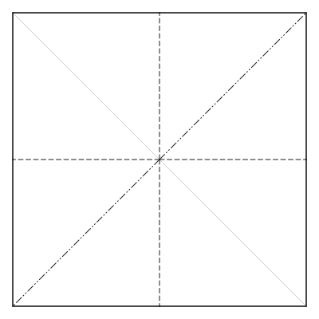
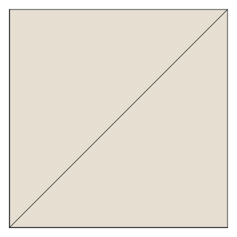
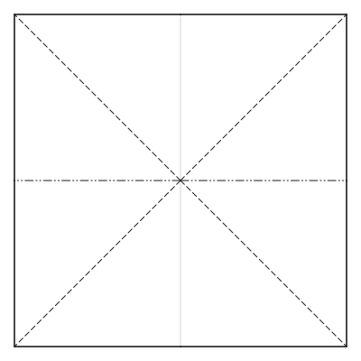
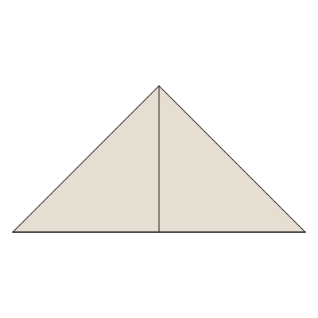
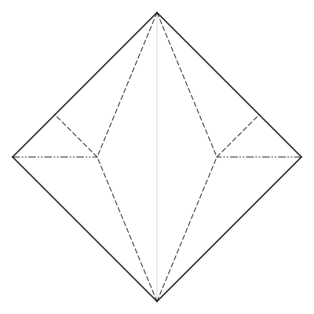
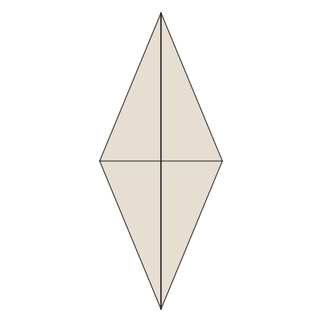
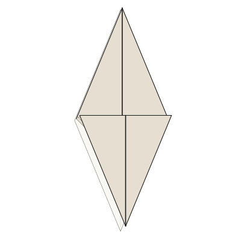
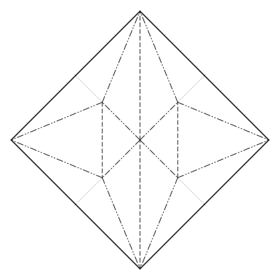
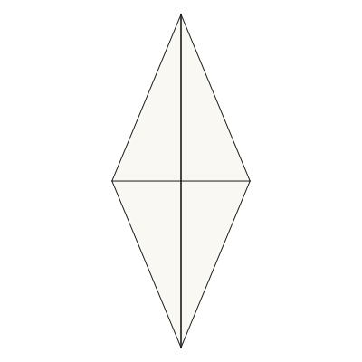
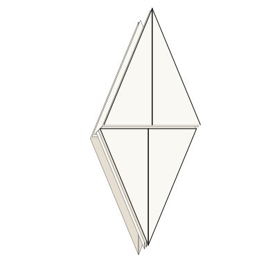

# Example crease patterns

`diagonal-cp.fold`, `squaretwist.fold` and `simple.fold` are taken from the
reference FOLD repository at <https://github.com/edemaine/FOLD/tree/main/examples>
(MIT licensed) and are kept here so the renderer is always exercised against
files it did not produce itself.

They were chosen because between them they cover the awkward parts of the
format:

| File                | What it exercises                                              |
| ------------------- | -------------------------------------------------------------- |
| `diagonal-cp.fold`  | A 2D crease pattern; `file_spec` of `1.1`; the vendor key `cpedit:page` |
| `simple.fold`       | 3D `foldedForm` coordinates, mountain and valley edges, and the only `faceOrders` in the repo — so it is the fixture for layer-correct drawing |
| `squaretwist.fold`  | A larger rigidly-folded 3D model                                |

Five more come from [Flat-Folder](https://github.com/origamimagiro/flat-folder)
(MIT), Jason Ku's flat layer-order solver, whose `examples/` folder ships 755
crease patterns, 741 of them with a row in a table of how its solver fared. They are copied
byte for byte from its `main` branch at commit `d50004815fb7` (2026-06-24), so
a diff against upstream is meaningful, and their `file_author` is as upstream
wrote it. They are here as the first real models in the suite and as a
cross-check: `Senbazuru.Origami.StackingSpec` compares the constraints our
solver generates for the four that have a row, kind by kind, against the counts
in that table; the fifth comes from the `unsatisfiable/` folder, which has no
table, and is tested for refusal.

A repository licence is not a design licence, so only three groups were taken.
The traditional models have no author to ask. Jason Ku's own designs are his to
license, and he licensed the repository. Daniel Brown's grids are an exhaustive
enumeration of the flat foldings of a small grid rather than a design. Every
other file in that folder is another designer's work and stays there.

| File                   | Upstream file, and what it is for                              |
| ---------------------- | -------------------------------------------------------------- |
| `crane.fold`           | `instagram/004_traditional_Crane.fold`. 72 faces, 20 flat creases, 5 valid stackings in 2 components. The first model in the suite that looks like anything; a golden |
| `kabuto.fold`          | `instagram/002_traditional_Kabuto.fold`. The samurai helmet: 18 faces, 9 valid stackings |
| `thirds-pinwheel.fold` | `instagram/006_ku_Thirds_Pinwheel.fold`. A twist with one valid stacking: its four flaps stack in a circle, which is a valid layer order and one that painting faces whole cannot draw. It is the fixture for drawing by visible regions instead |
| `bad-twist.fold`       | `unsatisfiable/001_ku_Bad_Twist.fold`. Folds without tearing and has no valid stacking at all; the solver must refuse it |
| `grid-2x2-d1.fold`     | `grids/002_brown_2x2_D1.fold`. 25 faces, 16 valid stackings in 5 components, and another twist |

One is not a FOLD file at all. `bird-base.cp` is Oriedita's own
`oriedita-data/src/test/resources/birdbase.cp`, copied byte for byte from
[oriedita/oriedita](https://github.com/oriedita/oriedita) (MIT) at commit
`c02a5442` (2026-06-12) and renamed to match the hyphenated names here. The
file itself has not changed since 2022.

It is the traditional bird base, so there is no designer to ask, and it is the
first real base in the suite. It is also the fixture for reading the `.cp`
format, which is why a hand-written one would not do: 26 lines of text, `y`
measured downwards, no vertices, no faces, and six creases meeting at a centre
the file spells three different ways. Its 52 endpoints are 22 distinct
spellings of 13 vertices, so a reader that does not merge them gets a bird base
in 22 disconnected pieces. See
[docs/notes/cp-and-opx.md](../docs/notes/cp-and-opx.md).

The other imported derivative is `bird-base.fold`, described
[below](#fish-and-bird-bases-opening-and-reshaping-flaps). The rest are
hand-written here, so they carry no third-party design and no licence but this
repository's. Between them they are what `senbazuru check` is
demonstrated on:

| File                   | What it is                                                     |
| ---------------------- | -------------------------------------------------------------- |
| `unit-square.fold`     | The smallest file with a border, a mountain fold and a valley fold. Its three interior creases cross at the centre without a vertex there, which earns it three jobs: `check` finds no interior vertex to look at, `Senbazuru.Fold.Crossings` cuts it into six creases through one new vertex, and the result folds and then cannot be *stacked* — its 2 mountains and 2 valleys at right angles are what Maekawa's theorem forbids, showing up as layers that would have to pass through each other |
| `quarter-fold.fold`    | A square folded into quarters: one interior vertex, four creases, and the lopsided three-mountains-to-one-valley that Maekawa's theorem forces. Its four faces meet at that vertex, which is what makes it the fixture for face filling |
| `three-crease.fold`    | Three creases meeting at a point, which cannot fold flat whatever the angles. `check` reports it |
| `big-little-big.fold`  | A vertex that satisfies both theorems `check` knows and still cannot fold flat, for the reason in [big-little-big.md](../docs/notes/big-little-big.md). `check` passes it, which is the point; `render --fold` refuses it, because its layers cannot be stacked |
| `puffed-square.fold` | Not a fold at all: a unit square on a 10×10 grid, each cell cut into two triangles, lifted by `z = 0.25 sin(πx) sin(πy)`, every interior edge `F`. Generated, so it carries no design. It is the method a puffed crane body would use, at the smallest size that shows it, and the fixture for drawing a curved surface as a mesh of flat faces — see [docs/notes/the-puff-is-a-drawing.md](../docs/notes/the-puff-is-a-drawing.md) |
| `letter-fold.fold`     | A square folded in three like a letter, with panels of different widths so that the layer order shows. Alternate the creases and it folds into an accordion; make them both valleys and it cannot be folded at all, because the long panel would have to pass through a closed fold |
| `quarter-fold-steps.fold` | The same quarter fold as three frames of a sequence, and the only multi-frame file here. Its folded coordinates were computed by senbazuru's own folding rather than typed out. `--arrows` and `--steps` are demonstrated on it |
| `crease-stops.fold` | Two creases that divide no paper: one running to a point in the middle of the sheet, and one ending part-way along a flat line, where the paper is continuous and three drawn lines leave one crease. What `check` reports as neither of its two theorems. |

## Folds with no interior vertex

These three are the first rung of a ladder of traditional folds, and they are
here for [#114](https://github.com/avalonalex/senbazuru/issues/114): senbazuru
draws a folded stack as though the layers were loose sheets, because it never
draws the paper that wraps around a fold. `docs/img/quarter-fold-offset.svg` is
the symptom, four squares with nothing joining them.

**What they have in common is that no crease meets another.** Every one runs
between two points on the border, so `check` skips every vertex and says so.
That is the point rather than a shortcoming, and it is why they are grouped
apart from the table above: there is nothing here for `check` to demonstrate.
Where creases *do* meet, the rounded folds interact and the surface stops being
developable, which is the one part of #114 with no clean answer. These let the
fold radius and the layer separation be settled first.

Each folds and stacks with exactly one valid layer order, so there is no choice
among stackings for a change to make differently in silence.
"Senbazuru.Origami.StackingSpec" pins that, and pins the absence of an interior
vertex with it, because those two properties are the whole reason these files
were chosen.

| File | What it is |
| ---- | ---------- |
| `book-base.fold` | The simplest fold there is: one crease, two faces, two layers. Nothing smaller exercises folding at all, which is what makes it the first case for #114 |
| `accordion.fold` | Four equal panels folded back and forth. The four layers land exactly on top of one another, as the quarter fold's do, but with no interior vertex — so it is the quarter fold's stacking problem with the hard part removed. Not a duplicate of `letter-fold.fold`, whose three panels are deliberately unequal so that the stack shows without an offset |
| `blintz-base.fold` | Four corners folded to the centre, so its creases are oblique and its four flaps tile the diamond they land on exactly. The creases are mountains rather than valleys, which is what puts the flaps towards the default camera; folded the other way it draws as a plain diamond with all eight of those edges hidden underneath |

They are traditional forms with no single author, and they were written here
rather than taken from anywhere, so they carry no design and no licence but
this repository's.

## Kite base for the material study

`kite-base.fold` was constructed here from a unit square: the two creases run
from `(0,0)` to `(1, sqrt(2)-1)` and `(sqrt(2)-1, 1)`. Folding the adjacent
sides onto the diagonal gives the traditional kite base. It has no single
designer; neither its data nor a tutorial image was copied. The coordinate
`sqrt(2)-1` is stored as a decimal. The authored angle states in
[`study/fold-material/cases.json`](../study/fold-material/cases.json) use this
file and the existing `blintz-base.fold` to exercise oblique creases.

## Square and waterbomb bases: meeting creases

[`square-base.fold`](square-base.fold) and
[`waterbomb-base.fold`](waterbomb-base.fold) are constructed here from the four
corners, four edge midpoints and centre of a unit square. They are traditional
bases, with no single designer; no tutorial data or images were copied. A base
is a folded starting shape used by several models. The square base is also
called the preliminary base; the triangular waterbomb base is the starting
shape for the paper balloon, not the inflated balloon itself.

Both files draw the diagonals and the horizontal and vertical midlines. All
eight segments share centre vertex 8, so the face builder reconstructs eight
triangles joined in one sheet. Six segments bend in the chosen collapsed
state; two stay flat. `M` is a mountain at −180°, `V` a valley at +180°, and
`F` a flat guide at 0°; see the [glossary](../docs/glossary.md). These assignments
describe the target state, not the direction used to make each preliminary
crease. Coordinates use x to the right and y upwards.

| File | Mountain | Valley | Flat guide | Collapsed outline |
| --- | --- | --- | --- | --- |
| `square-base.fold` | SW–NE diagonal | Both midlines | SE–NW diagonal | Square of side ½ |
| `waterbomb-base.fold` | Horizontal midline | Both diagonals | Vertical midline | Triangle of base 1 and height ½ |

Each preview below is independently fitted to its image; they do not share a
physical scale. Mountain folds use dash-dot-dot lines, valleys use dashes, and
flat guides use thin grey lines. In the folded views the creases are solid.

| Base | Crease pattern | Collapsed form |
| --- | --- | --- |
| Square |  |  |
| Waterbomb |  |  |

From the repository root, regenerate the previews and check both patterns:

```bash
for name in square-base waterbomb-base; do
  stack run -- check "examples/$name.fold"
  stack run -- render "examples/$name.fold" -o "docs/img/$name-cp.svg"
  stack run -- render "examples/$name.fold" --fold -o "docs/img/$name-folded.svg"
done
```

Both checks report one interior vertex with no violations. That alone is not
proof of a valid folded sheet: `BasePatternSpec` also checks shared corners,
preserved lengths, the expected collapsed coordinates and exactly one valid
flat layer order. See [why a pre-crease can stay flat](../docs/notes/precreases-and-target-states.md).
These fixtures establish the endpoints for the material study. Its
[square and waterbomb gallery states](../study/fold-material/README.md#square-and-waterbomb-collapse)
sample a compatible symmetric collapse, with contact checks at each state.

## Fish and bird bases: opening and reshaping flaps

[`fish-base.fold`](fish-base.fold) is constructed here from the angle bisectors
of the two triangles on either side of a unit square's diagonal. It has two
[rabbit-ear folds](../docs/glossary.md), laid towards the NE corner: eight
triangular panels, with two interior vertices where four creases bend.

[`bird-base.fold`](bird-base.fold) adapts the MIT Oriedita `bird-base.cp`
reference attributed above. The CP importer flips its screen y axis; we then
translate and scale to a unit square, reorder vertices, and replace numerical
noise with the constructed coordinates. To describe two lifted
[petal folds](../docs/glossary.md), we add valley hinges `9–10` and `11–12` and
change the four outer midline segments from valley to flat. The old CP remains
unchanged. The new endpoint has sixteen triangles, four interior vertices with
four active creases, and a centre with six. It is a traditional base, with no
single designer; no tutorial images or coordinate data were copied.

Both files store the closed endpoint angles: mountains −180°, valleys +180°,
flat guides and boundaries 0°. Faces and layer orders are reconstructed by the
existing production pipeline. The [construction note](../docs/notes/fish-and-bird-endpoints.md)
explains the coordinates and the difference between the two bird fixtures.

| Base | Crease pattern | Closed endpoint | Layers offset for inspection |
| --- | --- | --- | --- |
| Fish |  |  |  |
| Bird |  |  |  |

Figures are fitted independently, so their displayed heights do not compare
material scale. The fish's tip-to-tip length is sqrt(2), the bird's is 1. The
last column shifts layers on the page to reveal them; it does not model paper
thickness or another folding state. Mountain lines are dash-dot-dot, valleys
dashed, and flat guides thin grey. The fish endpoint is viewed from below to
show its flaps; the bird is viewed from above.

Regenerate these previews from the repository root:

```bash
stack run -- render examples/fish-base.fold --rotate 45 -o docs/img/fish-base-cp.svg
stack run -- render examples/fish-base.fold --fold --view bottom --rotate 90 -o docs/img/fish-base-folded.svg
stack run -- render examples/fish-base.fold --fold --view bottom --rotate 90 --offset 4 -o docs/img/fish-base-layers.svg
stack run -- render examples/bird-base.fold --rotate 45 -o docs/img/bird-base-unit-cp.svg
stack run -- render examples/bird-base.fold --fold --rotate 90 -o docs/img/bird-base-unit-folded.svg
stack run -- render examples/bird-base.fold --fold --rotate 90 --offset 4 --margin 32 -o docs/img/bird-base-unit-layers.svg
stack run -- check examples/fish-base.fold
stack run -- check examples/bird-base.fold
stack test --ta='--match flap-base'
```

`FlapPatternSpec` checks the intended material landmarks, shared vertices,
edge lengths, area, achieved crease magnitudes, a valid flat layer order and
all panel pairs for contact. These fixtures do not yet provide intermediate
rabbit-ear or petal-fold motion in the material-study gallery.
